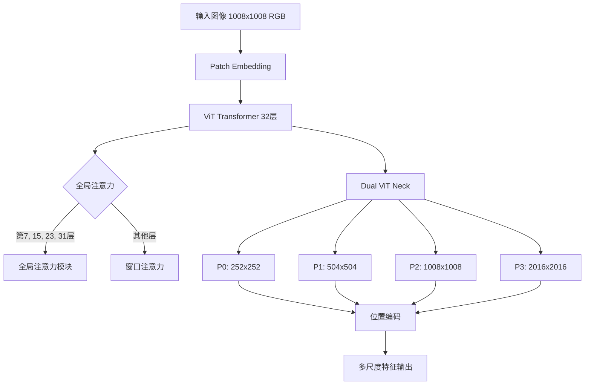
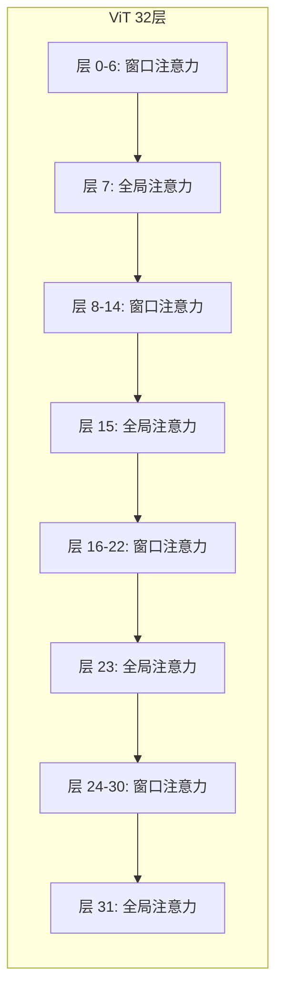
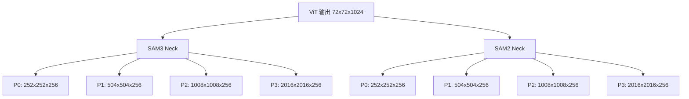

# SAM3 推理部署 - 视觉 Backbone 模块技术分析

## 1. 概述

SAM3 的视觉 Backbone 基于 Vision Transformer (ViT) 架构，结合了多种先进的位置编码技术和注意力机制。该模块负责从输入图像中提取多层次视觉特征，为下游检测和追踪任务提供丰富的特征表示。

## 2. 整体架构



## 3. Patch Embedding

### 3.1 功能概述

Patch Embedding 将原始图像分割成固定大小的 patches，并线性投影到嵌入空间。

**代码位置**: `sam3/model/vitdet.py:301-338`

```python
class PatchEmbed(nn.Module):
    """Image to Patch Embedding."""

    def __init__(
        self,
        kernel_size: Tuple[int, int] = (16, 16),
        stride: Tuple[int, int] = (16, 16),
        padding: Tuple[int, int] = (0, 0),
        in_chans: int = 3,
        embed_dim: int = 768,
        bias: bool = True,
    ):
        super().__init__()
        self.proj = nn.Conv2d(
            in_chans,
            embed_dim,
            kernel_size=kernel_size,
            stride=stride,
            padding=padding,
            bias=bias,
        )

    def forward(self, x: Tensor) -> Tensor:
        x = self.proj(x)
        # B C H W -> B H W C
        x = x.permute(0, 2, 3, 1)
        return x
```

### 3.2 配置参数

| 参数 | 值 | 说明 |
|------|-----|------|
| kernel_size | (14, 14) | Patch 大小 |
| stride | (14, 14) | 步长，等于 patch 大小 |
| in_chans | 3 | RGB 图像通道数 |
| embed_dim | 1024 | 嵌入维度 |

**输出形状**: `B × 72 × 72 × 1024`（1008/14 = 72）

## 4. Attention 机制

### 4.1 Attention 模块架构

SAM3 使用了多种注意力机制的组合，包括标准多头注意力、相对位置编码和旋转位置编码 (RoPE)。

**代码位置**: `sam3/model/vitdet.py:341-500`

```python
class Attention(nn.Module):
    """Multi-head Attention block with relative position embeddings and 2d-rope."""

    def __init__(
        self,
        dim: int,
        num_heads: int = 8,
        qkv_bias: bool = True,
        use_rel_pos: bool = False,
        rel_pos_zero_init: bool = True,
        input_size: Optional[Tuple[int, int]] = None,
        cls_token: bool = False,
        use_rope: bool = False,
        rope_theta: float = 10000.0,
        rope_pt_size: Optional[Tuple[int, int]] = None,
        rope_interp: bool = False,
    ):
```

### 4.2 旋转位置编码 (Rotary Position Embedding - RoPE)

RoPE 是 SAM3 的关键位置编码技术，通过在旋转空间中嵌入位置信息来增强注意力的位置感知能力。

**数学原理**:

给定查询向量 `q` 和键向量 `k`，RoPE 通过以下方式应用旋转：

```
q_rotated = q * e^(i * θ_pos)
k_rotated = k * e^(i * θ_pos)
```

其中 `θ_pos` 是基于位置的旋转角度。

**代码位置**: `sam3/model/vitdet.py:43-93`

```python
def compute_axial_cis(
    dim: int,
    end_x: int,
    end_y: int,
    theta: float = 10000.0,
    scale_pos: float = 1.0,
    offset: int = 0,
) -> torch.Tensor:
    freqs_x = 1.0 / (theta ** (torch.arange(0, dim, 4)[: (dim // 4)].float() / dim))
    freqs_y = 1.0 / (theta ** (torch.arange(0, dim, 4)[: (dim // 4)].float() / dim))

    t_x, t_y = init_t_xy(end_x, end_y, scale_pos, offset)
    freqs_x = torch.outer(t_x, freqs_x)
    freqs_y = torch.outer(t_y, freqs_y)
    freqs_cis_x = torch.polar(torch.ones_like(freqs_x), freqs_x)
    freqs_cis_y = torch.polar(torch.ones_like(freqs_y), freqs_y)
    return torch.cat([freqs_cis_x, freqs_cis_y], dim=-1)

def apply_rotary_enc(
    xq: torch.Tensor,
    xk: torch.Tensor,
    freqs_cis: torch.Tensor,
    repeat_freqs_k: bool = False,
) -> Tuple[torch.Tensor, torch.Tensor]:
    xq_ = torch.view_as_complex(xq.float().reshape(*xq.shape[:-1], -1, 2))
    xk_ = (
        torch.view_as_complex(xk.float().reshape(*xk.shape[:-1], -1, 2))
        if xk.shape[-2] != 0
        else None
    )
    freqs_cis = reshape_for_broadcast(freqs_cis, xq_)
    xq_out = torch.view_as_real(xq_ * freqs_cis).flatten(3)
    if xk_ is None:
        return xq_out.type_as(xq).to(xq.device), xk
    if repeat_freqs_k:
        r = xk_.shape[-2] // xq_.shape[-2]
        freqs_cis = freqs_cis.repeat(*([1] * (freqs_cis.ndim - 2)), r, 1)
    xk_out = torch.view_as_real(xk_ * freqs_cis).flatten(3)
    return xq_out.type_as(xq).to(xq.device), xk_out.type_as(xk).to(xk.device)
```

**RoPE 参数配置**:

| 参数 | 值 | 说明 |
|------|-----|------|
| rope_theta | 10000.0 | 控制频率分布的基频 |
| rope_interp | True | 启用位置插值，支持不同输入尺寸 |
| head_dim | 64 (1024/16) | 每个注意力头的维度 |

**优势分析**:

| 特性 | 说明 |
|------|------|
| 平移不变性 | RoPE 对平移操作具有不变性 |
| 外推能力 | 可以外推到训练时未见过的序列长度 |
| 高效实现 | 使用复数运算，计算效率高 |

### 4.3 相对位置编码 (Relative Position Embedding)

除了 RoPE，SAM3 还支持相对位置编码，通过可学习的偏置直接注入到注意力分数中。

**代码位置**: `sam3/model/vitdet.py:144-298`

```python
def concat_rel_pos(
    q: Tensor,
    k: Tensor,
    q_hw: Tuple[int, int],
    k_hw: Tuple[int, int],
    rel_pos_h: Tensor,
    rel_pos_w: Tensor,
    rescale: bool = False,
    relative_coords: Optional[Tensor] = None,
) -> Tuple[Tensor, Tensor]:
    """
    Concatenate rel pos coeffs to q & k tensors, so that qk^T is now
    effectively including rel pos biases.
    """
    q_h, q_w = q_hw
    k_h, k_w = k_hw

    assert (q_h == q_w) and (k_h == k_w), "only square inputs supported"

    if relative_coords is not None:
        Rh = rel_pos_h[relative_coords]
        Rw = rel_pos_w[relative_coords]
    else:
        Rh = get_rel_pos(q_h, k_h, rel_pos_h)
        Rw = get_rel_pos(q_w, k_w, rel_pos_w)

    B, _, dim = q.shape
    r_q = q.reshape(B, q_h, q_w, dim)

    old_scale = dim**0.5
    new_scale = (dim + k_h + k_w) ** 0.5 if rescale else old_scale  # for sdpa
    scale_ratio = new_scale / old_scale

    rel_h = torch.einsum("bhwc,hkc->bhwk", r_q, Rh) * new_scale  # (B, q_h, q_w, k_h)
    rel_w = torch.einsum("bhwc,wkc->bhwk", r_q, Rw) * new_scale  # (B, q_h, q_w, k_w)

    eye_h = torch.eye(k_h, dtype=q.dtype, device=q.device)
    eye_w = torch.eye(k_w, dtype=q.dtype, device=q.device)

    eye_h = eye_h.view(1, k_h, 1, k_h).expand([B, k_h, k_w, k_h])
    eye_w = eye_w.view(1, 1, k_w, k_w).expand([B, k_h, k_w, k_w])

    q = torch.cat([r_q * scale_ratio, rel_h, rel_w], dim=-1).view(B, q_h * q_w, -1)
    k = torch.cat([k.view(B, k_h, k_w, -1), eye_h, eye_w], dim=-1).view(
        B, k_h * k_w, -1
    )

    return q, k
```

## 5. ViT 层结构

### 5.1 ViT 配置参数

| 参数 | 值 | 说明 |
|------|-----|------|
| depth | 32 | Transformer 层数 |
| embed_dim | 1024 | 嵌入维度 |
| num_heads | 16 | 注意力头数 |
| mlp_ratio | 4.625 | MLP 扩展比例 |
| drop_path_rate | 0.1 | 随机深度丢弃概率 |

### 5.2 全局注意力策略

SAM3 采用稀疏全局注意力策略，仅在特定层使用全局注意力，在保持性能的同时降低计算复杂度。

**全局注意力层**: (7, 15, 23, 31)



### 5.3 窗口注意力 (Window Attention)

窗口注意力将输入划分为不重叠的窗口，每个窗口内进行注意力计算，显著降低计算复杂度。

**代码位置**: `sam3/model/vitdet.py:95-141`

```python
def window_partition(x: Tensor, window_size: int) -> Tuple[Tensor, Tuple[int, int]]:
    """
    Partition into non-overlapping windows with padding if needed.
    """
    B, H, W, C = x.shape

    pad_h = (window_size - H % window_size) % window_size
    pad_w = (window_size - W % window_size) % window_size
    if pad_h > 0 or pad_w > 0:
        x = F.pad(x, (0, 0, 0, pad_w, 0, pad_h))
    Hp, Wp = H + pad_h, W + pad_w

    x = x.view(B, Hp // window_size, window_size, Wp // window_size, window_size, C)
    windows = x.permute(0, 1, 3, 2, 4, 5).reshape(-1, window_size, window_size, C)
    return windows, (Hp, Wp)
```

**窗口大小配置**: `window_size=24`

**复杂度分析**:

| 注意力类型 | 复杂度 | 72×72 输入的 FLOPs |
|----------|--------|---------------------|
| 全局注意力 | O(N²) | ~4×10⁹ |
| 窗口注意力 | O(W² × N/W²) | ~3×10⁸ (8x 降低) |

## 6. Dual ViT Neck (特征金字塔)

### 6.1 架构设计

Neck 将 ViT 输出的单尺度特征转换为多尺度特征金字塔，支持从高分辨率细节到低分辨率语义的层次表示。

**代码位置**: `sam3/model/necks.py:14-126`

```python
class Sam3DualViTDetNeck(nn.Module):
    def __init__(
        self,
        trunk: nn.Module,
        position_encoding: nn.Module,
        d_model: int,
        scale_factors=(4.0, 2.0, 1.0, 0.5),
        add_sam2_neck: bool = False,
    ):
        super().__init__()
        self.trunk = trunk
        self.position_encoding = position_encoding
        self.convs = nn.ModuleList()

        self.scale_factors = scale_factors
        use_bias = True
        dim: int = self.trunk.channel_list[-1]

        for _, scale in enumerate(scale_factors):
            current = nn.Sequential()

            if scale == 4.0:
                # 上采样 4x
                current.add_module("dconv_2x2_0",
                    nn.ConvTranspose2d(dim, dim // 2, kernel_size=2, stride=2))
                current.add_module("gelu", nn.GELU())
                current.add_module("dconv_2x2_1",
                    nn.ConvTranspose2d(dim // 2, dim // 4, kernel_size=2, stride=2))
                out_dim = dim // 4
            elif scale == 2.0:
                # 上采样 2x
                current.add_module("dconv_2x2",
                    nn.ConvTranspose2d(dim, dim // 2, kernel_size=2, stride=2))
                out_dim = dim // 2
            elif scale == 1.0:
                # 保持原尺度
                out_dim = dim
            elif scale == 0.5:
                # 下采样 2x
                current.add_module("maxpool_2x2",
                    nn.MaxPool2d(kernel_size=2, stride=2))
                out_dim = dim

            current.add_module("conv_1x1",
                nn.Conv2d(in_channels=out_dim, out_channels=d_model,
                          kernel_size=1, bias=use_bias))
            current.add_module("conv_3x3",
                nn.Conv2d(in_channels=d_model, out_channels=d_model,
                          kernel_size=3, padding=1, bias=use_bias))
            self.convs.append(current)
```

### 6.2 特征金字塔结构

| 层级 | 缩放因子 | 分辨率 | 通道数 | 用途 |
|------|---------|--------|--------|------|
| P0 | 4.0x | 252×252 | 256 | 高分辨率细节 |
| P1 | 2.0x | 504×504 | 256 | 中等分辨率 |
| P2 | 1.0x | 1008×1008 | 256 | 主分辨率 |
| P3 | 0.5x | 2016×2016 | 256 | 低分辨率语义 |

### 6.3 双 Neck 设计

当 `add_sam2_neck=True` 时，系统会创建两个独立的 neck（SAM3 neck 和 SAM2 neck），支持不同权重的实例交互功能。



## 7. 位置编码 (Position Encoding)

### 7.1 正弦位置编码

SAM3 使用正弦位置编码将位置信息注入到特征中。

**代码位置**: `sam3/model/position_encoding.py:12-126`

```python
class PositionEmbeddingSine(nn.Module):
    """
    This is a more standard version of position embedding, very similar to
    one used by Attention is all you need paper, generalized to work on images.
    """

    def __init__(
        self,
        num_pos_feats,
        temperature: int = 10000,
        normalize: bool = True,
        scale: Optional[float] = None,
        precompute_resolution: Optional[int] = None,
    ):
        super().__init__()
        assert num_pos_feats % 2 == 0, "Expecting even model width"
        self.num_pos_feats = num_pos_feats // 2
        self.temperature = temperature
        self.normalize = normalize
        if scale is None:
            scale = 2 * math.pi
        self.scale = scale

        self.cache = {}
        # Precompute positional encodings to fill cache
        if precompute_resolution is not None:
            precompute_sizes = [
                (precompute_resolution // 4, precompute_resolution // 4),
                (precompute_resolution // 8, precompute_resolution // 8),
                (precompute_resolution // 16, precompute_resolution // 16),
                (precompute_resolution // 32, precompute_resolution // 32),
            ]
            for size in precompute_sizes:
                tensors = torch.zeros((1, 1) + size, device="cuda")
                self.forward(tensors)
                self.cache[size] = self.cache[size].clone().detach()
```

### 7.2 缓存机制

位置编码模块实现了缓存机制，预计算常用分辨率的位置编码，避免重复计算。

**预计算分辨率**:
- 1008//4 = 252
- 1008//8 = 126
- 1008//16 = 63
- 1008//32 = 31

**缓存键值**: `(height, width)` 元组

### 7.3 正弦位置编码公式

```python
pos_x = x_embed[:, :, :, None] / dim_t
pos_y = y_embed[:, :, :, None] / dim_t

dim_t = self.temperature ** (2 * (dim_t // 2) / self.num_pos_feats)

pos_x = torch.stack((pos_x[:, :, :, 0::2].sin(),
                   pos_x[:, :, :, 1::2].cos()), dim=4).flatten(3)
pos_y = torch.stack((pos_y[:, :, :, 0::2].sin(),
                   pos_y[:, :, :, 1::2].cos()), dim=4).flatten(3)
```

## 8. 性能分析与优化

### 8.1 计算复杂度

| 组件 | 输入 | 输出 | FLOPs (单帧) |
|------|------|------|---------------|
| Patch Embed | 1008×1008×3 | 72×72×1024 | ~1.0×10⁹ |
| ViT (32层) | 72×72×1024 | 72×72×1024 | ~4.5×10¹¹ |
| Neck (4层) | 72×72×1024 | 多尺度 | ~2.0×10⁹ |

**总计算量**: ~4.7×10¹¹ FLOPs

### 8.2 内存占用

| 组件 | 显存占用 (FP16) |
|------|-----------------|
| Patch Embedding | ~400 MB |
| ViT 特征 (激活值) | ~6 GB |
| Neck 输出 | ~2 GB |
| 总计（单帧） | ~8.5 GB |

### 8.3 优化建议

1. **使用混合精度**: FP16 显存减半，无精度损失
2. **启用 TF32**: Ampere GPU 可加速 2-4x
3. **梯度检查点**: 交换计算换显存，支持更长序列
4. **位置编码缓存**: 预计算避免重复计算

## 9. 关键文件索引

| 文件 | 行号 | 关键类/函数 |
|------|------|-------------|
| `vitdet.py` | 43-93 | `compute_axial_cis()`, `apply_rotary_enc()` |
| `vitdet.py` | 95-141 | `window_partition()`, `window_unpartition()` |
| `vitdet.py` | 144-298 | `concat_rel_pos()`, `get_rel_pos()` |
| `vitdet.py` | 301-338 | `PatchEmbed` |
| `vitdet.py` | 341-500 | `Attention` |
| `vitdet.py` | 500-700 | `Block`, `ViT` |
| `necks.py` | 14-126 | `Sam3DualViTDetNeck` |
| `position_encoding.py` | 12-126 | `PositionEmbeddingSine` |

## 10. 技术亮点总结

| 技术 | 优势 |
|------|------|
| RoPE + 相对位置编码 | 增强的位置感知，支持外推 |
| 稀疏全局注意力 | 平衡性能与精度 |
| 双 Neck 设计 | 支持多任务，灵活部署 |
| 位置编码缓存 | 减少重复计算，加速推理 |
| 混合注意力机制 | 兼顾局部与全局信息 |
