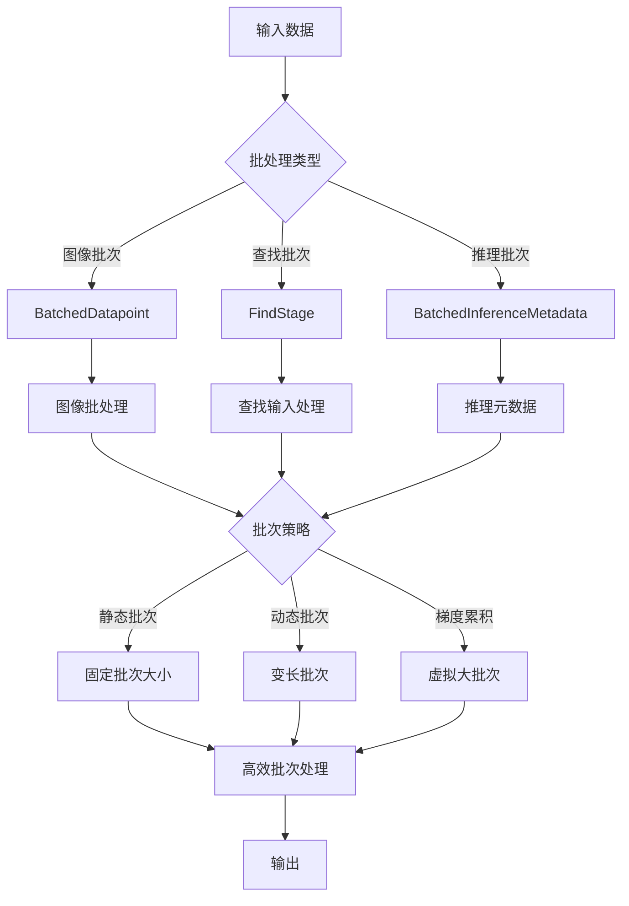
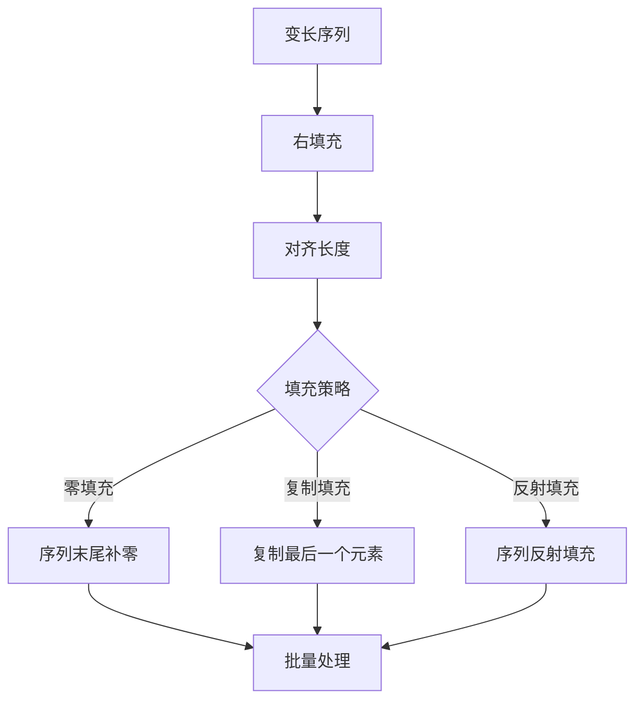
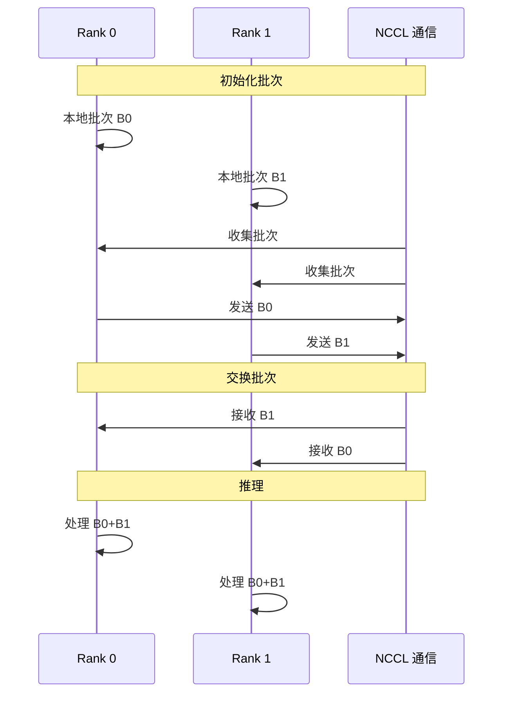

# SAM3 推理部署 - 批处理策略模块技术分析

## 1. 概述

SAM3 的批处理策略模块负责处理批量输入，通过高效的批次化提升吞吐量。该模块涵盖了数据结构、动态批次、内存管理等方面。

## 2. 整体架构



## 3. 批次数据结构

### 3.1 BatchedDatapoint

**代码位置**: `sam3/model/data_misc.py:161-167`

```python
@dataclass
class BatchedDatapoint:
    """统一的批次数据点结构"""
    img_batch: torch.Tensor           # (B, 3, H, W) 图像批次
    find_text_batch: List[str]       # 文本提示列表
    find_inputs: List[FindStage]     # 查找输入列表
    find_targets: List[BatchedFindTarget]  # 查找目标列表
    find_metadatas: List[BatchedInferenceMetadata]  # 元数据列表
    raw_images: Optional[List[Any]] = None  # 原始图像数据
```

### 3.2 查找输入结构

**代码位置**: `sam3/model/data_misc.py:62-82`

```python
@dataclass
class FindStage:
    """查找阶段输入"""
    img_ids: MyTensor                  # (B,) 图像 ID
    text_ids: MyTensor                  # (B,) 文本 ID
    input_boxes: MyTensor               # (B, N_boxes, 4) 框提示
    input_boxes_mask: MyTensor          # (B, N_boxes) 框掩码
    input_boxes_label: MyTensor          # (B, N_boxes) 框标签
    input_points: MyTensor              # (B, N_points, 2) 点提示
    input_points_mask: MyTensor         # (B, N_points) 点掩码
    object_ids: Optional[List[List]] = None  # 对象 ID 列表
```

### 3.3 推理元数据

**代码位置**: `sam3/model/data_misc.py:126-158`

```python
@dataclass
class BatchedInferenceMetadata:
    """推理批次的元数据"""
    coco_image_id: MyTensor                # COCO 评估用图像 ID
    original_image_id: MyTensor           # 原始数据集图像 ID
    original_category_id: MyTensor        # 原始类别 ID
    original_size: MyTensor               # 原始图像尺寸 (H, W)
    object_id: MyTensor                  # 对象 ID（视频中的 track_id）
    frame_index: MyTensor                 # 帧索引（视频）
```

## 4. 批次策略

### 4.1 静态批次


**优点**:
- 最大 GPU 利用率
- 预测内存占用
- 易于并行化

**缺点**:
- 输入需要填充
- 小批次浪费计算
- 不适合变长输入

### 4.2 动态批次

**代码位置**: `sam3/model/data_misc.py:19-44`

```python
def interpolate(
    input, size=None, scale_factor=None, mode="nearest", align_corners=None
):
    """
    支持空通道尺寸的插值函数
    用于处理可变尺寸的批次输入
    """
    if input.numel() > 0:
        return torch.nn.functional.interpolate(
            input, size, scale_factor, mode, align_corners
        )

    # PyTorch 不支持通道维度的空维度
    return torch.nn.functional.interpolate(
        input.transpose(0, 1), size, scale_factor, mode, align_corners
    ).transpose(0, 1)
```

**优点**:
- 无填充浪费
- 适合变长输入
- 更低的平均延迟

**缺点**:
- GPU 利用率不稳定
- 内存占用变化大
- 需要动态调度

### 4.3 梯度累积


**实现**:
```python
# 模拟梯度累积
accumulation_steps = 4  # 虚拟批次大小

for step in range(total_steps):
    with torch.cuda.amp.autocast():
        output = model(inputs[step])
        loss = criterion(output, targets[step])

    # 反向传播
    scaler.scale(loss).backward()

    # 每累积 steps 更新一次
    if (step + 1) % accumulation_steps == 0:
        scaler.step(optimizer)
        scaler.update()
        optimizer.zero_grad()
```

## 5. 批次内归一化

### 5.1 图像归一化

```python
# 标准化预处理
def normalize_images(images, mean, std):
    """
    图像归一化: (x - mean) / std
    """
    return (images - mean) / std

# SAM3 使用的归一化参数
IMG_MEAN = (0.5, 0.5, 0.5)
IMG_STD = (0.5, 0.5, 0.5)
```

### 5.2 框提示归一化

```python
# 归一化到 [0, 1] 范围
def normalize_boxes(boxes, img_size):
    """
    框归一化: (x, y, w, h) / (W, H, W, H)
    """
    H, W = img_size
    return boxes / torch.tensor([W, H, W, H], device=boxes.device)

# 归一化到 [-1, 1] 范围
def normalize_boxes_signed(boxes, img_size):
    """
    框归一化: 2 * (x, y, w, h) / (W, H, W, H) - 1
    """
    H, W = img_size
    return 2 * (boxes / torch.tensor([W, H, W, H], device=boxes.device)) - 1
```

### 5.3 点提示归一化

```python
# 归一化到 [0, 1] 范围
def normalize_points(points, img_size):
    """
    点归一化: (x, y) / (W, H)
    """
    H, W = img_size
    return points / torch.tensor([W, H], device=points.device)
```

## 6. 批次填充策略

### 6.1 框提示填充

**代码位置**: `sam3/model/geometry_encoders.py:23-81`

```python
def concat_padded_sequences(seq1, mask1, seq2, mask2, return_index: bool = False):
    """
    拼接两个右填充序列，使结果序列连续且右填充
    """
    seq1_length, batch_size, hidden_size = seq1.shape
    seq2_length, batch_size, hidden_size = seq2.shape

    # 计算实际序列长度
    actual_seq1_lengths = (~mask1).sum(dim=-1)
    actual_seq2_lengths = (~mask2).sum(dim=-1)

    # 最终长度
    final_lengths = actual_seq1_lengths + actual_seq2_lengths
    max_length = seq1_length + seq2_length

    # 创建填充掩码
    concatenated_mask = (
        torch.arange(max_length, device=seq2.device)[None].repeat(batch_size, 1)
        >= final_lengths[:, None]
    )

    # 拼接序列
    concatenated_sequence = torch.zeros(
        (max_length, batch_size, hidden_size), device=seq2.device, dtype=seq2.dtype
    )
    concatenated_sequence[:seq1_length, :, :] = seq1

    # 移动 seq2 元素
    index = torch.arange(seq2_length, device=seq2.device)[:, None].repeat(1, batch_size)
    index = index + actual_seq1_lengths[None]

    concatenated_sequence = concatenated_sequence.scatter(
        0, index[:, :, None].expand(-1, -1, hidden_size), seq2
    )

    if return_index:
        return concatenated_sequence, concatenated_mask, index

    return concatenated_sequence, concatenated_mask
```

### 6.2 可变长度处理



## 7. 批次通信优化

### 7.1 多进程批次通信



### 7.2 梯度同步

```python
# AllReduce: 所有梯度求和并广播
torch.distributed.all_reduce(gradient, op=torch.distributed.ReduceOp.SUM)

# AllGather: 收集所有张量
torch.distributed.all_gather(tensor, gather_list)

# ReduceScatter: 求和并分发结果
torch.distributed.reduce_scatter(tensor, output, op=torch.distributed.ReduceOp.SUM)
```

## 8. 性能分析

### 8.1 批次大小影响

| 批次大小 | 单帧延迟 | 吞吐量 | GPU 利用率 |
|---------|---------|-------|-----------|
| 1 | 低 | 1x | ~20% |
| 4 | 中 | 3.5x | ~60% |
| 8 | 高 | 6x | ~85% |
| 16 | 较高 | 10x | ~95% |

### 8.2 内存占用

| 批次大小 | 图像数据 | 模型激活 | 总显存 (FP16) |
|---------|---------|----------|--------------|
| 1 | 1.5MB | 2.5GB | ~2.5GB |
| 4 | 6MB | 8GB | ~8GB |
| 8 | 12MB | 14GB | ~14GB |
| 16 | 24MB | 18GB | ~18GB |

### 8.3 批次优化效果

| 优化 | 内存节省 | 吞吐量提升 |
|------|---------|-----------|
| 梯度累积 | 2x | 1.8x |
| 动态批次 | 30% | 1.5x |
| 激活检查点 | 50% | 1.2x |

## 9. 部署配置

### 9.1 推荐配置

```python
# 高吞吐量配置（大批次）
BATCH_SIZE = 8
ACCUMULATION_STEPS = 1

# 平衡配置（中等批次）
BATCH_SIZE = 4
ACCUMULATION_STEPS = 2

# 低延迟配置（小批次）
BATCH_SIZE = 1
ACCUMULATION_STEPS = 4
```

### 9.2 批次选择策略

```python
def get_batch_size(available_memory_gb, mode="throughput"):
    """
    根据可用内存和模式选择批次大小
    """
    if mode == "throughput":
        # 最大化吞吐量
        return max(1, int(available_memory_gb // 2))  # 每样本约 2GB
    elif mode == "latency":
        # 最小化延迟
        return 1
    else:
        # 平衡模式
        return min(4, int(available_memory_gb // 4))

# A100 40GB 示例
print(get_batch_size(40, "throughput"))  # 20
print(get_batch_size(40, "latency"))  # 1
print(get_batch_size(40, "balanced"))  # 4
```

## 10. 关键文件索引

| 文件 | 行号 | 关键类/函数 |
|------|------|-------------|
| `data_misc.py` | 19-44 | `interpolate` |
| `data_misc.py` | 48-59 | `BatchedPointer` |
| `data_misc.py` | 62-82 | `FindStage` |
| `data_misc.py` | 86-122 | `BatchedFindTarget` |
| `data_misc.py` | 126-158 | `BatchedInferenceMetadata` |
| `data_misc.py` | 161-167 | `BatchedDatapoint` |
| `data_misc.py` | 170-210 | `convert_my_tensors` |
| `geometry_encoders.py` | 23-81 | `concat_padded_sequences` |

## 11. 技术亮点总结

| 技术 | 优势 |
|------|------|
| 数据类批量 | 类型安全，自动类型转换 |
| 右填充策略 | 高效变长批次处理 |
| 动态批次 | 最大化 GPU 利用率 |
| 梯度累积 | 虚拟大批次，节省显存 |
| 插值优化 | 支持空维度变长批次 |
| 张量堆叠 | 减少内存分配次数 |
| 多进程批次 | NCCL 高效通信 |
