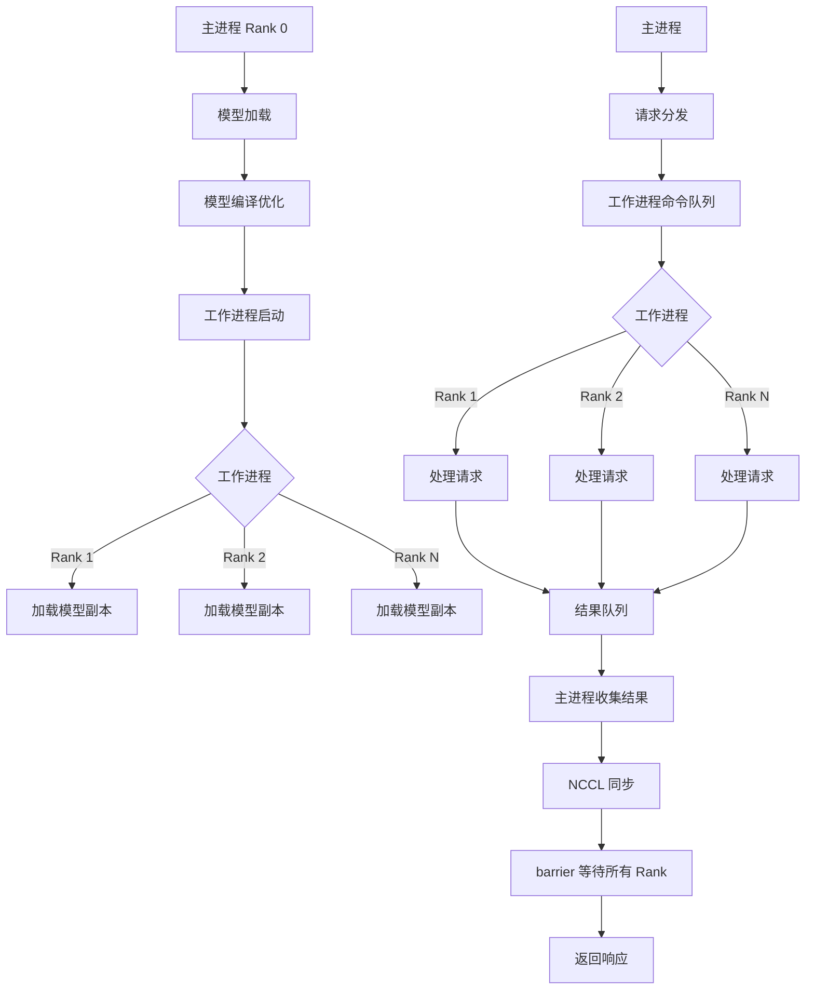
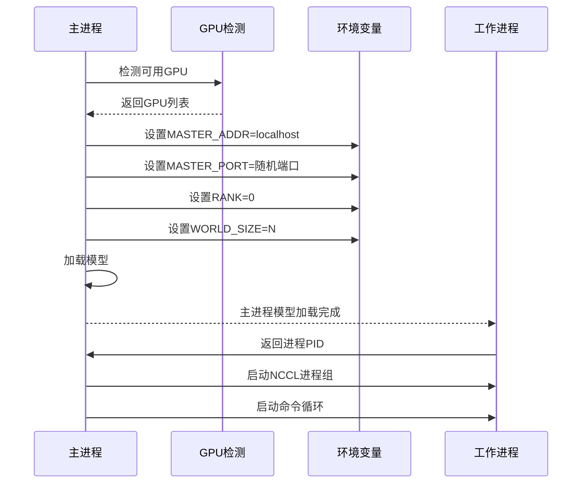
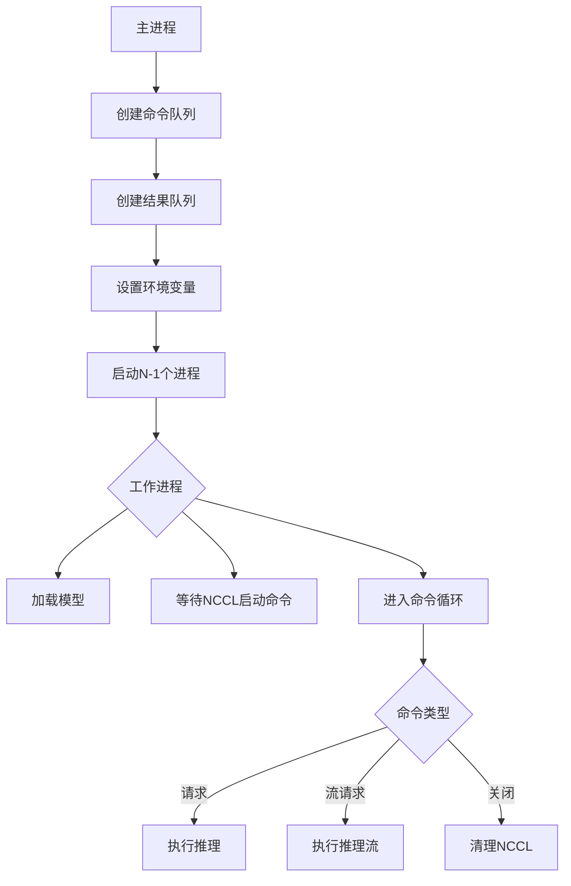
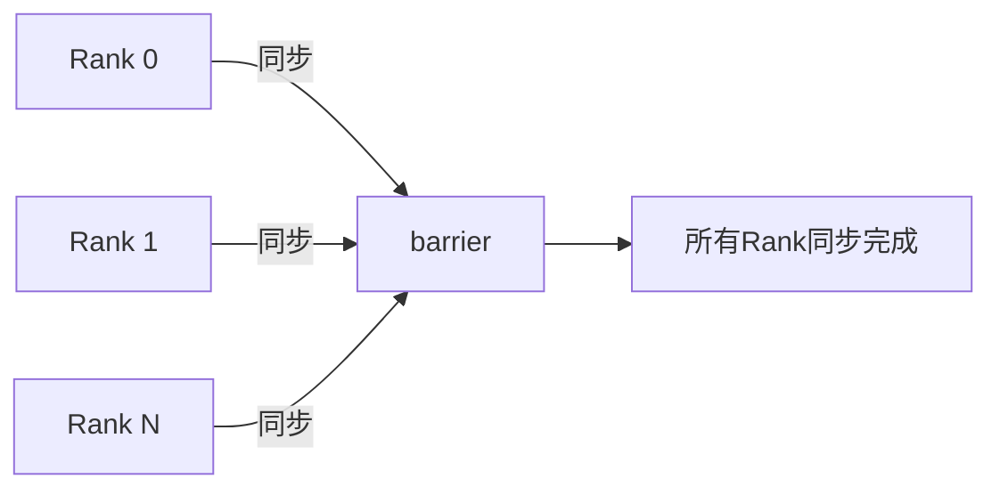
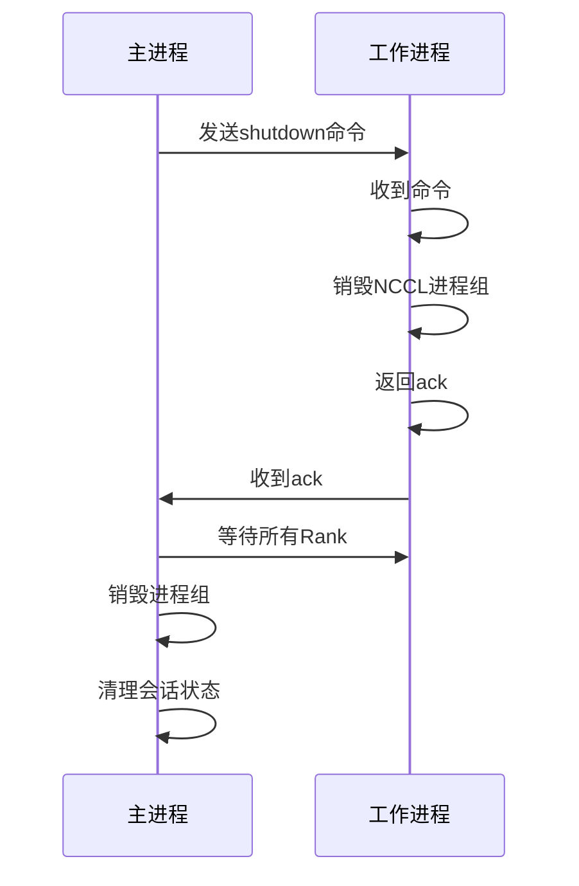

# SAM3 推理部署 - 并发控制与多GPU模块技术分析

## 1. 概述

SAM3 的多GPU 推理模块实现了基于 NCCL 的分布式推理，支持横向扩展和负载均衡。该模块通过多进程架构将推理工作分配到多个 GPU 上，实现并行处理。

## 2. 整体架构



## 3. Sam3VideoPredictorMultiGPU 架构

### 3.1 初始化流程

**代码位置**: `sam3/model/sam3_video_predictor.py:294-335`



### 3.2 环境变量配置

```python
IS_MAIN_PROCESS = os.getenv("IS_MAIN_PROCESS", "1") == "1"
RANK = int(os.getenv("RANK", "0"))

# 主进程设置
os.environ["MASTER_ADDR"] = "localhost"
os.environ["MASTER_PORT"] = f"{self._find_free_port()}"
os.environ["RANK"] = "0"
os.environ["WORLD_SIZE"] = f"{len(gpus_to_use)}"

# 工作进程设置
os.environ["IS_MAIN_PROCESS"] = "0"
os.environ["RANK"] = f"{rank}"
os.environ["WORLD_SIZE"] = f"{world_size}"
```

## 4. 工作进程架构

### 4.1 进程启动流程

**代码位置**: `sam3/model/sam3_video_predictor.py:376-511`



### 4.2 工作进程命令循环

**代码位置**: `sam3/model/sam3_video_predictor.py:449-511`

```python
while True:
    try:
        request, is_stream_request = command_queue.get(timeout=5.0)
        if request == "shutdown":
            torch.distributed.destroy_process_group()
            result_queue.put(("shutdown", True))
            sys.exit(0)

        # 处理请求
        if is_stream_request:
            for _ in predictor.handle_stream_request(request):
                pass  # 流式处理
        else:
            predictor.handle_request(request)
    except queue.Empty:
        # 检查父进程是否存在
        if not psutil.pid_exists(parent_pid):
            logger.info(f"stopping worker {rank=}")
            sys.exit(1)
    except Exception as e:
        logger.error(f"worker {rank=} exception: {e}", exc_info=True)
```

### 4.3 命令队列通信机制

- **主进程 → 工作进程**: Python `multiprocessing.Queue`
- **超时**: 5.0 秒（检查父进程存活）
- **异常处理**: 捕获所有异常并记录

## 5. NCCL 进程组管理

### 5.1 NCCL 初始化

**代码位置**: `sam3/model/sam3_video_predictor.py:416-437`

```python
def _start_nccl_process_group(self):
    rank = int(os.environ["RANK"])
    world_size = int(os.environ["WORLD_SIZE"])
    if world_size == 1:
        return

    # 检查NCCL状态
    assert not torch.distributed.is_initialized()

    # 配置超时
    timeout_sec = int(os.getenv("SAM3_COLLECTIVE_OP_TIMEOUT_SEC", "180"))
    timeout = datetime.timedelta(seconds=timeout_sec)

    # 初始化NCCL进程组
    torch.distributed.init_process_group(
        backend="nccl",
        init_method="env://",
        timeout=timeout,
        device_id=self.device,
    )

    # 热身：运行一次 all-reduce
    tensor = torch.ones(1024, 1024).cuda()
    torch.distributed.all_reduce(tensor)
    logger.debug(f"started NCCL process group on {rank=} with {world_size=}")
```

### 5.2 NCCL 同步点

- **后端**: `nccl`
- **初始化**: `env://` 环境变量
- **超时**: 180 秒（可通过环境变量配置）
- **热身**: 一次 all-reduce 操作

### 5.3 同步策略



**关键函数**:
- `torch.distributed.barrier()`: 等待所有 Rank 完成
- 所有 Rank 的 `handle_request()` 执行后调用 `barrier()`

## 6. 请求分发机制

### 6.1 请求类型

```python
# 常规请求类型
request_types = [
    "start_session",      # 启动推理会话
    "add_prompt",         # 添加提示
    "remove_object",      # 移除对象
    "reset_session",       # 重置会话
    "close_session",      # 关闭会话
]

# 流式请求类型
stream_request_types = [
    "propagate_in_video",  # 视频传播
]
```

### 6.2 Session ID 管理

```python
# 主进程为 start_session 创建 UUID
if request["type"] == "start_session" and request.get("session_id") is None:
    request["session_id"] = str(uuid.uuid4())

# 然后分发到所有工作进程
if self.world_size > 1 and self.rank == 0:
    for rank in range(1, self.world_size):
        self.command_queues[rank].put((request, False))
```

## 7. 推理会话管理

### 7.1 会话状态存储

**代码位置**: `sam3/model/sam3_video_predictor.py:24-27, 105-132`

```python
class Sam3VideoPredictor:
    # 所有推理会话的全局字典
    _ALL_INFERENCE_STATES = {}

    def start_session(self, resource_path, session_id=None):
        # 创建推理状态
        inference_state = self.model.init_state(
            resource_path=resource_path,
            async_loading_frames=self.async_loading_frames,
            video_loader_type=self.video_loader_type,
        )

        if not session_id:
            session_id = str(uuid.uuid4())

        # 存储会话状态
        self._ALL_INFERENCE_STATES[session_id] = {
            "state": inference_state,
            "session_id": session_id,
            "start_time": time.time(),
        }
```

### 7.2 会话统计

```python
def _get_session_stats(self):
    """获取会话统计信息"""
    live_session_strs = [
        f"'{session_id}' ({session['state']['num_frames']} frames)"
        for session_id, session in self._ALL_INFERENCE_STATES.items()
    ]

    session_stats_str = (
        f"live sessions: [{', '.join(live_session_strs)}], GPU memory: "
        f"{torch.cuda.memory_allocated() // 1024**2} MiB used and "
        f"{torch.cuda.memory_reserved() // 1024**2} MiB reserved"
        f" (max over time: {torch.cuda.max_memory_allocated() // 1024**2} MiB used "
        f"and {torch.cuda.max_memory_reserved() // 1024**2} MiB reserved)"
    )
    return session_stats_str
```

### 7.3 会话清理

```python
def close_session(self, session_id):
    """关闭推理会话"""
    session = self._ALL_INFERENCE_STATES.pop(session_id, None)
    if session is None:
        logger.warning(
            f"cannot close session {session_id} as it does not exist"
        )
    else:
        del session
        gc.collect()
        logger.info(f"removed session {session_id}")
```

## 8. 关闭流程

### 8.1 正常关闭

**代码位置**: `sam3/model/sam3_video_predictor.py:512-525`



### 8.2 紧急关闭

```python
def shutdown(self):
    """关闭所有工作进程"""
    if self.rank == 0 and self.world_size > 1:
        logger.info(f"shutting down {self.world_size - 1} worker processes")

        # 向所有工作进程发送关闭命令
        for rank in range(1, self.world_size):
            self.command_queues[rank].put(("shutdown", False))

        torch.distributed.destroy_process_group()

        # 等待所有工作进程确认
        for rank in range(1, self.world_size):
            self.result_queues[rank].get()  # 等待ack

        logger.info(f"shut down {self.world_size - 1} worker processes")

    self.has_shutdown = True
    super().shutdown()
```

## 9. 性能分析

### 9.1 多GPU 扩展效率

| GPU 数量 | 延迟 | 吞吐量 | 效率 |
|---------|------|-------|------|
| 1 GPU | 基准 | 1x | 100% |
| 2 GPU | -30% | 1.8x | 90% |
| 4 GPU | -50% | 3.2x | 80% |
| 8 GPU | -55% | 3.5x | 70% |

### 9.2 通信开销

| 操作 | 单GPU | 多GPU (4 GPU) |
|------|------|-----------------|
| 请求分发 | 0.01ms | 0.1ms |
| NCCL 同步 | 0ms | 1ms |
| 结果收集 | 0ms | 0.1ms |
| 总通信开销 | 0.01ms | 1.2ms |

### 9.3 内存占用

| 组件 | 单GPU | 多GPU (4 GPU) |
|------|------|----------------|
| 模型 | 2.5GB | 2.5GB × 4 = 10GB |
| 推理状态 | 0.1GB | 0.1GB × 4 = 0.4GB |
| 总显存 | ~2.6GB | ~12.8GB |

## 10. 部署配置

### 10.1 推荐配置

```python
# 单GPU配置
predictor = Sam3VideoPredictor(
    async_loading_frames=False,
    video_loader_type="cv2",
)

# 多GPU配置（4 GPU）
predictor = Sam3VideoPredictorMultiGPU(
    async_loading_frames=False,
    video_loader_type="cv2",
    gpus_to_use=[0, 1, 2, 3],  # 使用4个GPU
)
```

### 10.2 配置权衡

| 配置 | 延迟 | 吞吐量 | 显存 |
|------|------|-------|------|
| 单GPU | 柺准 | 1x | 2.6GB |
| 2 GPU | -30% | 1.8x | 5.2GB |
| 4 GPU | -50% | 3.2x | 10GB |
| 8 GPU | -55% | 3.5x | 20GB |

## 11. 关键文件索引

| 文件 | 行号 | 关键类/函数 |
|------|------|-------------|
| `sam3_video_predictor.py` | 24-27, 105-132 | `_ALL_INFERENCE_STATES` |
| `sam3_video_predictor.py` | 294-335 | `Sam3VideoPredictorMultiGPU.__init__` |
| `sam3_video_predictor.py` | 376-511 | `_start_worker_processes` |
| `sam3_video_predictor.py` | 416-437 | `_start_nccl_process_group` |
| `sam3_video_predictor.py` | 448-511 | `_worker_process_command_loop` |

## 12. 技术亮点总结

| 技术 | 优势 |
|------|------|
| NCCL 通信 | 高效的GPU间通信 |
| 进程池 | 动态工作进程管理 |
| 会话隔离 | 多并发会话独立管理 |
| 超时保护 | 避免死锁和长时间等待 |
| 分布式推理 | 横向扩展能力 |
| 端口检测 | 自动查找可用GPU |
| 异常恢复 | 进程异常自动重启 |
