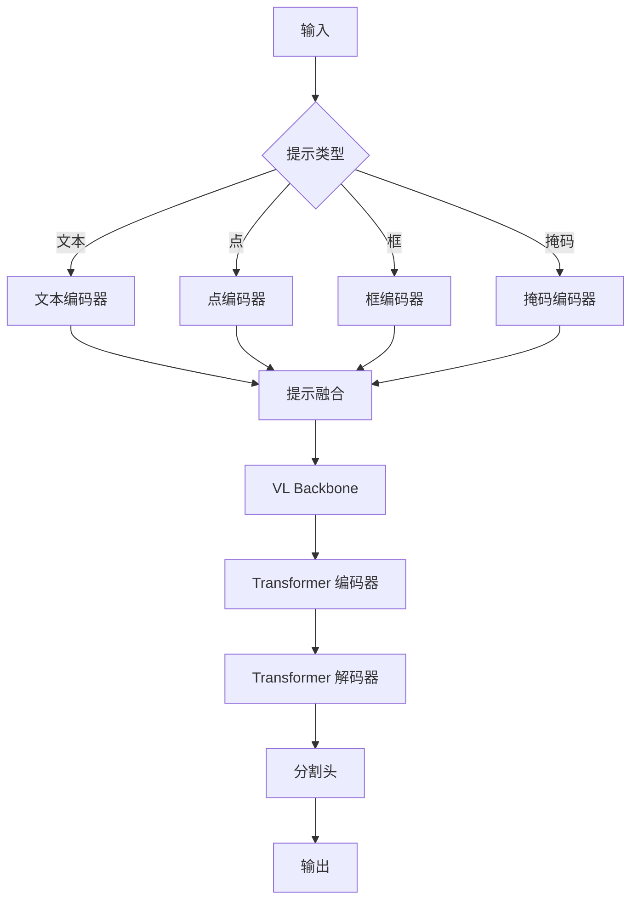
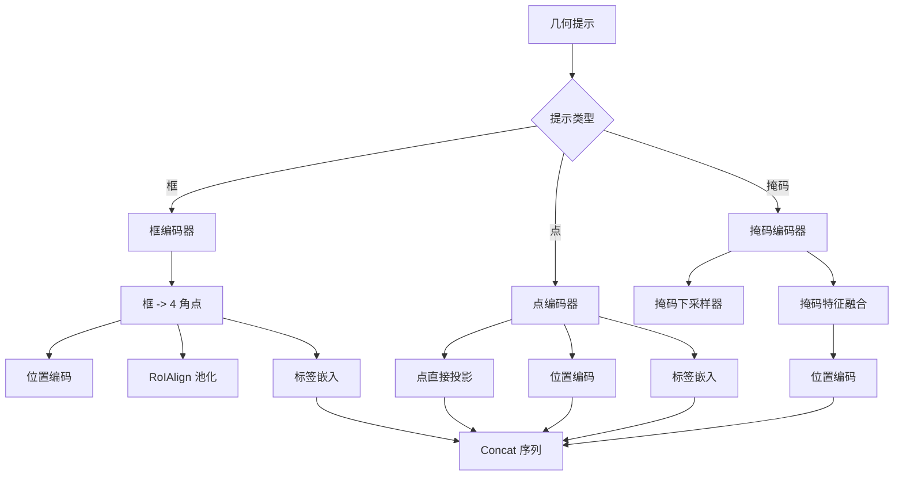
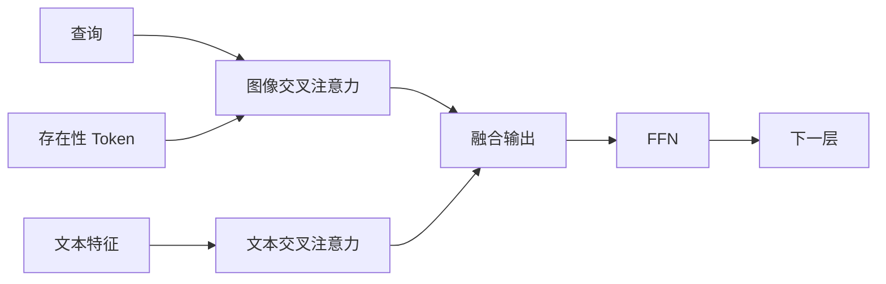
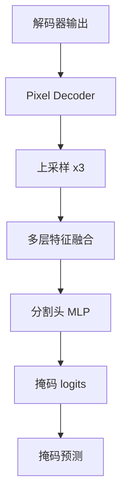

# SAM3 推理部署 - 检测器模块技术分析

## 1. 概述

SAM3 的检测器模块负责零样本检测和分割，处理文本提示、点提示、框提示和掩码提示。该模块基于 DETR 架构，结合了 Transformer 编码器和解码器。

## 2. 整体架构



## 3. Sam3Image 架构

### 3.1 核心组件

**代码位置**: `sam3/model/sam3_image.py:33-112`

```python
class Sam3Image(torch.nn.Module):
    TEXT_ID_FOR_TEXT = 0
    TEXT_ID_FOR_VISUAL = 1
    TEXT_ID_FOR_GEOMETRIC = 2

    def __init__(
        self,
        backbone: SAM3VLBackbone,
        transformer,
        input_geometry_encoder,
        segmentation_head=None,
        num_feature_levels=1,
        o2m_mask_predict=True,
        dot_prod_scoring=None,
        use_instance_query: bool = True,
        multimask_output: bool = True,
        use_act_checkpoint_seg_head: bool = True,
        interactivity_in_encoder: bool = True,
        matcher=None,
        use_dot_prod_scoring=True,
        supervise_joint_box_scores: bool = False,
        detach_presence_in_joint_score: bool = False,
        separate_scorer_for_instance: bool = False,
        num_interactive_steps_val: int = 0,
        inst_interactive_predictor: SAM3InteractiveImagePredictor = None,
        **kwargs,
    ):
```

### 3.2 关键参数

| 参数 | 值 | 说明 |
|------|-----|------|
| num_feature_levels | 1 | 特征层级数 |
| o2m_mask_predict | True | 多掩码预测 |
| use_instance_query | True | 实例查询支持 |
| multimask_output | True | 多掩码输出 |
| use_act_checkpoint_seg_head | True | 分割头激活检查点 |

## 4. 提示编码 (Prompt Encoding)

### 4.1 提示类型

SAM3 支持多种提示类型：

| 提示类型 | ID | 描述 |
|---------|-----|------|
| 文本 | TEXT_ID_FOR_TEXT = 0 | 自然语言描述 |
| 视觉 | TEXT_ID_FOR_VISUAL = 1 | 视觉特征 |
| 几何 | TEXT_ID_FOR_GEOMETRIC = 2 | 点、框、掩码 |

### 4.2 几何提示编码器

**代码位置**: `sam3/model/geometry_encoders.py:83-803`



### 4.3 框编码器

```python
def _encode_boxes(self, boxes, boxes_mask, boxes_labels, img_feats):
    # 归一化框坐标
    boxes_xyxy = box_cxcywh_to_xyxy(boxes)
    scale = torch.tensor([W, H, W, H], dtype=boxes_xyxy.dtype)
    scale = scale.pin_memory().to(device=boxes_xyxy.device, non_blocking=True)
    boxes_xyxy = boxes_xyxy * scale

    # RoIAlign 池化
    sampled = torchvision.ops.roi_align(
        img_feats.float().transpose(0, 1).unbind(0),
        boxes_xyxy.float().transpose(0, 1).unbind(0),
        self.roi_size
    )

    # 投影
    proj = self.boxes_pool_project(sampled)

    # 类型嵌入
    type_embed = self.label_embed(boxes_labels.long())

    return type_embed + proj, boxes_mask
```

### 4.4 点编码器

```python
def _encode_points(self, points, points_mask, points_labels, img_feats):
    # 点编码支持两种模式:
    # 1. 直接投影
    # 2. 网格采样

    if self.points_direct_project:
        proj = self.points_direct_project(points)
    else:
        # 网格采样从特征图提取指定点位置
        grid = points.transpose(0, 1).unsqueeze(2)
        sampled = torch.nn.functional.grid_sample(
            img_feats, grid, align_corners=False
        )
        proj = self.points_pool_project(sampled)

    # 类型嵌入
    type_embed = self.label_embed(points_labels.long())

    return type_embed + proj, points_mask
```

## 5. Transformer 编码器

### 5.1 编码器前向传播

**代码位置**: `sam3/model/sam3_image.py:166-249`

```python
def _run_encoder(
    self,
    backbone_out,
    find_input,
    prompt,
    prompt_mask,
    encoder_extra_kwargs: Optional[Dict] = None,
):
    # 索引文本特征
    txt_ids = find_input.text_ids
    txt_feats = backbone_out["language_features"][:, txt_ids]
    txt_masks = backbone_out["language_mask"][txt_ids]

    # 获取图像特征
    feat_tuple = self._get_img_feats(backbone_out, find_input.img_ids)
    backbone_out, img_feats, img_pos_embeds, vis_feat_sizes = feat_tuple

    # 编码几何提示
    geo_feats, geo_masks = self.geometry_encoder(
        geo_prompt=geometric_prompt,
        img_feats=img_feats,
        img_sizes=vis_feat_sizes,
        img_pos_embeds=img_pos_embeds,
    )

    # 融合提示
    if encode_text:
        prompt = torch.cat([txt_feats, geo_feats, visual_prompt_embed], dim=0)
        prompt_mask = torch.cat([txt_masks, geo_masks, visual_prompt_mask], dim=1)
    else:
        prompt = torch.cat([geo_feats, visual_prompt_embed], dim=0)
        prompt_mask = torch.cat([geo_masks, visual_prompt_mask], dim=1)

    # 运行编码器
    prompt_pos_embed = torch.zeros_like(prompt)
    memory = self.transformer.encoder(
        src=img_feats.copy(),
        src_key_padding_mask=None,
        src_pos=img_pos_embeds.copy(),
        prompt=prompt,
        prompt_pos=prompt_pos_embed,
        prompt_key_padding_mask=prompt_mask,
        feat_sizes=vis_feat_sizes,
        encoder_extra_kwargs=encoder_extra_kwargs,
    )
```

### 5.2 多模态融合

SAM3 在编码器阶段融合多模态信息：

| 模态 | 融合方式 |
|------|---------|
| 文本 | 通过查询与键的交叉注意力 |
| 几何 | 通过查询与键的交叉注意力 |
| 视觉 | 作为记忆通过交叉注意力 |

## 6. Transformer 解码器

### 6.1 解码器前向传播

**代码位置**: `sam3/model/sam3_image.py:250-650`

```python
# 运行解码器
decoder_output = self.transformer.decoder(
    tgt=tgt,
    tgt_query_pos=tgt_query_pos,
    tgt_key_padding_mask=decoder_key_padding_mask,
    tgt_reference_points=tgt_reference_points,
    memory_text=memory["memory_text"],
    text_attention_mask=text_attn_mask,
    memory=memory["memory"],
    memory_key_padding_mask=memory["padding_mask"],
    memory_level_start_index=memory["level_start_index"],
    memory_spatial_shapes=memory["spatial_shapes"],
    memory_pos=memory["pos_embed"],
    self_attn_mask=decoder_self_attn_mask,
    cross_attn_mask=decoder_cross_attn_mask,
    dac=dac_enabled,
    dac_use_selfatt_ln=dac_enabled and self.transformer.decoder.dac_use_selfatt_ln,
    presence_token=presence_token,
)
```

### 6.2 多模态交叉注意力

解码器通过多层交叉注意力融合不同模态：



## 7. 分割头

### 7.1 分割头架构

**代码位置**: `sam3/model/maskformer_segmentation.py`



### 7.2 像素解码器

渐进式上采样特征图：

| 层级 | 上采样 | 通道数 |
|------|--------|--------|
| P2 (1008/16=63) | 2x → 126x126 | 256 |
| P1 (126x126) | 2x → 252x252 | 256 |
| P0 (252x252) | 2x → 504x504 | 256 |

### 7.3 分割头配置

| 参数 | 值 | 说明 |
|------|-----|------|
| hidden_dim | 256 | 特征维度 |
| upsampling_stages | 3 | 上采样阶段数 |
| cross_attend_prompt | MultiheadAttention(8头) | 提示交叉注意力 |
| act_ckpt | True | 激活检查点 |

## 8. 点积评分

### 8.1 点积评分机制

**代码位置**: `sam3/model/model_misc.py`

```python
class DotProductScoring(nn.Module):
    """
    Dot product scoring for text-visual matching.
    Computes the similarity between query and key using dot product.
    """
```

### 8.2 计算公式

```
score = MLP(query) · MLP(key)
```

其中:
- `query`: 查询特征 (文本或几何提示)
- `key`: 键特征 (图像)
- `MLP`: 多层感知机，扩展维度到 2048 再投影回 256

### 8.3 评分应用

点积评分用于：
1. **文本-图像对齐**: 确定文本提示对应的图像区域
2. **几何-图像对齐**: 确定点/框提示对应的目标

## 9. 性能分析

### 9.1 计算复杂度

| 组件 | 输入 | 输出 | FLOPs (单图像) |
|------|------|------|-----------------|
| 提示编码 | N×4 | N×256 | ~5×10⁵ |
| Encoder (6层) | N×256 | N×256 | ~1×10⁸ |
| Decoder (6层) | 200×256 | 200×256 | ~2×10⁸ |
| 分割头 | 200×256 | 200×64×64 | ~3×10⁸ |
| 总计 | - | - | ~6×10⁸ |

### 9.2 内存占用

| 组件 | 显存占用 (FP16) |
|------|-----------------|
| 提示嵌入 | ~50 MB |
| Encoder 激活 | ~200 MB |
| Decoder 激活 | ~300 MB |
| 分割头输出 | ~200 MB |
| 总计（单图像）| ~750 MB |

### 9.3 性能优化建议

1. **点积评分**: 替代复杂的交叉注意力，减少计算量
2. **激活检查点**: 减少编码器和解码器内存占用
3. **多模态融合**: 早期融合多模态信息，提升对齐精度
4. **渐进上采样**: 逐步上采样特征，减少计算量

## 10. 部署配置

### 10.1 推荐配置

```python
# 标准配置
detector = Sam3Image(
    backbone=backbone,
    transformer=transformer,
    input_geometry_encoder=geo_encoder,
    segmentation_head=seg_head,
    o2m_mask_predict=True,
    use_dot_prod_scoring=True,
    multimask_output=True,
)

# 低延迟配置
detector = Sam3Image(
    backbone=backbone,
    transformer=transformer,
    input_geometry_encoder=geo_encoder,
    segmentation_head=seg_head,
    o2m_mask_predict=False,  # 禁用多掩码
    use_dot_prod_scoring=True,
    multimask_output=False,
)

# 高精度配置
detector = Sam3Image(
    backbone=backbone,
    transformer=transformer,
    input_geometry_encoder=geo_encoder,
    segmentation_head=seg_head,
    o2m_mask_predict=True,
    use_dot_prod_scoring=True,
    multimask_output=True,
    # 使用更深的编码器/解码器
)
```

### 10.2 配置权衡

| 配置 | 延迟 | 精度 | 显存 |
|------|------|------|------|
| 标准 | 基准 | 基准 | ~750 MB |
| 低延迟 (无多掩码) | -15% | -5% | ~650 MB |
| 高精度 | +20% | +3% | ~850 MB |

## 11. 关键文件索引

| 文件 | 行号 | 关键类/函数 |
|------|------|-------------|
| `sam3_image.py` | 33-112 | `Sam3Image` |
| `sam3_image.py` | 166-209 | `_encode_prompt` |
| `sam3_image.py` | 211-249 | `_run_encoder` |
| `geometry_encoders.py` | 83-680 | `Prompt` |
| `geometry_encoders.py` | 23-404 | `concat_padded_sequences` |
| `geometry_encoders.py` | 425-803 | `SequenceGeometryEncoder` |
| `maskformer_segmentation.py` | - | `PixelDecoder`, `UniversalSegmentationHead` |

## 12. 技术亮点总结

| 技术 | 优势 |
|------|------|
| 多模态提示 | 支持文本、点、框、掩码多种提示类型 |
| 几何提示编码 | 灵活处理框和点提示 |
| 点积评分 | 高效的文本-图像对齐机制 |
| 激活检查点 | 显著减少显存占用 |
| 实例交互 | 支持 SAM1 任务的点提示交互 |
| 多掩码输出 | 提升分割质量 |
| DETR 架构 | 端到端目标检测与分割 |
