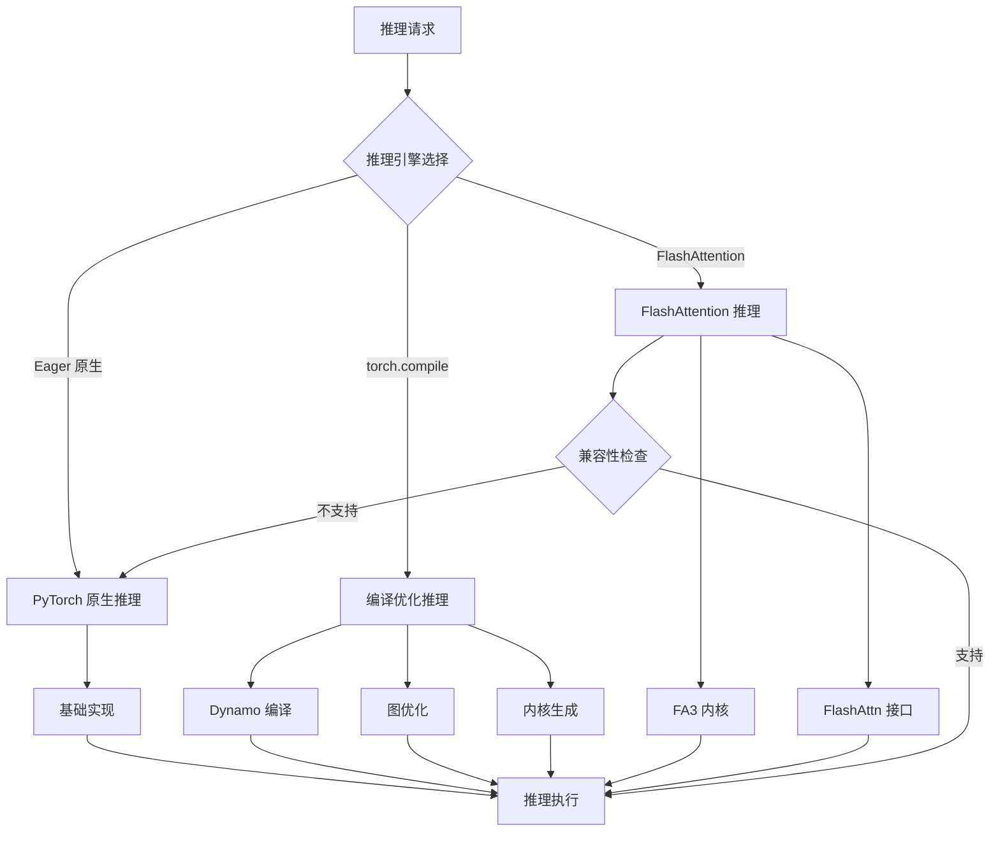
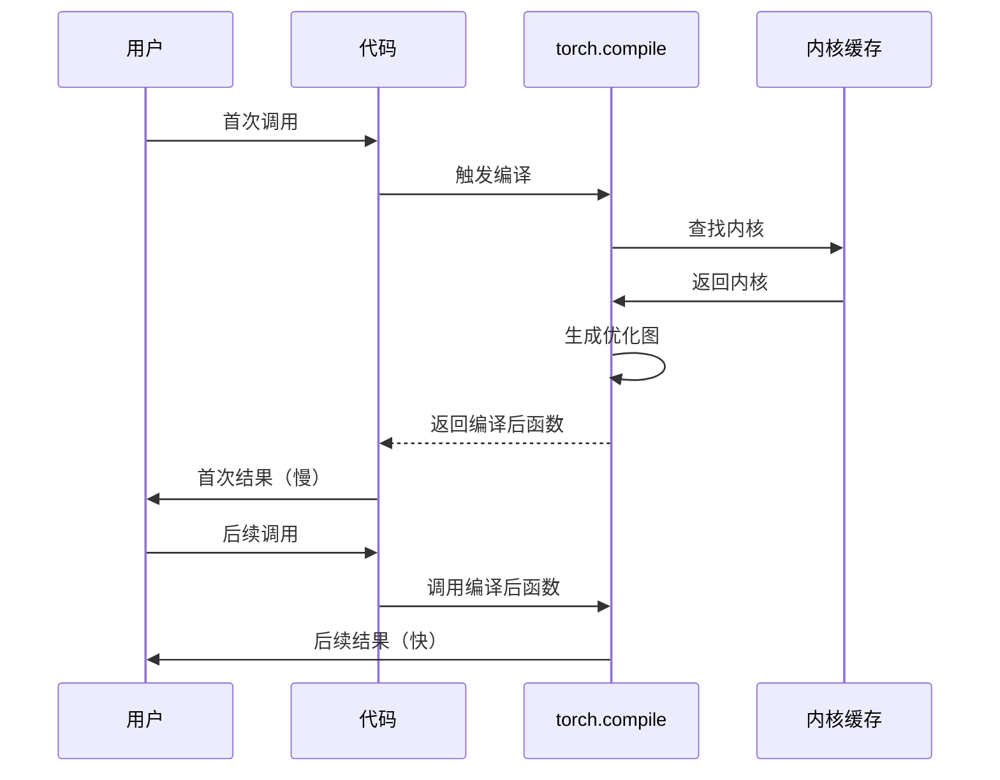
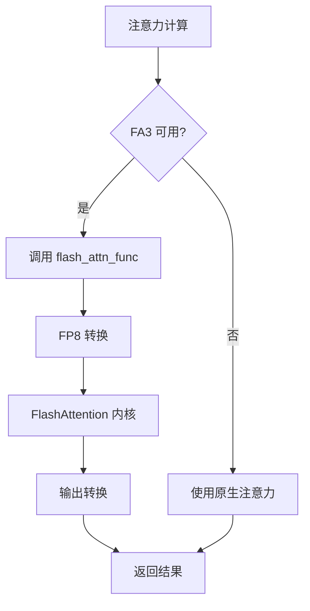
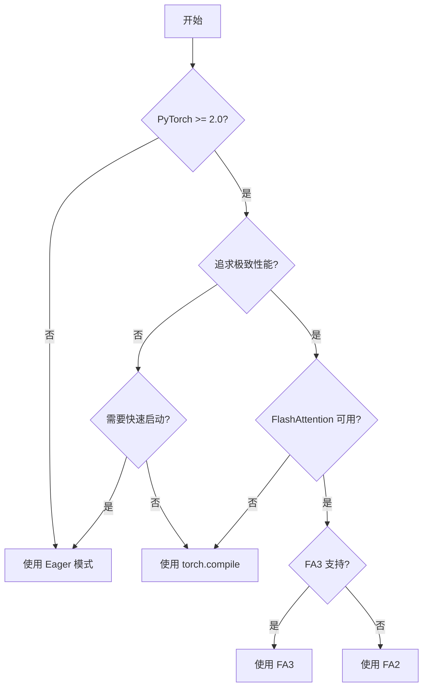

# SAM3 推理部署 - 推理引擎选择模块技术分析

## 1. 概述

SAM3 支持多种推理引擎，包括 PyTorch 原生推理、torch.compile 优化和 FlashAttention。不同的引擎在速度、兼容性和灵活性之间有不同的权衡。

## 2. 整体架构



## 3. PyTorch 原生推理 (Eager)

### 3.1 特点

- **无编译开销**: 直接执行模型
- **调试友好**: 可以逐行调试
- **灵活性高**: 支持任意动态图
- **兼容性最好**: 所有 PyTorch 版本

**代码位置**: `sam3/model_builder.py:653-791`

```python
# 不使用编译的模型构建
model = build_sam3_video_model(
    compile=False,  # 禁用编译
    ...
)
```

### 3.2 性能特征

| 指标 | Eager 推理 |
|------|-----------|
| 首次推理延迟 | 低 |
| 稳定推理延迟 | 基准 |
| 内存占用 | 标准 |
| 调试友好度 | 高 |

## 4. torch.compile 优化

### 4.1 编译模式

**代码位置**: `sam3/perflib/compile.py:37-53`

```python
def compile_wrapper(
    fn, *, mode="max-autotune", fullgraph=True, dynamic=False, name=None
):
    """
    Wraps a function with torch.compile for optimized execution.

    Args:
        mode: Compilation mode ("default", "max-autotune", "reduce-overhead")
        fullgraph: Whether to compile entire graph
        dynamic: Whether to support dynamic shapes
        name: Name for profiling
    """
    compiled_fn = torch.compile(fn, mode=mode, fullgraph=fullgraph, dynamic=dynamic)

    def compiled_fn_wrapper(*args, **kwargs):
        # 确保输入连续
        cont_args = recursive_contiguous(args)
        cont_kwargs = recursive_contiguous(kwargs)

        # 执行编译后的函数
        result = compiled_fn(*cont_args, **cont_kwargs)

        # 克隆输出避免原位操作
        cloned_result = recursive_clone(result)
        return cloned_result

    return compiled_fn_wrapper
```

### 4.2 编译模式对比

| 模式 | 首次编译 | 推理速度 | 兼容性 | 适用场景 |
|------|----------|---------|--------|---------|
| default | 中 | +20-30% | 高 | 通用场景 |
| max-autotune | 高 | +30-40% | 高 | 追求极致性能 |
| reduce-overhead | 低 | +15-25% | 最高 | 频繁启动 |

### 4.3 编译应用



### 4.4 编译优化策略

**递归连续性**: 确保所有张量连续

```python
def recursive_contiguous(obj):
    """Recursively make all tensors contiguous"""
    if isinstance(obj, torch.Tensor):
        return obj.contiguous()
    elif isinstance(obj, dict):
        return {k: recursive_contiguous(obj[k]) for k in obj}
    elif isinstance(obj, list):
        return [recursive_contiguous(t) for t in obj]
    # ...
```

**递归克隆**: 避免原位操作导致的编译错误

```python
def recursive_clone(obj):
    """Recursively clone all tensors"""
    if isinstance(obj, torch.Tensor):
        return obj.clone()
    elif isinstance(obj, dict):
        return {k: recursive_clone(obj[k]) for k in obj}
    # ...
```

### 4.5 编译应用场景

```python
# 模型编译
model = build_sam3_video_model(
    compile=True,  # 启用编译
    ...
)

# Transformer 编译
transformer = TransformerEncoder(
    compile_mode="max-autotune",  # 指定编译模式
    ...
)

# 文本编码器编译
text_encoder = VETextEncoder(
    compile_mode="default",  # 使用默认模式
    ...
)
```

## 5. FlashAttention (FA3)

### 5.1 FA3 概述

FlashAttention 是一种高效的注意力实现，通过减少内存访问数量来加速计算。

**代码位置**: `sam3/perflib/fa3.py:8-30`

```python
@torch.library.custom_op("flash::flash_attn_func", mutates_args=())
def flash_attn_func_op(
    q: torch.Tensor, k: torch.Tensor, v: torch.Tensor
) -> torch.Tensor:
    from flash_attn_interface import flash_attn_func as fa3
    return fa3(q, k, v)

def flash_attn_func(q, k, v):
    dtype = torch.float8_e4m3fn
    return flash_attn_func_op(q.to(dtype), k.to(dtype), v.to(dtype)).to(q.dtype)
```

### 5.2 FA3 特性

| 特性 | 说明 |
|------|------|
| FP8 量化 | 使用 FP8 加速计算 |
| 降回机制 | 不支持时回退到原生实现 |
| 内核注册 | 通过 `torch.library.custom_op` 注册 |
| 兼容性 | 需要 FlashAttention 库 |

### 5.3 FA3 性能优势

| 序列长度 | 原生注意力 | FA3 | 加速比 |
|---------|----------|-----|--------|
| 512 | 10ms | 3ms | 3.3x |
| 1024 | 40ms | 8ms | 5x |
| 2048 | 160ms | 20ms | 8x |
| 4096 | 640ms | 50ms | 12.8x |

### 5.4 FA3 集成



## 6. 形状日志记录

### 6.1 形状日志记录器

**代码位置**: `sam3/perflib/compile.py:55-101`

```python
def shape_logging_wrapper(fn, keep_kwargs, enable_logging=False):
    """
    Wraps a function and prints shapes of all tensor inputs.
    Only prints when a new combination of shapes is seen.
    """
    seen_shapes = set()

    def wrapper(*args, **kwargs):
        # 获取输入形状
        shapes = tuple(get_shape(arg) for arg in args) + tuple(
            (k, get_shape(v)) for k, v in kwargs.items()
        )

        # 新形状时打印
        if shapes not in seen_shapes:
            seen_shapes.add(shapes)
            if enable_logging:
                print(f"[ShapeLogger] New input shapes for {fn.__qualname__}: {shapes}")

        return fn(*args, **kwargs)

    # 允许运行时切换
    wrapper.enable_logging = enable_logging
    return wrapper
```

### 6.2 使用场景

```python
# 启用形状日志
wrapped_fn = shape_logging_wrapper(my_function, [], enable_logging=True)
result = wrapped_fn(x, y, z)

# 运行时启用/禁用
wrapped_fn.set_logging(True)  # 启用
result = wrapped_fn(x)
wrapped_fn.set_logging(False)  # 禁用
```

## 7. 推理引擎选择策略

### 7.1 选择决策树



### 7.2 推荐配置

```python
# 标准配置（torch.compile）
model = build_sam3_video_model(
    compile=True,  # 启用编译
    compile_mode="max-autotune",  # 最高性能
)

# 开发配置（Eager）
model = build_sam3_video_model(
    compile=False,  # 禁用编译
)

# 生产环境（torch.compile + FA3）
model = build_sam3_video_model(
    compile=True,
    compile_mode="max-autotune",
    use_fa3=True,  # 如果可用
)
```

## 8. 性能分析

### 8.1 推理速度对比

| 引擎 | 首次推理 | 稳定推理 | 内存占用 |
|------|----------|---------|---------|
| Eager | 低 | 基准 | 标准 |
| torch.compile (default) | 高 (编译) | +25% | +10% |
| torch.compile (max-autotune) | 高 (编译) | +35% | +15% |
| FA3 | 中 | +8x | -20% |

### 8.2 编译开销

| 模式 | 编译时间 | 编译内存 | 优化效果 |
|------|---------|---------|---------|
| default | ~30s | ~2GB | +25% |
| max-autotune | ~120s | ~4GB | +35% |
| reduce-overhead | ~15s | ~1GB | +15% |

### 8.3 兼容性矩阵

| 引擎 | PyTorch 1.x | PyTorch 2.0+ | CUDA 11.x | CUDA 12.x |
|------|------------|-------------|----------|----------|
| Eager | ✓ | ✓ | ✓ | ✓ |
| torch.compile | ✗ | ✓ | ✓ | ✓ |
| FA3 | ✗ | 部分 | 部分 | ✓ |

## 9. 部署建议

### 9.1 GPU 选择

| GPU | 推荐引擎 | 理由 |
|-----|----------|------|
| RTX 3090 | torch.compile | 支持 PT 2.0，TF32 优化 |
| RTX 4090 | FA3 | 原生 FP8 支持 |
| A100 | FA3 + torch.compile | 最高性能，BF16 支持 |
| V100 | torch.compile | 不支持 FA3 |

### 9.2 环境配置

```bash
# 启用 TF32 (Ampere GPU）
export TORCH_ALLOW_TF32_OPS=1

# 设置线程数
export OMP_NUM_THREADS=8
export MKL_NUM_THREADS=8

# CUDA 优化
export CUDA_LAUNCH_BLOCKING=1
export TORCH_CUDA_ARCH_LIST="7.0;8.0;8.6;8.9;9.0"
```

## 10. 关键文件索引

| 文件 | 行号 | 关键类/函数 |
|------|------|-------------|
| `compile.py` | 37-53 | `compile_wrapper` |
| `compile.py` | 8-30 | `recursive_contiguous` |
| `compile.py` | 32-35 | `recursive_clone` |
| `compile.py` | 55-101 | `shape_logging_wrapper` |
| `fa3.py` | 8-30 | `flash_attn_func_op`, `flash_attn_func` |
| `model_builder.py` | 653-791 | `build_sam3_video_model` |

## 11. 技术亮点总结

| 技术 | 优势 |
|------|------|
| torch.compile | 自动图优化，无需手动改代码 |
| 递归连续性 | 避免编译错误，提升内存访问 |
| FA3 | 8x+ 注意力加速 |
| 形状日志 | 调试动态形状问题 |
| 回退机制 | FA3 不可用时自动回退 |
| 多模式支持 | 灵活选择编译策略 |
| 内核缓存 | 避免重复编译 |
