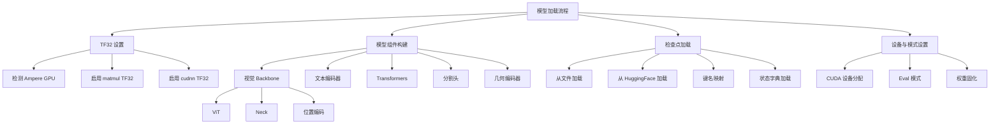
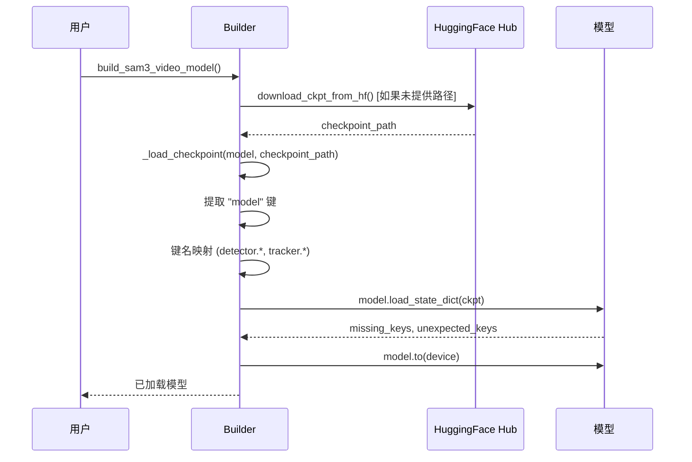

# SAM3 推理部署 - 模型加载与初始化模块技术分析

## 1. 概述

模型加载与初始化模块是 SAM3 推理系统的入口，负责构建完整的模型架构、加载检查点、配置设备，以及准备推理环境。该模块在 `sam3/model_builder.py` 中实现。

## 2. 核心架构



## 3. TF32 自动优化

SAM3 自动启用 TensorFloat-32 优化，这是 Ampere 架构 GPU（A100、A30、A40 等）的原生数据格式。

### 代码位置
`sam3/model_builder.py:49-58`

### 实现细节

```python
def _setup_tf32() -> None:
    """Enable TensorFloat-32 for Ampere GPUs if available."""
    if torch.cuda.is_available():
        device_props = torch.cuda.get_device_properties(0)
        if device_props.major >= 8:
            torch.backends.cuda.matmul.allow_tf32 = True
            torch.backends.cudnn.allow_tf32 = True
```

### 技术优势

| 特性 | 说明 | 性能提升 |
|------|------|---------|
| 原生支持 | Ampere GPU 硬件直接支持 TF32 | 2-4x 加速 |
| 精度权衡 | FP32 相当精度，计算速度接近 FP16 | 平衡精度与速度 |
| 兼容性 | 自动检测 GPU 架构，非 Ampere GPU 不影响 | 向后兼容 |

## 4. 模型组件构建

### 4.1 位置编码 (Position Encoding)

**位置编码类型**: 正弦位置编码 (Sine Position Encoding)

**代码位置**: `sam3/model_builder.py:61-69`

```python
def _create_position_encoding(precompute_resolution=None):
    """Create position encoding for visual backbone."""
    return PositionEmbeddingSine(
        num_pos_feats=256,
        normalize=True,
        scale=None,
        temperature=10000,
        precompute_resolution=precompute_resolution,
    )
```

**参数说明**:
- `num_pos_feats=256`: 位置编码维度，与模型隐藏维度匹配
- `normalize=True`: 归一化位置坐标
- `temperature=10000`: 控制位置编码频率分布
- `precompute_resolution`: 预计算分辨率以优化推理速度

### 4.2 视觉 Backbone (Visual Backbone)

**模型**: ViT (Vision Transformer) - 32 层深度

**代码位置**: `sam3/model_builder.py:72-99`

```python
def _create_vit_backbone(compile_mode=None):
    """Create ViT backbone for visual feature extraction."""
    return ViT(
        img_size=1008,
        pretrain_img_size=336,
        patch_size=14,
        embed_dim=1024,
        depth=32,
        num_heads=16,
        mlp_ratio=4.625,
        norm_layer="LayerNorm",
        drop_path_rate=0.1,
        qkv_bias=True,
        use_abs_pos=True,
        tile_abs_pos=True,
        global_att_blocks=(7, 15, 23, 31),
        rel_pos_blocks=(),
        use_rope=True,
        use_interp_rope=True,
        window_size=24,
        pretrain_use_cls_token=True,
        retain_cls_token=False,
        ln_pre=True,
        ln_post=False,
        return_interm_layers=False,
        bias_patch_embed=False,
        compile_mode=compile_mode,
    )
```

**关键特性**:

| 特性 | 配置 | 说明 |
|------|------|------|
| 输入尺寸 | 1008x1008 | 大分辨率输入，保持细节 |
| Patch 大小 | 14 | 图像被划分为 72x72 的 patches |
| Embedding 维度 | 1024 | 高维特征表示 |
| 层数 | 32 | 深层网络捕获复杂模式 |
| 注意力头 | 16 | 并行注意力计算 |
| 全局注意力块 | (7, 15, 23, 31) | 稀疏全局注意力减少计算量 |
| RoPE | 启用 | 旋转位置编码增强位置感知 |

**性能分析**:
- 计算复杂度: O(N²) 其中 N = (1008/14)² = 5184 tokens
- 全局注意力仅在 4 个特定层触发，显著减少 FLOPs
- 稀疏注意力策略平衡了性能与精度

### 4.3 ViT Neck (特征金字塔)

**代码位置**: `sam3/model_builder.py:102-110`

```python
def _create_vit_neck(position_encoding, vit_backbone, enable_inst_interactivity=False):
    """Create ViT neck for feature pyramid."""
    return Sam3DualViTDetNeck(
        position_encoding=position_encoding,
        d_model=256,
        scale_factors=[4.0, 2.0, 1.0, 0.5],
        trunk=vit_backbone,
        add_sam2_neck=enable_inst_interactivity,
    )
```

**特征金字塔**:

| 层级 | 缩放因子 | 分辨率 | 用途 |
|------|---------|--------|------|
| P0 | 4.0 | 252x252 | 高分辨率细节 |
| P1 | 2.0 | 504x504 | 中等分辨率 |
| P2 | 1.0 | 1008x1008 | 主分辨率 |
| P3 | 0.5 | 2016x2016 | 上下文信息 |

### 4.4 文本编码器 (Text Encoder)

**代码位置**: `sam3/model_builder.py:489-498`

```python
def _create_text_encoder(bpe_path: str) -> VETextEncoder:
    """Create SAM3 text encoder."""
    tokenizer = SimpleTokenizer(bpe_path=bpe_path)
    return VETextEncoder(
        tokenizer=tokenizer,
        d_model=256,
        width=1024,
        heads=16,
        layers=24,
    )
```

**配置参数**:
- `d_model=256`: 文本 embedding 维度
- `width=1024`: Transformer 隐藏维度
- `heads=16`: 注意力头数
- `layers=24`: 编码器层数

### 4.5 VL Backbone (视觉-语言融合)

**代码位置**: `sam3/model_builder.py:113-115`

```python
def _create_vl_backbone(vit_neck, text_encoder):
    """Create visual-language backbone."""
    return SAM3VLBackbone(visual=vit_neck, text=text_encoder, scalp=1)
```

### 4.6 Transformer 编解码器

**编码器**: `sam3/model_builder.py:118-153`

```python
def _create_transformer_encoder() -> TransformerEncoderFusion:
    encoder_layer = TransformerEncoderLayer(
        activation="relu",
        d_model=256,
        dim_feedforward=2048,
        dropout=0.1,
        pos_enc_at_attn=True,
        pos_enc_at_cross_attn_keys=False,
        pos_enc_at_cross_attn_queries=False,
        pre_norm=True,
        self_attention=MultiheadAttention(
            num_heads=8,
            dropout=0.1,
            embed_dim=256,
            batch_first=True,
        ),
        cross_attention=MultiheadAttention(
            num_heads=8,
            dropout=0.1,
            embed_dim=256,
            batch_first=True,
        ),
    )

    encoder = TransformerEncoderFusion(
        layer=encoder_layer,
        num_layers=6,
        d_model=256,
        num_feature_levels=1,
        frozen=False,
        use_act_checkpoint=True,
        add_pooled_text_to_img_feat=False,
        pool_text_with_mask=True,
    )
```

**设计要点**:
- 6 层编码器，每层包含自注意力和交叉注意力
- 预归一化 (Pre-norm) 架构提升训练稳定性
- 激活检查点 (Act-Checkpoint) 减少显存占用

**解码器**: `sam3/model_builder.py:156-190`

```python
def _create_transformer_decoder() -> TransformerDecoder:
    decoder_layer = TransformerDecoderLayer(
        activation="relu",
        d_model=256,
        dim_feedforward=2048,
        dropout=0.1,
        cross_attention=MultiheadAttention(
            num_heads=8,
            dropout=0.1,
            embed_dim=256,
        ),
        n_heads=8,
        use_text_cross_attention=True,
    )

    decoder = TransformerDecoder(
        layer=decoder_layer,
        num_layers=6,
        num_queries=200,
        return_intermediate=True,
        box_refine=True,
        num_o2m_queries=0,
        dac=True,
        boxRPB="log",
        d_model=256,
        frozen=False,
        interaction_layer=None,
        dac_use_selfatt_ln=True,
        resolution=1008,
        stride=14,
        use_act_checkpoint=True,
        presence_token=True,
    )
```

**关键特性**:
- 200 个可学习查询 (Learnable Queries)
- 动态锚框 (Dense Anchor Cues)
- 存在性令牌 (Presence Token)
- 文本交叉注意力

## 5. 检查点加载

### 5.1 检查点加载流程



### 5.2 检查点加载实现

**代码位置**: `sam3/model_builder.py:526-549`

```python
def _load_checkpoint(model, checkpoint_path):
    """Load model checkpoint from file."""
    with g_pathmgr.open(checkpoint_path, "rb") as f:
        ckpt = torch.load(f, map_location="cpu", weights_only=True)
    if "model" in ckpt and isinstance(ckpt["model"], dict):
        ckpt = ckpt["model"]
    sam3_image_ckpt = {
        k.replace("detector.", ""): v for k, v in ckpt.items() if "detector" in k
    }
    if model.inst_interactive_predictor is not None:
        sam3_image_ckpt.update(
            {
                k.replace("tracker.", "inst_interactive_predictor.model."): v
                for k, v in ckpt.items()
                if "tracker" in k
            }
        )
    missing_keys, _ = model.load_state_dict(sam3_image_ckpt, strict=False)
    if len(missing_keys) > 0:
        print(
            f"loaded {checkpoint_path} and found "
            f"missing and/or unexpected keys:\n{missing_keys=}"
        )
```

### 5.3 HuggingFace 自动下载

**代码位置**: `sam3/model_builder.py:644-650`

```python
def download_ckpt_from_hf():
    SAM3_MODEL_ID = "facebook/sam3"
    SAM3_CKPT_NAME = "sam3.pt"
    SAM3_CFG_NAME = "config.json"
    _ = hf_hub_download(repo_id=SAM3_MODEL_ID, filename=SAM3_CFG_NAME)
    checkpoint_path = hf_hub_download(repo_id=SAM3_MODEL_ID, filename=SAM3_CKPT_NAME)
    return checkpoint_path
```

### 5.4 检查点加载策略

| 策略 | 说明 | 优点 |
|------|------|------|
| CPU 加载 | `map_location="cpu"` | 避免多个 GPU 同时加载时显存竞争 |
| 非严格模式 | `strict=False` | 允许部分权重缺失（用于兼容性） |
| 键名映射 | 自动转换权重名称 | 支持模型结构演进 |

## 6. 模型构建入口

### 6.1 图像模型构建

**代码位置**: `sam3/model_builder.py:560-641`

```python
def build_sam3_image_model(
    bpe_path=None,
    device="cuda" if torch.cuda.is_available() else "cpu",
    eval_mode=True,
    checkpoint_path=None,
    load_from_HF=True,
    enable_segmentation=True,
    enable_inst_interactivity=False,
    compile=False,
):
    """
    Build SAM3 image model

    Args:
        bpe_path: Path to the BPE tokenizer vocabulary
        device: Device to load the model on ('cuda' or 'cpu')
        eval_mode: Whether to set the model to evaluation mode
        checkpoint_path: Optional path to model checkpoint
        enable_segmentation: Whether to enable segmentation head
        enable_inst_interactivity: Whether to enable instance interactivity (SAM 1 task)
        compile_mode: To enable compilation, set to "default"

    Returns:
        A SAM3 image model
    """
```

### 6.2 视频模型构建

**代码位置**: `sam3/model_builder.py:653-791`

```python
def build_sam3_video_model(
    checkpoint_path: Optional[str] = None,
    load_from_HF=True,
    bpe_path: Optional[str] = None,
    has_presence_token: bool = True,
    geo_encoder_use_img_cross_attn: bool = True,
    strict_state_dict_loading: bool = True,
    apply_temporal_disambiguation: bool = True,
    device="cuda" if torch.cuda.is_available() else "cpu",
    compile=False,
) -> Sam3VideoInferenceWithInstanceInteractivity:
    """
    Build SAM3 dense tracking model.
    """
```

### 6.3 视频预测器构建

**代码位置**: `sam3/model_builder.py:794-797`

```python
def build_sam3_video_predictor(*model_args, gpus_to_use=None, **model_kwargs):
    return Sam3VideoPredictorMultiGPU(
        *model_args, gpus_to_use=gpus_to_use, **model_kwargs
    )
```

## 7. 性能权衡分析

### 7.1 编译模式 (Compile)

```python
compile_mode = "default" if compile else None
```

| 模式 | 启动延迟 | 推理速度 | 适用场景 |
|------|---------|---------|---------|
| None (Eager) | 低 | 基准 | 开发调试 |
| "default" | 高（首次） | +20-40% | 生产部署 |

### 7.2 实例交互功能 (Instance Interactivity)

```python
enable_inst_interactivity=True
```

| 选项 | 显存占用 | 功能 | 启用场景 |
|------|---------|------|---------|
| False | 基准 | 仅文本/框提示 | 纯检测任务 |
| True | +10-15% | 点提示支持 | 交互式分割 |

## 8. 部署配置建议

### 8.1 GPU 选择

| GPU 型号 | 推荐 TF32 | 最大批次 | 显存需求 |
|---------|-----------|---------|---------|
| A100 80GB | 是 | 4 | ~40GB |
| A100 40GB | 是 | 2 | ~20GB |
| V100 32GB | 否 | 1 | ~18GB |
| RTX 3090 | 否 | 1 | ~24GB |

### 8.2 推荐配置

```python
# 生产环境配置
model = build_sam3_video_model(
    checkpoint_path="path/to/checkpoint.pt",
    apply_temporal_disambiguation=True,
    compile=True,  # 启用编译优化
)

# 开发环境配置
model = build_sam3_image_model(
    checkpoint_path=None,  # 从 HF 下载
    enable_inst_interactivity=True,
    compile=False,  # 跳过编译，加快加载
)
```

## 9. 常见问题与解决方案

| 问题 | 原因 | 解决方案 |
|------|------|---------|
| CUDA OOM | 模型太大/批次过大 | 减少 batch size 或使用 `compile=False` |
| 检查点加载失败 | 网络问题/路径错误 | 手动下载并指定 `checkpoint_path` |
| TF32 不可用 | GPU 架构低于 Ampere | 自动降级，无需处理 |
| 权重不匹配 | 模型版本不兼容 | 使用 `strict=False` 或更新代码 |

## 10. 关键文件索引

| 文件 | 行号 | 关键函数 |
|------|------|---------|
| `model_builder.py` | 49-58 | `_setup_tf32()` |
| `model_builder.py` | 61-69 | `_create_position_encoding()` |
| `model_builder.py` | 72-99 | `_create_vit_backbone()` |
| `model_builder.py` | 102-110 | `_create_vit_neck()` |
| `model_builder.py` | 489-498 | `_create_text_encoder()` |
| `model_builder.py` | 118-153 | `_create_transformer_encoder()` |
| `model_builder.py` | 156-190 | `_create_transformer_decoder()` |
| `model_builder.py` | 526-549 | `_load_checkpoint()` |
| `model_builder.py` | 560-641 | `build_sam3_image_model()` |
| `model_builder.py` | 653-791 | `build_sam3_video_model()` |
