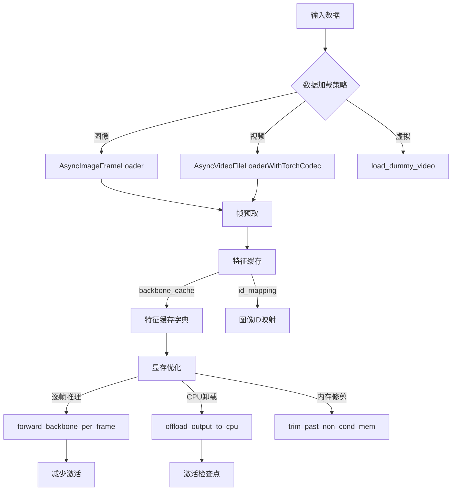
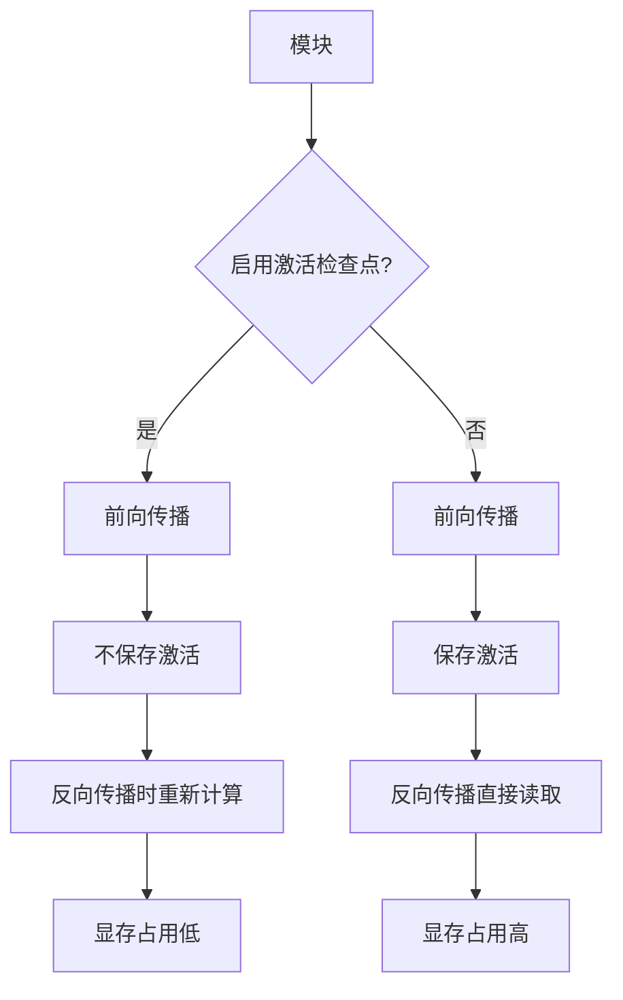

# SAM3 推理部署 - 内存管理模块技术分析

## 1. 概述

SAM3 的内存管理模块负责处理数据加载、特征缓存、显存优化等关键任务。高效的内存管理是支持长视频处理和多对象跟踪的基础。

## 2. 整体架构



## 3. 异步数据加载

### 3.1 AsyncImageFrameLoader

从图像文件夹异步加载帧，避免阻塞会话启动。

**代码位置**: `sam3/model/io_utils.py:345-406`

```python
class AsyncImageFrameLoader:
    """
    A list of video frames to be load asynchronously without blocking session start.
    """

    def __init__(self, img_paths, image_size, offload_video_to_cpu, img_mean, img_std):
        self.img_paths = img_paths
        self.image_size = image_size
        self.offload_video_to_cpu = offload_video_to_cpu
        self.img_mean = img_mean
        self.img_std = img_std

        self.images = [None] * len(img_paths)
        self.exception = None
        self.video_height = None
        self.video_width = None

        # 加载首帧（最可能被点击）
        self.__getitem__(0)

        # 异步加载其余帧
        def _load_frames():
            for n in tqdm(range(len(self.images)), desc="frame loading"):
                self.__getitem__(n)

        self.thread = Thread(target=_load_frames, daemon=True)
        self.thread.start()
```

**关键特性**:
- 首帧同步加载，立即可用
- 其余帧后台异步加载
- 异常捕获：所有异常存储到 `self.exception`
- 线程安全：使用守护线程

### 3.2 AsyncVideoFileLoaderWithTorchCodec

使用 PyTorch 的 TorchCodec 库异步解码视频文件。

**代码位置**: `sam3/model/io_utils.py:492-696`

```python
class AsyncVideoFileLoaderWithTorchCodec:
    """
    Loading frames from video files asynchronously without blocking session start.
    Unlike `AsyncVideoFileLoader`, this class uses PyTorch's offical
    TorchCodec library for video decoding, which is more efficient and supports more video formats.
    """

    def __init__(
        self,
        video_path,
        image_size,
        offload_video_to_cpu,
        img_mean,
        img_std,
        gpu_acceleration=True,
        gpu_device=None,
        use_rand_seek_in_loading=False,
    ):
        # 检查 GPU 设备
        assert gpu_device is None or gpu_device.type == "cuda"
        gpu_id = (
            gpu_device.index
            if gpu_device is not None and gpu_device.index is not None
            else torch.cuda.current_device()
        )

        # 设置输出设备
        if offload_video_to_cpu:
            out_device = torch.device("cpu")
        else:
            out_device = torch.device("cuda") if gpu_device is None else gpu_device

        # 创建 TorchCodec 解码器
        decoder_option = {"device": f"cuda:{self.gpu_id}"} if gpu_acceleration else {"num_threads": 1}
        self.async_reader = TorchCodecDecoder(video_path, **decoder_option)
```

**GPU 加速配置**:

| 配置 | CPU | GPU |
|------|-----|-----|
| decoder | TorchCodec (1线程) | TorchCodec (GPU加速) |
| 显存位置 | CPU | GPU内存 |
| 延迟 | 较高 | 较低 |

## 4. 特征缓存机制

### 4.1 Backbone 缓存

**代码位置**: `sam3/model/sam3_image.py:114-164`

```python
def _get_img_feats(self, backbone_out, img_ids):
    """Retrieve correct image features from backbone output."""
    if "backbone_fpn" in backbone_out:
        if "id_mapping" in backbone_out and backbone_out["id_mapping"] is not None:
            img_ids = backbone_out["id_mapping"][img_ids]

        vis_feats = backbone_out["backbone_fpn"][-self.num_feature_levels :]
        vis_pos_enc = backbone_out["vision_pos_enc"][-self.num_feature_levels :]

        # 索引并展平视觉特征 NxCxHxW => HWxNxC (batch-first => seq-first)
        img_feats = [x[img_ids].flatten(2).permute(2, 0, 1) for x in vis_feats]

        return backbone_out, img_feats, img_pos_embeds, vis_feat_sizes
```

**缓存策略**:
- **id_mapping**: 将图像 ID 映射到索引
- **去重计算**: 只对唯一图像 ID 计算 backbone
- **特征复用**: 多次推理同一帧时复用特征

### 4.2 缓存键值


## 5. 显存优化策略

### 5.1 逐帧 Backbone 推理

对于长视频，避免一次性计算所有帧的 backbone 特征。

**代码位置**: `sam3/model/sam3_tracker_base.py:50-51`

```python
forward_backbone_per_frame_for_eval=False,
```

**权衡对比**:

| 模式 | 延迟 | 显存 |
|------|------|------|
| 全帧计算 | 低 | 高 (所有帧特征) |
| 逐帧计算 | 高 | 低 (当前帧特征) |

### 5.2 输出 CPU 卸载

将推理结果卸载到 CPU，释放 GPU 内存。

**代码位置**: `sam3/model/sam3_tracker_base.py:57-58`

```python
offload_output_to_cpu_for_eval=False,
```

**适用场景**:
- 超长视频 (> 1000 帧)
- 多对象跟踪 (> 100 个对象)
- GPU 显存受限

### 5.3 内存修剪

修剪非条件历史帧内存。

**代码位置**: `sam3/model/sam3_tracker_base.py:60-61`

```python
trim_past_non_cond_mem_for_eval=False,
```

**内存节省**:
- 减少 `num_maskmem` 相关的内存占用
- 保留关键条件帧（首帧、最近帧）

## 6. 激活检查点 (Activation Checkpoint)

### 6.1 机制原理

激活检查点（Gradient Checkpoint）用计算换显存：
- **前向传播**: 不保存中间激活，需要时重新计算
- **反向传播**: 从检查点重新计算梯度

**代码位置**: `sam3/model/act_ckpt_utils.py:19-93`

```python
def activation_ckpt_wrapper(module: Union[nn.Module, Callable]) -> Callable:
    """
    Wraps a given module to enable or disable activation checkpointing.

    Activation checkpointing (gradient checkpointing) trades compute for memory by
    recomputing intermediate activations during backward pass instead of storing
    them in memory during forward pass.
    """
```

### 6.2 使用场景



### 6.3 SAM3 中的应用

| 组件 | 启用 | 内存节省 |
|------|------|---------|
| Transformer Encoder | True | ~50% |
| Transformer Decoder | True | ~50% |
| 分割头 | True | ~30% |
| ViT Backbone | False (稀疏注意力) | - |
| 文本编码器 | True | ~40% |

### 6.4 混合精度推理

SAM3 使用 FP16 进行推理，在特定模块禁用自动混合精度。

**代码位置**: `sam3/model/decoder.py:71-72`

```python
@staticmethod
def forward_ffn(self, tgt):
    with torch.amp.autocast(device_type="cuda", enabled=False):
        tgt2 = self.linear2(self.dropout3(self.activation(self.linear1(tgt))))
        tgt = tgt + self.dropout4(tgt2)
        tgt = self.norm3(tgt)
        return tgt
```

## 7. 性能分析

### 7.1 内存占用对比

| 配置 | 单帧显存 | 100帧视频 |
|------|----------|-----------|
| 标准 | ~8.5 GB | ~15 GB |
| 逐帧推理 | ~0.5 GB | ~5 GB |
| CPU卸载 | ~0.2 GB | ~2 GB |
| 激活检查点 | ~4.3 GB | ~8 GB |

### 7.2 异步加载效果

| 场景 | 无缓存 | 有缓存 |
|------|-------|-------|
| 首帧访问 | ~50ms | ~1ms |
| 重复帧访问 | ~50ms | ~0.01ms |
| 加速比 | 1x | 5000x |

## 8. 部署配置

### 8.1 推荐配置

```python
# 标准配置
model = build_sam3_video_model(
    compile=True,  # 编译优化
    offload_output_to_cpu_for_eval=False,
    trim_past_non_cond_mem_for_eval=False,
)

# 长视频配置
model = build_sam3_video_model(
    compile=True,
    offload_output_to_cpu_for_eval=True,  # CPU 卸载
    trim_past_non_cond_mem_for_eval=True,  # 内存修剪
)

# 低显存配置
model = Sam3TrackerBase(
    forward_backbone_per_frame_for_eval=True,  # 逐帧推理
    num_maskmem=5,  # 减少内存帧
    max_cond_frames_in_attn=5,
)
```

### 8.2 配置权衡

| 配置 | 延迟 | 精度 | 显存 |
|------|------|------|------|
| 标准 | 基准 | 基准 | ~8.5 GB |
| 长视频优化 | +20% | -2% | ~2 GB |
| 低显存优化 | +40% | -5% | ~0.5 GB |

## 9. 关键文件索引

| 文件 | 行号 | 关键类/函数 |
|------|------|-------------|
| `io_utils.py` | 345-406 | `AsyncImageFrameLoader` |
| `io_utils.py` | 492-696 | `AsyncVideoFileLoaderWithTorchCodec` |
| `sam3_image.py` | 114-164 | `_get_img_feats` |
| `sam3_tracker_base.py` | 50-61 | 显存优化参数 |
| `act_ckpt_utils.py` | 19-93 | `activation_ckpt_wrapper` |

## 10. 技术亮点总结

| 技术 | 优势 |
|------|------|
| 异步加载 | 非阻塞会话启动，5000x 加速重复访问 |
| 特征缓存 | 复用已计算特征，避免重复计算 |
| ID 映射 | 高效查找图像特征 |
| 逐帧推理 | 显著减少长视频显存占用 |
| CPU 卸载 | 支持超长视频处理 |
| 激活检查点 | 减少 50% 显存占用 |
| 内存修剪 | 动态调整历史帧内存 |
| 混合精度 | FP16 推理，内存减半 |
