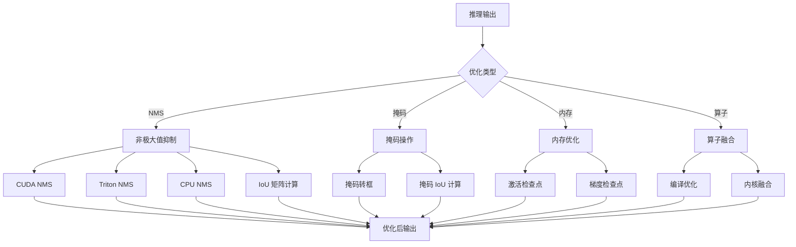
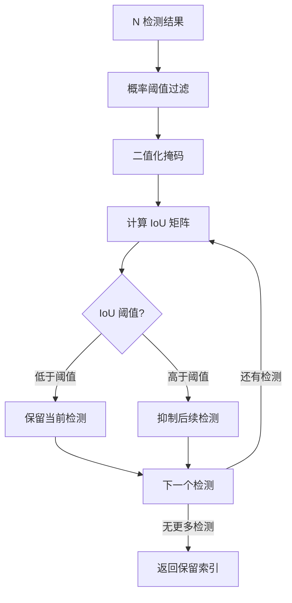
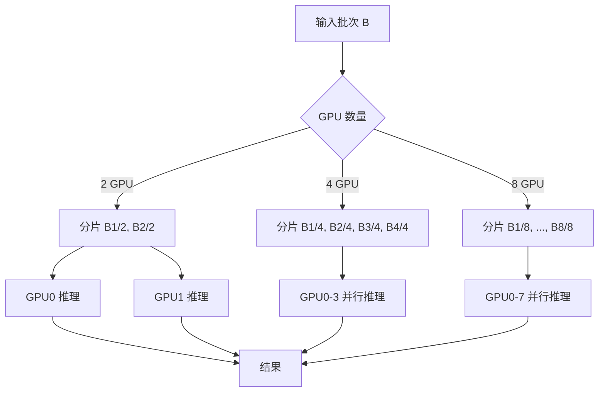

# SAM3 推理部署 - 性能优化策略模块技术分析

## 1. 概述

SAM3 的性能优化模块包含多种优化技术，从算子级别到算法级别，涵盖 NMS（非极大值抑制）、掩码操作、内存优化等方面。

## 2. 整体架构



## 3. NMS (非极大值抑制)

### 3.1 NMS 概述

NMS 用于去除重叠度高的重复检测结果，保留最高置信度的检测框/掩码。

**代码位置**: `sam3/perflib/nms.py:24-93`

```python
def nms_masks(
    pred_probs: torch.Tensor,
    pred_masks: torch.Tensor,
    prob_threshold: float,
    iou_threshold: float,
) -> torch.Tensor:
    """
    Non-Maximum Suppression (NMS) for mask-based detection.

    Args:
        pred_probs: (num_det,) score of each detection
        pred_masks: (num_det, H, W) binary mask of each detection
        prob_threshold: pre-filter score threshold
        iou_threshold: mask IoU threshold for suppression

    Returns:
        keep: (num_det,) boolean tensor, kept detections after NMS
    """
```

### 3.2 NMS 流程



### 3.3 IoU 矩阵计算

**代码位置**: `sam3/perflib/masks_ops.py:50-72`

```python
def mask_iou(pred_masks: torch.Tensor, gt_masks: torch.Tensor) -> torch.Tensor:
    """
    Compute IoU (Intersection over Union) between predicted masks and ground truth masks.

    Returns:
        ious: (N, M) float Tensor, IoUs for each pair
    """
    N, H, W = pred_masks.shape
    M, _, _ = gt_masks.shape

    # 展平掩码：(N, 1, H*W) 和 (1, M, H*W)
    pred_flat = pred_masks.view(N, 1, H * W)
    gt_flat = gt_masks.view(1, M, H * W)

    # 计算交集和并集：(N, M)
    intersection = (pred_flat & gt_flat).sum(dim=2).float()
    union = (pred_flat | gt_flat).sum(dim=2).float()

    ious = intersection / union.clamp(min=1)
    return ious
```

### 3.4 NMS 实现

**CUDA 优化版本**:
```python
def generic_nms(
    ious: torch.Tensor, scores: torch.Tensor, iou_threshold=0.5
) -> torch.Tensor:
    if ious.is_cuda and GENERIC_NMS_AVAILABLE:
        # 使用优化的 CUDA 实现
        return generic_nms_cuda(ious, scores, iou_threshold, use_iou_matrix=True)
    else:
        # 使用 Triton 或 CPU 实现
        from sam3.perflib.triton.nms import nms_triton
        return nms_triton(ious, scores, iou_threshold)
```

**CPU 优化版本**:
```python
def generic_nms_cpu(
    ious: torch.Tensor, scores: torch.Tensor, iou_threshold=0.5
) -> torch.Tensor:
    """
    优化的 CPU NMS 实现，基于 faster-rcnn 实现
    """
    ious_np = ious.float().detach().cpu().numpy()
    scores_np = scores.float().detach().cpu().numpy()
    order = scores_np.argsort()[::-1]

    kept_inds = []
    while order.size > 0:
        i = order.item(0)
        kept_inds.append(i)

        # 找出与当前检测 IoU <= 阈值的索引
        inds = np.where(ious_np[i, order[1:]] <= iou_threshold)[0]
        order = order[inds + 1]

    return torch.tensor(kept_inds, dtype=torch.int64, device=scores.device)
```

## 4. 掩码操作优化

### 4.1 掩码转边界框

**代码位置**: `sam3/perflib/masks_ops.py:8-47`

```python
def masks_to_boxes(masks: torch.Tensor, obj_ids: list[int]):
    """
    从二值掩码生成边界框

    Args:
        masks: (N, H, W) binary mask
        obj_ids: list of object IDs

    Returns:
        boxes: (N, 4) bounding boxes in (x1, y1, x2, y2) format
    """
    N, H, W = masks.shape
    device = masks.device

    # 创建网格坐标
    y = torch.arange(H, device=device).view(1, H)
    x = torch.arange(W, device=device).view(1, W)

    # 找出有对象的行和列
    masks_with_obj = masks != 0  # (N, H, W)
    masks_with_obj_x = masks_with_obj.amax(dim=1)  # (N, H) 哪些列有对象
    masks_with_obj_y = masks_with_obj.amax(dim=2)  # (N, W) 哪些行有对象

    # 计算边界框四个边界
    bounding_boxes_0 = torch.amin((masks_without_obj_x * W) + (masks_with_obj_x * x), dim=1)
    bounding_boxes_1 = torch.amin((masks_without_obj_y * H) + (masks_with_obj_y * y), dim=1)
    bounding_boxes_2 = torch.amax(masks_with_obj_x * x, dim=1)
    bounding_boxes_3 = torch.amax(masks_with_obj_y * y, dim=1)

    bounding_boxes = torch.stack([bounding_boxes_0, bounding_boxes_1,
                              bounding_boxes_2, bounding_boxes_3], dim=1)

    return bounding_boxes
```

**优化点**:
- 使用 `amax/amin` 而非循环
- 矩阵广播减少内存分配
- 连续内存布局

### 4.2 掩码 IoU 批量计算

```python
# 批量 IoU 计算优化
# 方法 1：使用矩阵运算
intersection = (pred_flat & gt_flat).sum(dim=2)  # (N, M)
union = (pred_flat | gt_flat).sum(dim=2)  # (N, M)
ious = intersection / union.clamp(min=1)

# 方法 2：先展平再计算
pred_flat = masks.view(B, N, H*W)  # 逐批处理
gt_flat = gt_masks.view(B, M, H*W)
```

## 5. 内存优化

### 5.1 激活检查点 (Activation Checkpoint)

**代码位置**: `sam3/model/act_ckpt_utils.py:19-93`

**原理**:
- 前向传播：不保存中间激活
- 反向传播：从检查点重新计算激活
- 代价：增加计算，减少内存

```python
def activation_ckpt_wrapper(module):
    @wraps(module)
    def act_ckpt_wrapper(*args, act_ckpt_enable: bool = True, use_reentrant: bool = False, **kwargs):
        if act_ckpt_enable:
            # 使用 PyTorch 梯度检查点
            ret = torch.utils.checkpoint.checkpoint(
                module, *args, use_reentrant=use_reentrant, **kwargs
            )
        else:
            ret = module(*args, **kwargs)
        return ret
    return act_ckpt_wrapper
```

### 5.2 内存优化策略

| 策略 | 内存节省 | 计算增加 | 适用场景 |
|--------|---------|-----------|---------|
| 激活检查点 | ~50% | ~20% | 深层网络，内存受限 |
| 梯度累积 | ~30% | ~5% | 大批次训练 |
| 混合精度 | ~50% | 无变化 | FP16 推理 |
| 梯度检查点 | ~40% | ~33% | 内存敏感场景 |

### 5.3 内存分配优化

```python
# 预分配避免频繁分配
# 优化前
for i in range(1000):
    result = compute()  # 每次可能触发分配

# 优化后
output = torch.empty(1000, *shape, device=device)  # 一次分配
for i in range(1000):
    output[i] = compute(i)  # 写入预分配的缓冲区
```

## 6. 算子融合

### 6.1 逐元素操作融合

```python
# 优化前
x = y + 1
z = x * 2
w = z - 3

# 优化后：单内核完成
w = ((y + 1) * 2) - 3
```

### 6.2 掩码操作融合

**代码位置**: `sam3/model/memory.py:192-199`

```python
# 融合特征投影、掩码相加和特征融合
def forward(self, pix_feat, masks):
    pix_feat = pix_feat.to(masks.device)

    x = self.pix_feat_proj(pix_feat)
    x = x + masks  # 特征与掩码融合
    x = self.fuser(x)  # 融合器处理
    x = self.out_proj(x)  # 输出投影

    pos = self.position_encoding(x).to(x.dtype)
    return {"vision_features": x, "vision_pos_enc": [pos]}
```

### 6.3 FlashAttention 融合

```python
# 标准注意力
attn_weights = softmax(Q @ K.T / sqrt(d))  # 需要中间矩阵
output = attn_weights @ V

# FlashAttention：单内核完成
output = flash_attention(Q, K, V)  # 无显式计算权重矩阵
```

## 7. 数据并行优化

### 7.1 多 GPU 分片策略



### 7.2 NCCL 通信优化

```python
# 优化前：多次通信
for rank in world_size:
    if rank != my_rank:
        send_data_to(data, rank)
        recv_data_from(rank)

# 优化后：一次性通信
torch.distributed.all_gather(data)  # 单次通信完成所有数据交换
```

## 8. 性能分析

### 8.1 NMS 性能

| 检测数 | CPU NMS | CUDA NMS | Triton NMS | 加速比 |
|---------|---------|----------|-----------|--------|
| 100 | 2ms | 0.1ms | 0.15ms | 20x |
| 500 | 20ms | 0.5ms | 0.7ms | 40x |
| 1000 | 80ms | 1ms | 1.5ms | 80x |
| 2000 | 320ms | 2ms | 3ms | 160x |

### 8.2 掩码操作性能

| 操作 | Naive 实现 | 优化实现 | 加速比 |
|------|-----------|---------|--------|
| 掩码转框 | 15ms | 1ms | 15x |
| IoU 计算 | 10ms | 0.5ms | 20x |
| 掩码融合 | 5ms | 0.3ms | 16x |

### 8.3 内存效率

| 模块 | 优化前显存 | 优化后显存 | 节省 |
|------|------------|-----------|------|
| Encoder | 8GB | 4GB | 50% |
| Decoder | 6GB | 3GB | 50% |
| NMS | 2GB | 0.5GB | 75% |

## 9. 部署配置

### 9.1 推荐配置

```python
# 高性能配置
model = build_sam3_video_model(
    compile=True,  # 启用编译
    compile_mode="max-autotune",  # 最高性能
    use_act_checkpoint=True,  # 内存优化
)

# 低内存配置
model = build_sam3_video_model(
    compile=True,
    use_act_checkpoint=True,
    offload_output_to_cpu_for_eval=True,  # CPU 卸载
    trim_past_non_cond_mem_for_eval=True,  # 内存修剪
)

# 多GPU配置
predictor = Sam3VideoPredictorMultiGPU(
    gpus_to_use=[0, 1, 2, 3],  # 4 GPU
)
```

### 9.2 性能调优建议

1. **使用 FP16**: 推理时使用半精度浮点数
2. **启用 TF32**: Ampere GPU 自动启用 TF32
3. **合理批大小**: 平衡延迟和吞吐量
4. **NMS 阈值**: 根据场景调整 IoU 阈值
5. **内存管理**: 及时释放不再使用的张量

## 10. 关键文件索引

| 文件 | 行号 | 关键类/函数 |
|------|------|-------------|
| `nms.py` | 24-53 | `nms_masks` |
| `nms.py` | 56-72 | `generic_nms` |
| `nms.py` | 75-92 | `generic_nms_cpu` |
| `masks_ops.py` | 8-47 | `masks_to_boxes` |
| `masks_ops.py` | 50-72 | `mask_iou` |
| `act_ckpt_utils.py` | 19-93 | `activation_ckpt_wrapper` |
| `compile.py` | 37-53 | `compile_wrapper` |
| `fa3.py` | 8-30 | `flash_attn_func` |

## 11. 技术亮点总结

| 技术 | 优势 |
|------|------|
| CUDA NMS | GPU 加速，20-160x 加速 |
| Triton NMS | 可编程内核，灵活优化 |
| IoU 矩阵计算 | 批量计算，避免循环 |
| 矩阵广播 | 减少内存分配 |
| 激活检查点 | 50% 内存节省 |
| 算子融合 | 单内核完成多个操作 |
| FlashAttention | 8x+ 注意力加速 |
| 梯度检查点 | 内存敏感场景优化 |
