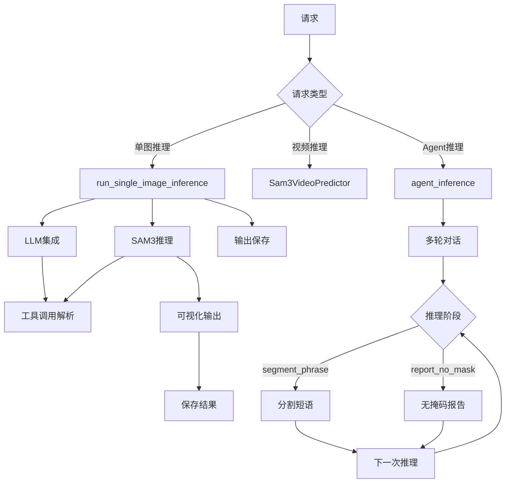
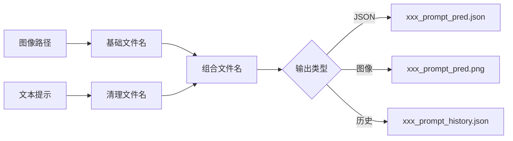
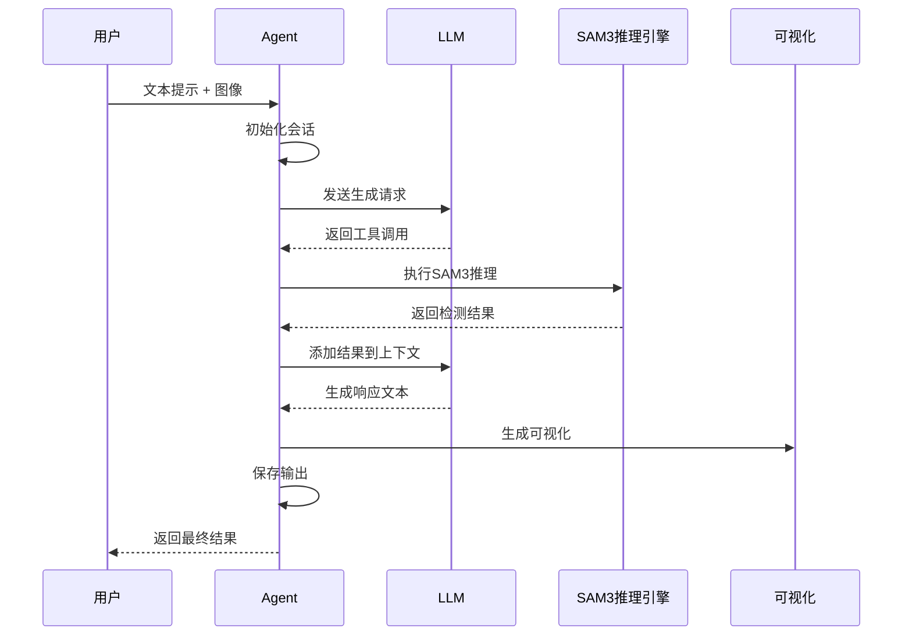
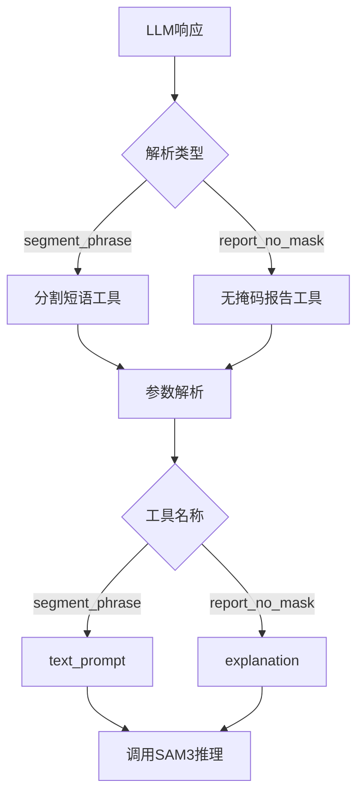
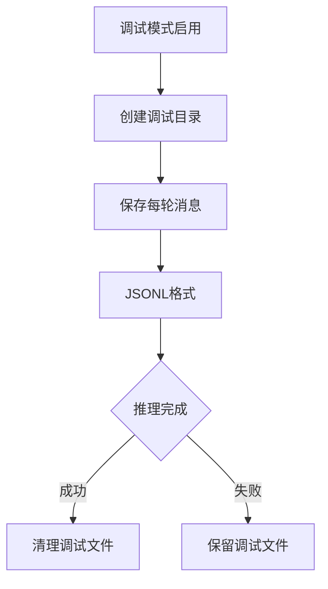
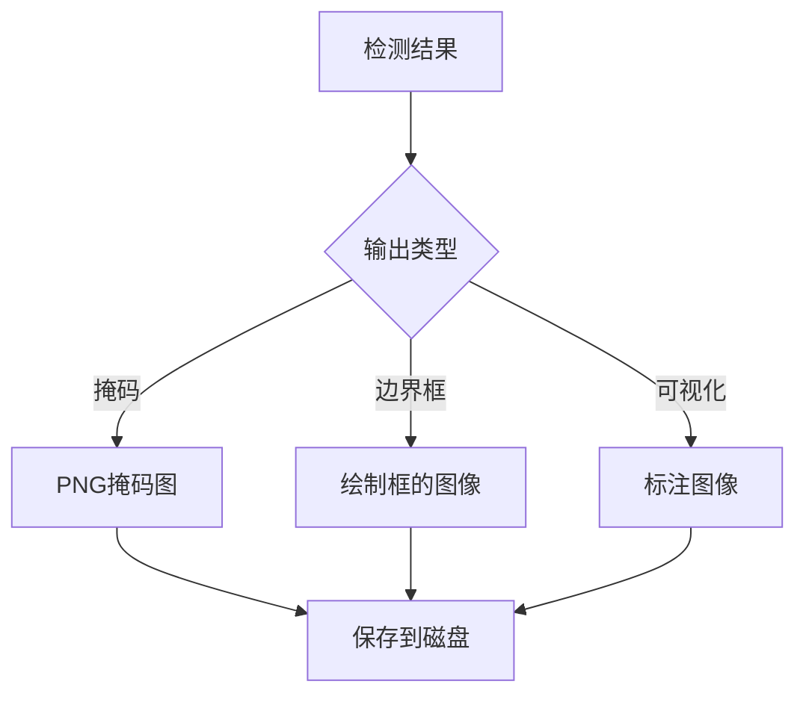
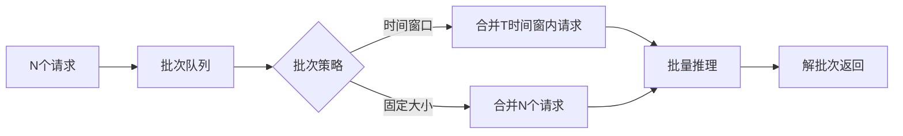

# SAM3 推理部署 - 服务化部署模块技术分析

## 1. 概述

SAM3 的服务化部署模块提供了将模型包装为推理服务的接口，支持单图推理、视频推理和 Agent 交互等多种使用模式。

## 2. 整体架构



## 3. 单图推理接口

### 3.1 接口定义

**代码位置**: `sam3/agent/inference.py:11-67`

```python
def run_single_image_inference(
    image_path,
    text_prompt,
    llm_config,
    send_generate_request,
    call_sam_service,
    output_dir="agent_output",
    debug=False,
):
    """
    运行单图推理

    Args:
        image_path: 输入图像路径
        text_prompt: 文本提示
        llm_config: LLM 配置
        send_generate_request: 生成请求函数
        call_sam_service: SAM3 服务调用函数
        output_dir: 输出目录
        debug: 调试模式
    """
```

### 3.2 输出文件



### 3.3 输出格式

**JSON 输出**:
```json
{
    "text_prompt": "a cat",
    "image_path": "/path/to/image.jpg",
    "predictions": [
        {
            "label": "cat",
            "score": 0.95,
            "bbox": [x1, y1, x2, y2],
            "mask": "/path/to/mask.png"
        }
    ],
    "metadata": {...}
}
```

## 4. Agent 推理架构

### 4.1 Agent 核心流程

**代码位置**: `sam3/agent/agent_core.py:124-250+`



### 4.2 消息管理

**代码位置**: `sam3/agent/agent_core.py:56-121`

```python
def _prune_messages_for_next_round(
    messages_list,
    used_text_prompts,
    latest_sam3_text_prompt,
    img_path,
    initial_text_prompt,
):
    """
    返回新的消息列表，仅包含：
    1) messages[:2] (第一个两条消息)
    2) 最近的助手消息（包含segment_phrase工具调用）
    """
    # 保持最多10条历史消息
    assert len(messages_list) < 10

    # 第一部分：前两条消息
    part1 = copy.deepcopy(messages_list[:2])

    # 第二部分：最近的segment_phrase工具调用
    part2_start_idx = None
    for idx in range(len(messages_list) - 1, 1, -1):
        msg = messages_list[idx]
        if msg.get("role") != "assistant":
            continue
        for content in msg["content"]:
            if (
                isinstance(content, dict)
                and content.get("type") == "text"
                and "<tool>" in content.get("text", "")
                and "segment_phrase" in content.get("text", "")
            ):
                part2_start_idx = idx
                break
        if part2_start_idx is not None:
            break

    part2 = messages_list[part2_start_idx:] if part2_start_idx is not None else []

    # 组装新消息列表
    new_messages = list(part1)
    new_messages.extend(part2)
    return new_messages
```

### 4.3 对话轮次管理

```python
generation_count = 0
max_generations = 100  # 最大轮次限制

while generated_text is not None and generation_count < max_generations:
    # 当前轮次
    print(f"Round {generation_count + 1}")
    generated_text = send_generate_request(messages)

    # 解析工具调用
    tool_call = parse_tool_call(generated_text)

    # 执行推理
    result = call_sam_service(tool_call)

    # 更新消息历史
    messages = prune_and_append(messages, tool_call, result)

    generation_count += 1
```

### 4.4 工具调用解析



**segment_phrase 工具**:
```json
{
    "name": "segment_phrase",
    "parameters": {
        "text_prompt": "a cat"
    }
}
```

## 5. 系统提示词管理

### 5.1 系统提示词加载

**代码位置**: `sam3/agent/agent_core.py:176-179`

```python
# 系统提示词路径
MLLM_SYSTEM_PROMPT_PATH = os.path.join(
    current_dir, "system_prompts/system_prompt.txt"
)

ITERATIVE_CHECKING_SYSTEM_PROMPT_PATH = os.path.join(
    current_dir, "system_prompts/system_prompt_iterative_checking.txt"
)

# 加载系统提示词
with open(MLLM_SYSTEM_PROMPT_PATH, "r") as f:
    system_prompt = f.read().strip()

with open(ITERATIVE_CHECKING_SYSTEM_PROMPT_PATH, "r") as f:
    iterative_checking_system_prompt = f.read().strip()
```

### 5.2 系统提示词结构

```python
messages = [
    {
        "role": "system",
        "content": system_prompt  # 指导Agent的行为和规则
    },
    {
        "role": "user",
        "content": [
            {"type": "image", "image": img_path},
            {
                "type": "text",
                "text": f"The above image is the raw input image. The initial user input query is: '{initial_text_prompt}'."
            },
        ],
    },
]
```

### 5.3 提示词切换策略

| 场景 | 系统提示词 | 用途 |
|------|----------|------|
| 初始推理 | `system_prompt.txt` | 单轮推理指导 |
| 迭代检查 | `iterative_checking.txt` | 多轮迭代优化 |
| Agent模式 | `agent_system_prompt.txt` | Agent推理模式 |

## 6. 调试与日志

### 6.1 调试模式

**代码位置**: `sam3/agent/agent_core.py:17-36`

```python
def save_debug_messages(messages_list, debug, debug_folder_path, debug_jsonl_path):
    """保存调试消息到JSONL文件"""
    if debug and debug_jsonl_path:
        os.makedirs(debug_folder_path, exist_ok=True)
        with open(debug_jsonl_path, "w") as f:
            for msg in messages_list:
                f.write(json.dumps(msg, indent=4) + "\n")

def cleanup_debug_files(debug, debug_folder_path, debug_jsonl_path):
    """函数成功返回时清理调试文件"""
    if debug and debug_folder_path:
        try:
            if os.path.exists(debug_jsonl_path):
                os.remove(debug_jsonl_path)
            if os.path.exists(debug_folder_path):
                os.rmdir(debug_folder_path)
        except Exception as e:
            print(f"Warning: Could not clean up debug files: {e}")
```

### 6.2 日志结构



**JSONL 格式**:
```jsonl
{"role": "system", "content": "..."}
{"role": "user", "content": [{"type": "image", ...}, ...]}
{"role": "assistant", "content": "..."}
```

## 7. 可视化输出

### 7.1 输出类型



### 7.2 输出目录结构

```
agent_output/
├── sam_out/                  # SAM3输出
│   ├── frame_0_mask.png
│   ├── frame_0_pred.json
│   └── ...
├── agent_debug_out/          # Agent调试输出
│   └── frame_x/
│       ├── debug_history.json
│       └── ...
└── frame_x_pred.png          # 最终可视化输出
```

## 8. 部署模式

### 8.1 单进程模式

```python
# 单GPU推理
predictor = build_sam3_video_predictor()
result = predictor.inference(...)
```

### 8.2 多进程模式

```python
# 多GPU推理
predictor = Sam3VideoPredictorMultiGPU(gpus_to_use=[0, 1, 2, 3])
result = predictor.inference(...)
```

### 8.3 服务化模式

```python
# 启动推理服务
from sam3.agent import serve

app = create_app()
app.run(host="0.0.0.0", port=8000)
```

### 8.4 部署对比

| 模式 | 延迟 | 吞吐量 | 扩展性 | 适用场景 |
|------|------|-------|--------|---------|
| 单进程 | 低 | 低 | 无 | 开发测试 |
| 多进程 | 中 | 高 | GPU级 | 生产环境 |
| 服务化 | 中 | 中 | 节点级 | 大规模部署 |

## 9. 性能优化

### 9.1 请求批处理



### 9.2 连接池管理

```python
# 模拟连接池（推荐使用gunicorn/uWSGI）
class RequestPool:
    def __init__(self, size=10):
        self.workers = [SAM3Predictor() for _ in range(size)]

    def process(self, requests):
        # 简单轮询分配
        for i, req in enumerate(requests):
            self.workers[i % len(self.workers)].inference(req)
        return [r.wait() for r in requests]
```

### 9.3 结果缓存

```python
# 结果缓存策略
cache = {}

def cached_inference(request):
    key = hash_request(request)
    if key in cache:
        return cache[key]

    result = do_inference(request)
    cache[key] = result
    return result
```

## 10. 安全考虑

### 10.1 输入验证

```python
def validate_input(image_path, text_prompt):
    """输入验证"""
    # 检查文件存在性
    if not os.path.exists(image_path):
        raise FileNotFoundError(f"Image not found: {image_path}")

    # 检查文件类型
    allowed_extensions = {'.jpg', '.jpeg', '.png'}
    ext = os.path.splitext(image_path)[1].lower()
    if ext not in allowed_extensions:
        raise ValueError(f"Unsupported image type: {ext}")

    # 检查文本长度
    if len(text_prompt) > 1000:
        raise ValueError("Text prompt too long (max 1000 chars)")
```

### 10.2 资源限制

```python
# 内存监控
def check_memory_usage():
    used = torch.cuda.memory_allocated() / 1024**2  # GB
    total = torch.cuda.get_device_properties(0).total_memory / 1024**2  # GB
    if used / total > 0.9:
        raise MemoryError("GPU memory over 90%")

# 请求限制
MAX_CONCURRENT_REQUESTS = 10
REQUEST_TIMEOUT = 30  # 秒
```

## 11. 部署配置

### 11.1 环境变量

```bash
# 推理服务配置
export SAM3_MODEL_PATH=/path/to/model.pt
export SAM3_DEVICE=cuda
export SAM3_ASYNC_LOADING=false

# Agent 配置
export MLLM_ENDPOINT=http://localhost:8000
export AGENT_DEBUG=false
export AGENT_OUTPUT_DIR=./agent_output

# 性能配置
export OMP_NUM_THREADS=8
export CUDA_VISIBLE_DEVICES=0,1,2,3
```

### 11.2 配置文件

```python
# config.py
CONFIG = {
    "model": {
        "checkpoint_path": "sam3.pt",
        "device": "cuda",
        "compile": True,
        "fp16": True,
    },
    "inference": {
        "batch_size": 4,
        "max_concurrent": 10,
        "timeout": 30,
    },
    "agent": {
        "system_prompt_path": "system_prompts/system_prompt.txt",
        "max_generations": 100,
        "debug": False,
    },
}
```

## 12. 关键文件索引

| 文件 | 行号 | 关键类/函数 |
|------|------|-------------|
| `inference.py` | 11-67 | `run_single_image_inference` |
| `agent_core.py` | 56-121 | `_prune_messages_for_next_round` |
| `agent_core.py` | 124-250+ | `agent_inference` |
| `agent_core.py` | 17-36 | `save_debug_messages` |
| `viz.py` | - | `visualize` |
| `client_sam3.py` | - | `call_sam_service` |
| `client_llm.py` | - | `send_generate_request` |

## 13. 技术亮点总结

| 技术 | 优势 |
|------|------|
| Agent架构 | 支持多轮对话和迭代优化 |
| 工具调用 | 灵活调用多种推理函数 |
| 消息修剪 | 保持上下文在窗口内 |
| 调试模式 | 详细的调试信息输出 |
| 异步加载 | 非阻塞启动 |
| 多模态输出 | 支持多种可视化格式 |
| 输出验证 | 确保输出完整性 |
