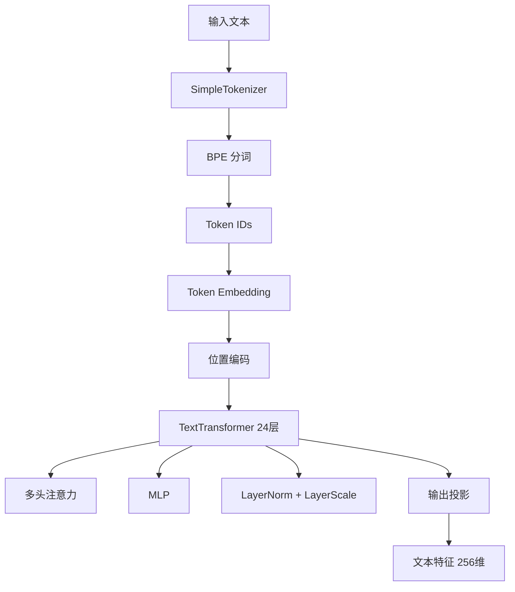
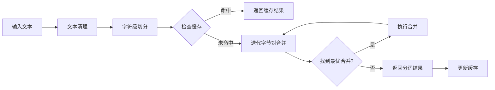
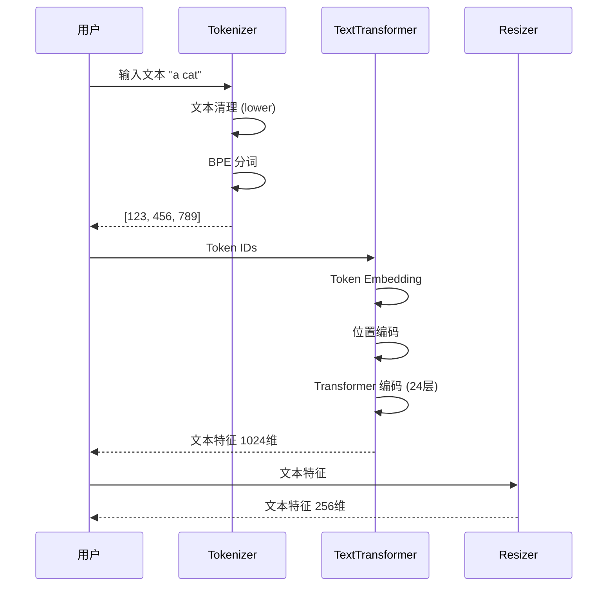

# SAM3 推理部署 - 文本编码器模块技术分析

## 1. 概述

SAM3 的文本编码器模块负责将自然语言文本转换为高维特征表示，使模型能够理解文本提示并执行零样本检测与分割。该模块采用 BPE (Byte Pair Encoding) 分词和 Transformer 架构，与视觉 backbone 协同工作。

## 2. 整体架构



## 3. 分词器 (SimpleTokenizer)

### 3.1 BPE 分词原理

Byte Pair Encoding (BPE) 是一种基于子词的分词方法，通过迭代合并最频繁的字节对来构建词汇表。

**代码位置**: `sam3/model/tokenizer_ve.py:130-256`

```python
class SimpleTokenizer(object):
    def __init__(
        self,
        bpe_path: Union[str, os.PathLike],
        additional_special_tokens: Optional[List[str]] = None,
        context_length: Optional[int] = DEFAULT_CONTEXT_LENGTH,
        clean: str = "lower",
    ):
        self.byte_encoder = bytes_to_unicode()
        self.byte_decoder = {v: k for k, v in self.byte_encoder.items()}

        with g_pathmgr.open(bpe_path, "rb") as fh:
            bpe_bytes = io.BytesIO(fh.read())
            merges = gzip.open(bpe_bytes).read().decode("utf-8").split("\n")

        # BPE 合并规则
        merges = merges[1: 49152 - 256 - 2 + 1]
        merges = [tuple(merge.split()) for merge in merges]

        # 构建词汇表
        vocab = list(bytes_to_unicode().values())
        vocab = vocab + [v + "</w>" for v in vocab]
        for merge in merges:
            vocab.append("".join(merge))

        # 特殊标记
        special_tokens = ["<start_of_text>", "<end_of_text>"]
        if additional_special_tokens:
            special_tokens += additional_special_tokens
        vocab.extend(special_tokens)

        self.encoder = dict(zip(vocab, range(len(vocab))))
        self.decoder = {v: k for k, v in self.encoder.items()}
        self.bpe_ranks = dict(zip(merges, range(len(merges))))
        self.cache = {t: t for t in special_tokens}

        special = "|".join(special_tokens)
        self.pat = re.compile(
            special + r"""|'s|'t|'re|'ve|'m|'d|[\p{L}]+|[\p{N}]|[^\s\p{L}\p{N}]+""",
            re.IGNORECASE,
        )
```

### 3.2 BPE 编码流程



### 3.3 BPE 编码实现

**代码位置**: `sam3/model/tokenizer_ve.py:170-206`

```python
def bpe(self, token):
    if token in self.cache:
        return self.cache[token]

    word = tuple(token[:-1]) + (token[-1] + "</w>",)
    pairs = get_pairs(word)

    if not pairs:
        return token + "</w>"

    while True:
        bigram = min(pairs, key=lambda pair: self.bpe_ranks.get(pair, float("inf")))
        if bigram not in self.bpe_ranks:
            break

        first, second = bigram
        new_word = []
        i = 0
        while i < len(word):
            try:
                j = word.index(first, i)
                new_word.extend(word[i:j])
                i = j
            except:
                new_word.extend(word[i:])
                break

            if word[i] == first and i < len(word) - 1 and word[i + 1] == second:
                new_word.append(first + second)
                i += 2
            else:
                new_word.append(word[i])
                i += 1

        new_word = tuple(new_word)
        word = new_word
        if len(word) == 1:
            break
        else:
            pairs = get_pairs(word)

    word = " ".join(word)
    self.cache[token] = word
    return word
```

### 3.4 词汇表配置

| 参数 | 值 | 说明 |
|------|-----|------|
| 词汇表大小 | ~49,408 | 基础 unicode 字符 + BPE 合并 + 特殊标记 |
| BPE 合并数 | 48,894 | 预训练的合并规则 |
| 上下文长度 | 32 | 最大 token 序列长度 |
| 特殊标记 | 2 | `<start_of_text>`, `<end_of_text>` |

### 3.5 文本清理策略

分词器支持三种清理模式：

**代码位置**: `sam3/model/tokenizer_ve.py:97-128`

| 模式 | 函数 | 处理 |
|------|------|------|
| canonicalize | `_clean_canonicalize()` | 移除标点、小写化 |
| lower | `_clean_lower()` | 移除空白、小写化 |
| whitespace | `_clean_whitespace()` | 仅移除多余空白 |

**推荐配置**: `clean="lower"` 用于推理，保留更多原始信息

## 4. TextTransformer 架构

### 4.1 Transformer 层结构

每个 Transformer 层包含多头注意力和 MLP，带有 LayerNorm 和 LayerScale。

**代码位置**: `sam3/model/text_encoder_ve.py:15-89`

```python
class ResidualAttentionBlock(nn.Module):
    def __init__(
        self,
        d_model: int,
        n_head: int,
        mlp_ratio: float = 4.0,
        ls_init_value: Optional[float] = None,
        act_layer: Callable[[], nn.Module] = nn.GELU,
        norm_layer: Callable[[int], nn.Module] = nn.LayerNorm,
    ):
        super().__init__()
        # Attention
        self.attn = nn.MultiheadAttention(d_model, n_head, batch_first=True)

        # LayerNorm, LayerScale
        self.ln_1 = norm_layer(d_model)
        self.ln_2 = norm_layer(d_model)

        self.ls_1 = (
            LayerScale(d_model, ls_init_value)
            if ls_init_value is not None
            else nn.Identity()
        )
        self.ls_2 = (
            LayerScale(d_model, ls_init_value)
            if ls_init_value is not None
            else nn.Identity()
        )

        # MLP
        mlp_width = int(d_model * mlp_ratio)
        self.mlp = nn.Sequential(
            OrderedDict(
                [
                    ("c_fc", nn.Linear(d_model, mlp_width)),
                    ("gelu", act_layer()),
                    ("c_proj", nn.Linear(mlp_width, d_model)),
                ]
            )
        )
```

### 4.2 TextTransformer 配置

**代码位置**: `sam3/model/text_encoder_ve.py:166-252`

```python
class TextTransformer(nn.Module):
    def __init__(
        self,
        context_length: int = 77,
        vocab_size: int = 49408,
        width: int = 512,
        heads: int = 8,
        layers: int = 12,
        mlp_ratio: float = 4.0,
        ls_init_value: Optional[float] = None,
        output_dim: int = 512,
        no_causal_mask: bool = False,
        pool_type: str = "none",
        proj_bias: bool = False,
        act_layer: Callable = nn.GELU,
        norm_layer: Callable[[], nn.Module] = nn.LayerNorm,
        output_tokens: bool = False,
        use_ln_post: bool = True,
        compile_mode: Optional[str] = None,
        use_act_checkpoint: bool = False,
    ):
```

### 4.3 配置参数对比

| 参数 | TextTransformer | VETextEncoder | 说明 |
|------|----------------|--------------|------|
| width | 512 | 1024 | 隐藏维度 |
| layers | 12 | 24 | Transformer 层数 |
| heads | 8 | 16 | 注意力头数 |
| context_length | 77 | 32 | 最大序列长度 |
| mlp_ratio | 4.0 | 4.0 | MLP 扩展比例 |
| output_dim | 512 | 256 | 输出维度 |
| use_act_checkpoint | False | True | 激活检查点 |

## 5. VETextEncoder

### 5.1 整体流程

**代码位置**: `sam3/model/text_encoder_ve.py:255-330`



### 5.2 VETextEncoder 实现

```python
class VETextEncoder(nn.Module):
    def __init__(
        self,
        d_model: int,
        tokenizer: Callable,
        width: int = 1024,
        heads: int = 16,
        layers: int = 24,
        context_length: int = 32,
        vocab_size: int = 49408,
        use_ln_post: bool = True,
        compile_mode: Optional[str] = None,
        use_act_checkpoint: bool = True,
    ):
        super().__init__()
        self.context_length = context_length
        self.use_ln_post = use_ln_post
        self.tokenizer = tokenizer

        self.encoder = TextTransformer(
            context_length=self.context_length,
            vocab_size=vocab_size,
            width=width,
            heads=heads,
            layers=layers,
            output_tokens=True,
            use_ln_post=use_ln_post,
            compile_mode=compile_mode,
            use_act_checkpoint=use_act_checkpoint,
        )
        self.resizer = nn.Linear(self.encoder.width, d_model)

    def forward(
        self,
        text: Union[List[str], Tuple[torch.Tensor, torch.Tensor, dict]],
        input_boxes: Optional[List] = None,
        device: torch.device = None,
    ) -> Tuple[torch.Tensor, torch.Tensor, torch.Tensor]:
        if isinstance(text[0], str):
            # 分词
            tokenized = self.tokenizer(text, context_length=self.context_length).to(device)
            text_attention_mask = (tokenized != 0).bool()

            # Token Embedding
            inputs_embeds = self.encoder.token_embedding(tokenized)
            _, text_memory = self.encoder(tokenized)

            # 注意力掩码反转（PyTorch 约定）
            text_attention_mask = text_attention_mask.ne(1)
            text_memory = text_memory.transpose(0, 1)

            # 投影到目标维度
            text_memory_resized = self.resizer(text_memory)
        else:
            # 预编码文本
            text_attention_mask, text_memory_resized, tokenized = text
            inputs_embeds = tokenized["inputs_embeds"]

        return (
            text_attention_mask,
            text_memory_resized,
            inputs_embeds.transpose(0, 1),
        )
```

### 5.3 文本特征维度转换


## 6. 文本池化策略

### 6.1 支持的池化类型

**代码位置**: `sam3/model/text_encoder_ve.py:150-163`

```python
def text_global_pool(
    x: torch.Tensor, text: Optional[torch.Tensor] = None, pool_type: str = "argmax"
) -> Tuple[torch.Tensor, torch.Tensor]:
    if pool_type == "first":
        pooled, tokens = x[:, 0], x[:, 1:]
    elif pool_type == "last":
        pooled, tokens = x[:, -1], x[:, :-1]
    elif pool_type == "argmax":
        # 从 EOT token 获取特征
        assert text is not None
        pooled, tokens = x[torch.arange(x.shape[0]), text.argmax(dim=-1)], x
    else:
        pooled = tokens = x
    return pooled, tokens
```

| 池化类型 | 说明 | 使用场景 |
|---------|------|---------|
| first | 取第一个 token | 通用 |
| last | 取最后一个 token | 语言模型 |
| argmax | 基于 EOT token 位置 | VE 专用 |
| none | 不池化，返回全部 token | 需要逐 token 处理 |

### 6.2 EOT Token 选择机制

SAM3 使用 **argmax** 池化策略，根据 `</end_of_text>` (EOT) token 的位置选择对应的特征作为池化结果。

```python
# 从编码器输出中根据 EOT token 位置选择特征
pooled, tokens = x[torch.arange(x.shape[0]), text.argmax(dim=-1)], x
```

这种设计的优势：
1. 自适应池化：根据实际输入长度动态选择最相关的特征
2. EOT 语义：EOT token 标记文本结束，其位置蕴含全局语义

## 7. 性能分析

### 7.1 计算复杂度

| 组件 | 输入 | 输出 | FLOPs (单文本) |
|------|------|------|-----------------|
| BPE 分词 | ~10 字符 | ~15 tokens | ~10³ |
| Token Embedding | 15 tokens | 15×1024 | ~5×10⁴ |
| Transformer (24层) | 15×1024 | 15×1024 | ~2×10⁸ |
| Resizer | 1024 | 256 | ~2.6×10⁵ |

**总计算量**: ~2×10⁸ FLOPs

### 7.2 内存占用

| 组件 | 显存占用 (FP16) |
|------|-----------------|
| Token Embedding | ~100 MB |
| Transformer 激活值 | ~50 MB |
| 总计（单文本）| ~150 MB |

### 7.3 BPE 缓存效果

BPE 分词器使用 LRU 缓存，显著加速重复文本的编码。

| 场景 | 无缓存 | 有缓存 | 加速比 |
|------|-------|-------|--------|
| 重复文本 | ~5ms | ~0.01ms | 500x |
| 新文本 | ~5ms | ~5ms | 1x |

## 8. 部署配置

### 8.1 推荐配置

```python
# 生产环境
text_encoder = VETextEncoder(
    d_model=256,              # 与视觉特征对齐
    tokenizer=SimpleTokenizer(bpe_path),
    width=1024,              # 内部维度
    heads=16,
    layers=24,
    context_length=32,
    use_ln_post=True,
    compile_mode=None,         # 使用编译优化
    use_act_checkpoint=True,   # 启用激活检查点
)

# 快速推理（低延迟）
text_encoder = VETextEncoder(
    d_model=256,
    tokenizer=SimpleTokenizer(bpe_path, context_length=16),  # 减少上下文长度
    width=768,               # 减少隐藏维度
    heads=12,
    layers=16,                # 减少层数
    context_length=16,
)
```

### 8.2 配置权衡

| 配置 | 延迟 | 精度 | 显存 |
|------|------|------|------|
| 完整配置 | 基准 | 基准 | ~150 MB |
| 减少层数 (16) | -25% | -2% | ~100 MB |
| 减少隐藏维度 (768) | -40% | -5% | ~85 MB |
| 短上下文 (16) | -50% | -1% | ~75 MB |

## 9. 关键文件索引

| 文件 | 行号 | 关键类/函数 |
|------|------|-------------|
| `tokenizer_ve.py` | 130-256 | `SimpleTokenizer` |
| `tokenizer_ve.py` | 170-206 | `SimpleTokenizer.bpe()` |
| `tokenizer_ve.py` | 208-216 | `SimpleTokenizer.encode()` |
| `tokenizer_ve.py` | 227-255 | `SimpleTokenizer.__call__()` |
| `text_encoder_ve.py` | 15-89 | `ResidualAttentionBlock` |
| `text_encoder_ve.py` | 92-147 | `Transformer` |
| `text_encoder_ve.py` | 166-252 | `TextTransformer` |
| `text_encoder_ve.py` | 255-330 | `VETextEncoder` |

## 10. 技术亮点总结

| 技术 | 优势 |
|------|------|
| BPE 分词 | 高效处理未知词，词汇表紧凑 |
| LRU 缓存 | 显著加速重复文本编码 |
| 激活检查点 | 减少显存占用 |
| EOT 选择池化 | 自适应特征选择，更好的语义对齐 |
| LayerScale | 稳定深层网络训练 |
| 模块化设计 | 文本和视觉编码器独立，便于维护 |
