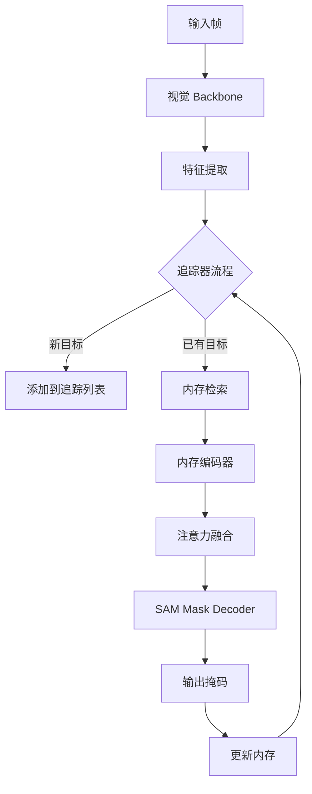
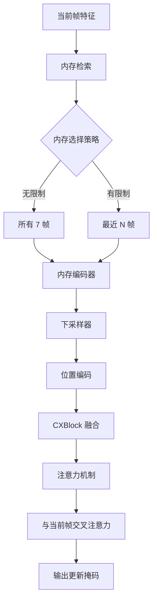
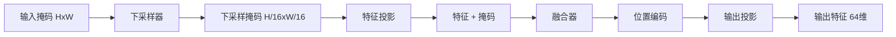
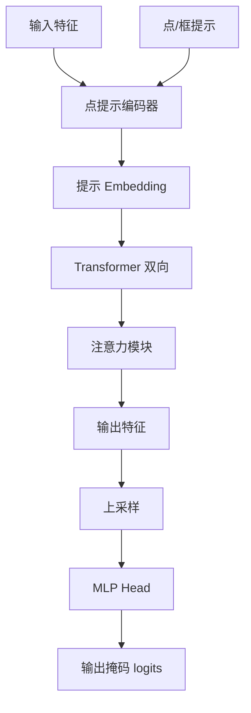

# SAM3 推理部署 - 追踪器模块技术分析

## 1. 概述

SAM3 的追踪器模块负责视频序列中的目标跟踪，结合检测器和追踪器实现密集跟踪。该模块基于 SAM2 架构，采用内存编码器存储历史帧信息，通过注意力机制实现跨帧关联。

## 2. 整体架构



## 3. Sam3TrackerBase 架构

### 3.1 核心组件

**代码位置**: `sam3/model/sam3_tracker_base.py:26-150`

```python
class Sam3TrackerBase(torch.nn.Module):
    def __init__(
        self,
        backbone,
        transformer,
        maskmem_backbone,
        num_maskmem=7,  # 默认 1 输入帧 + 6 历史帧
        image_size=1008,
        backbone_stride=14,
        max_cond_frames_in_attn=-1,
        keep_first_cond_frame=False,
        multimask_output_in_sam=False,
        multimask_min_pt_num=1,
        multimask_max_pt_num=1,
        multimask_output_for_tracking=False,
        forward_backbone_per_frame_for_eval=False,
        memory_temporal_stride_for_eval=1,
        offload_output_to_cpu_for_eval=False,
        trim_past_non_cond_mem_for_eval=False,
        non_overlap_masks_for_mem_enc=False,
        max_obj_ptrs_in_encoder=16,
        sam_mask_decoder_extra_args=None,
        compile_all_components=False,
        use_memory_selection=False,
        mf_threshold=0.01,
    ):
```

### 3.2 关键参数

| 参数 | 值 | 说明 |
|------|-----|------|
| num_maskmem | 7 | 内存帧数 |
| image_size | 1008 | 输入图像尺寸 |
| backbone_stride | 14 | Backbone 步长 |
| max_cond_frames_in_attn | -1 | 最大条件帧数 (-1 无限制) |
| keep_first_cond_frame | False | 是否保留首帧 |
| offload_output_to_cpu_for_eval | False | 输出卸载到 CPU |
| use_memory_selection | False | 内存选择机制 |

### 3.3 内存架构

**代码位置**: `sam3/model/sam3_tracker_base.py:92-149`



## 4. 内存编码器 (Memory Encoder)

### 4.1 SimpleMaskDownSampler

将掩码渐进式下采样，减少内存占用。

**代码位置**: `sam3/model/memory.py:21-80`

```python
class SimpleMaskDownSampler(nn.Module):
    """
    Progressively downsample a mask by total_stride, each time by stride.
    Note that LayerNorm is applied per *token*, like in ViT.
    """
```

**下采样流程**:

| 步骤 | 输入尺寸 | 输出尺寸 | 通道数 |
|------|---------|---------|--------|
| 输入 | H×W×1 | - | 1 |
| Conv 1 | H×W×1 | H/4×W/4×16 | 16 |
| LayerNorm 1 | H/4×W/4×16 | - | 16 |
| Conv 2 | H/4×W/4×16 | H/16×W/16×256 | 256 |
| LayerNorm 2 | H/16×W/16×256 | - | 256 |
| Conv 3 | H/16×W/16×256 | H/64×W/64×256 | 256 |
| ... | ... | ... | ... |
| 最终 | H/256×W/256×256 | - | 256 |

**总下采样比例**: 16×16 = 256

### 4.2 CXBlock

ConvNeXt 风格的特征融合块，用于融合掩码和特征。

**代码位置**: `sam3/model/memory.py:83-139`

```python
class CXBlock(nn.Module):
    """
    ConvNeXt Block.
    """
    def __init__(
        self,
        dim,
        kernel_size=7,
        padding=3,
        drop_path=0.0,
        layer_scale_init_value=1e-6,
        use_dwconv=True,
    ):
```

**结构**:
- 深度卷积 (Depthwise Conv)
- LayerNorm
- 1×1 卷积 (4× 扩展)
- GELU 激活
- 1×1 卷积 (4× 投影)
- LayerScale (初始化 1e-6)

### 4.3 SimpleFuser

多层特征融合器。

**代码位置**: `sam3/model/memory.py:142-157`

```python
class SimpleFuser(nn.Module):
    def __init__(self, layer, num_layers, dim=None, input_projection=False):
        super().__init__()
        self.proj = nn.Identity()
        self.layers = get_clones(layer, num_layers)

        if input_projection:
            self.proj = nn.Conv2d(dim, dim, kernel_size=1)
```

### 4.4 SimpleMaskEncoder

完整的掩码编码器。

**代码位置**: `sam3/model/memory.py:160-203`

```python
class SimpleMaskEncoder(nn.Module):
    def __init__(
        self,
        out_dim,
        mask_downsampler,
        fuser,
        position_encoding,
        in_dim=256,  # in_dim of pix_feats
    ):
```

**编码流程**:


## 5. 内存管理策略

### 5.1 内存帧存储

**代码位置**: `sam3/model/sam3_tracker_base.py:102-111`

```python
# Temporal encoding of memories
self.maskmem_tpos_enc = torch.nn.Parameter(
    torch.zeros(num_maskmem, 1, 1, self.mem_dim)
)
trunc_normal_(self.maskmem_tpos_enc, std=0.02)
```

- **mem_dim**: 内存特征维度 (64)
- **num_maskmem**: 内存帧数 (7)
- **初始化**: 零初始化，std=0.02

### 5.2 内存选择机制

当 `max_cond_frames_in_attn > 0` 时，只使用最近的 N 个条件帧。

**代码位置**: `sam3/model/sam3_tracker_utils.py`

```python
def select_closest_cond_frames(
    cond_frame_idxes,
    max_cond_frames_in_attn,
    keep_first_cond_frame,
):
    """
    Select closest conditioning frames for attention.
    """
    if max_cond_frames_in_attn <= 0 or len(cond_frame_idxes) <= max_cond_frames_in_attn:
        return cond_frame_idxes

    if keep_first_cond_frame:
        # 始终保留首帧，选择其余帧中最接近的
        first_frame = cond_frame_idxes[0]
        other_frames = cond_frame_idxes[1:]
        selected_other = select_closest_frames(
            other_frames, current_frame_idx, max_cond_frames_in_attn - 1
        )
        return torch.cat([first_frame.unsqueeze(0), selected_other], dim=0)
    else:
        return select_closest_frames(
            cond_frame_idxes, current_frame_idx, max_cond_frames_in_attn
        )
```

### 5.3 内存清除策略

- **trim_past_non_cond_mem**: 修剪非条件内存
- **clear_non_cond_mem_around_input**: 清除输入周围的内存
- **offload_output_to_cpu**: 输出卸载到 CPU

## 6. SAM Mask Decoder

### 6.1 模块概述

基于 SAM2 架构的掩码解码器，从特征生成高分辨率掩码。

**代码位置**: `sam3/sam/mask_decoder.py` (外部模块)



### 6.2 多掩码输出

**代码位置**: `sam3/model/sam3_tracker_base.py:121-124`

```python
# 在初始条件帧上使用多掩码输出
self.multimask_output_in_sam = multimask_output_in_sam
self.multimask_min_pt_num = multimask_min_pt_num
self.multimask_max_pt_num = multimask_max_pt_num
```

- **multimask_output_in_sam**: 是否启用多掩码
- **multimask_min_pt_num**: 最小点数 (默认 1)
- **multimask_max_pt_num**: 最大点数 (默认 1)
- **multimask_output_for_tracking**: 追踪时是否使用多掩码

### 6.3 动态多掩码

**代码位置**: `sam3/model/sam3_tracker_base.py:475-480`

```python
sam_mask_decoder_extra_args={
    "dynamic_multimask_via_stability": True,
    "dynamic_multimask_stability_delta": 0.05,
    "dynamic_multimask_stability_thresh": 0.98,
}
```

**机制**:
1. 生成多个掩码候选
2. 计算每个候选的稳定性分数
3. 选择超过稳定性阈值的掩码
4. 如果多个满足，选择最稳定的

## 7. 性能分析

### 7.1 计算复杂度

| 组件 | 输入 | 输出 | FLOPs (单帧) |
|------|------|------|-----------------|
| 内存编码器 | 256×256 | 64×64×64 | ~5×10⁷ |
| 注意力融合 | 64×64×64 + 7×64 | 64×64×64 | ~2×10⁸ |
| SAM Decoder | 64×64×64 | 256×256 | ~5×10⁷ |
| 总计 | - | - | ~1×10⁸ |

### 7.2 内存占用

| 组件 | 显存占用 (FP16) |
|------|-----------------|
| 内存帧 (7帧) | ~50 MB |
| 激活值 | ~100 MB |
| 总计（单对象）| ~150 MB |

### 7.3 性能优化建议

1. **内存限制**: 限制条件帧数，减少注意力计算
2. **输出卸载**: 长视频时启用 CPU 卸载
3. **内存修剪**: 启用非条件内存修剪
4. **逐帧推理**: 长视频时启用逐帧 backbone 推理

## 8. 部署配置

### 8.1 推荐配置

```python
# 标准视频跟踪
tracker = Sam3TrackerBase(
    backbone=backbone,
    transformer=transformer,
    maskmem_backbone=maskmem_backbone,
    num_maskmem=7,
    image_size=1008,
    max_cond_frames_in_attn=-1,  # 无限制
    use_memory_selection=False,
)

# 长视频优化
tracker = Sam3TrackerBase(
    backbone=backbone,
    transformer=transformer,
    maskmem_backbone=maskmem_backbone,
    num_maskmem=5,  # 减少内存帧
    max_cond_frames_in_attn=5,  # 限制条件帧
    forward_backbone_per_frame_for_eval=True,  # 逐帧推理
    offload_output_to_cpu_for_eval=True,  # CPU 卸载
    use_memory_selection=True,  # 内存选择
)

# 高精度跟踪
tracker = Sam3TrackerBase(
    backbone=backbone,
    transformer=transformer,
    maskmem_backbone=maskmem_backbone,
    num_maskmem=10,  # 增加内存帧
    max_cond_frames_in_attn=-1,
    use_memory_selection=True,
    mf_threshold=0.005,  # 更严格的阈值
)
```

### 8.2 配置权衡

| 配置 | 延迟 | 精度 | 显存 |
|------|------|------|------|
| 标准 (7帧/无限制) | 基准 | 基准 | ~150 MB |
| 长视频优化 (5帧/5条件) | +15% | -3% | ~80 MB |
| 高精度 (10帧/无限制) | +30% | +2% | ~220 MB |

## 9. 关键文件索引

| 文件 | 行号 | 关键类/函数 |
|------|------|-------------|
| `sam3_tracker_base.py` | 26-150 | `Sam3TrackerBase` |
| `memory.py` | 21-80 | `SimpleMaskDownSampler` |
| `memory.py` | 83-139 | `CXBlock` |
| `memory.py` | 142-157 | `SimpleFuser` |
| `memory.py` | 160-203 | `SimpleMaskEncoder` |
| `sam3_tracker_utils.py` | - | `select_closest_cond_frames` |

## 10. 技术亮点总结

| 技术 | 优势 |
|------|------|
| 内存编码器 | 压缩历史信息，减少存储需求 |
| 渐进下采样 | 逐层下采样，保持多尺度信息 |
| ConvNeXt 融合 | 高效的特征融合 |
| 内存选择 | 限制计算复杂度，处理长视频 |
| 动态多掩码 | 自适应选择最佳掩码 |
| 逐帧推理 | 避免 OOM，支持超长视频 |
| CPU 卸载 | 减少显存占用，支持更多对象 |
