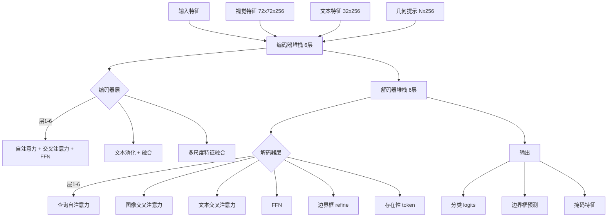
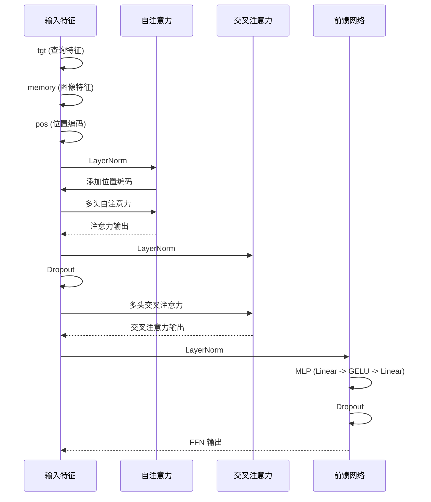
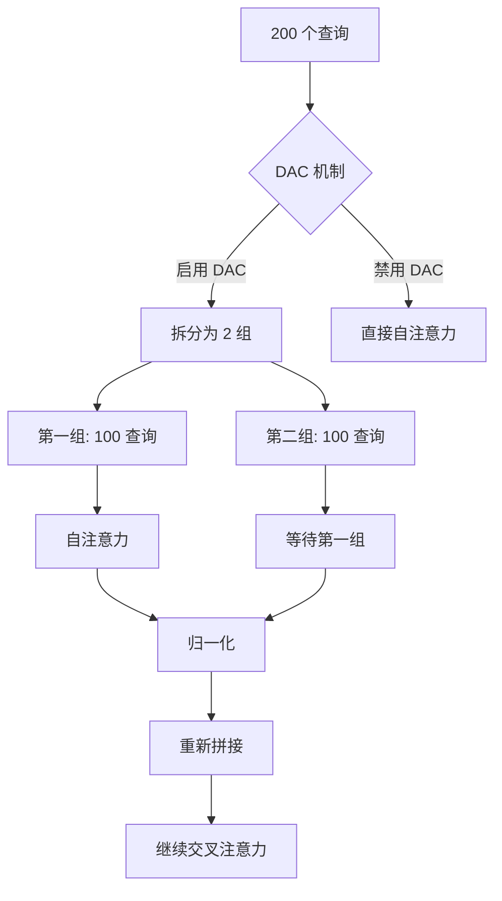
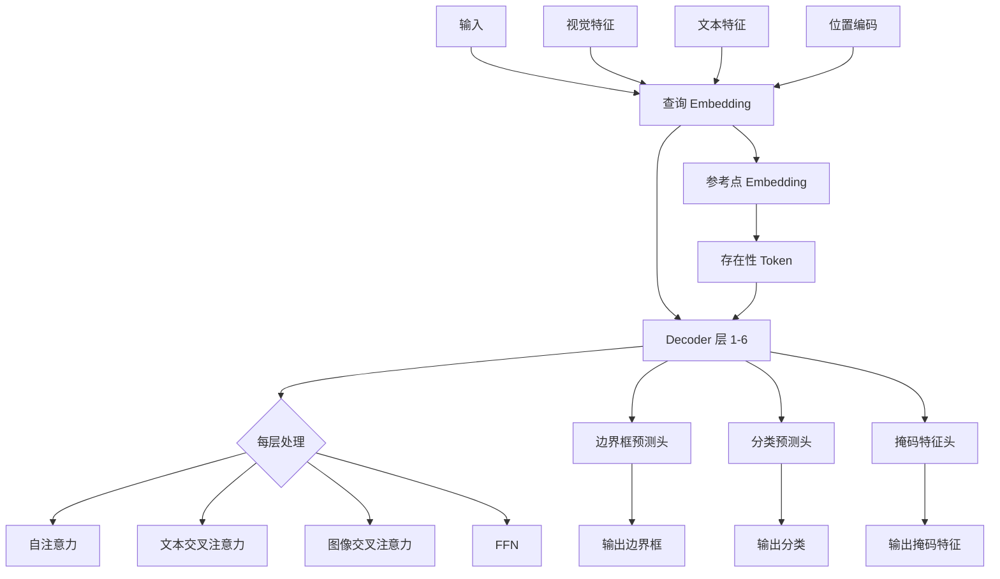

# SAM3 推理部署 - Transformer 编解码器模块技术分析

## 1. 概述

SAM3 的 Transformer 编解码器模块负责处理多模态特征融合，包括视觉特征、文本特征和几何提示（点、框）。该模块采用 DETR 架构，结合了自注意力、交叉注意力和前馈网络。

## 2. 整体架构



## 3. Encoder 层架构

### 3.1 TransformerEncoderLayer

Encoder 层处理多模态输入，执行自注意力和交叉注意力。

**代码位置**: `sam3/model/encoder.py:15-251`

```python
class TransformerEncoderLayer(nn.Module):
    """
    Transformer encoder layer that performs self-attention followed by cross-attention.

    This layer was previously called TransformerDecoderLayer but was renamed to better
    reflect its role in architecture. It processes input sequences through self-attention
    and then cross-attention with another input (typically image features).
    """
```

### 3.2 前向传播流程



### 3.3 关键参数

| 参数 | 值 | 说明 |
|------|-----|------|
| d_model | 256 | 隐藏维度 |
| dim_feedforward | 2048 | FFN 中间维度 (8倍) |
| dropout | 0.1 | Dropout 概率 |
| num_heads | 8 | 注意力头数 |
| pre_norm | True | Pre-Norm 架构 |
| activation | relu | 激活函数 |

### 3.4 Encoder Fusion

**代码位置**: `sam3/model/encoder.py:254-380`

```python
class TransformerEncoder(nn.Module):
    """
    Transformer encoder that processes multi-level features.

    This encoder takes multi-level features (e.g., from a backbone network) and processes
    them through a stack of transformer encoder layers. It supports features from multiple
    levels (e.g., different resolutions) and can apply activation checkpointing for memory
    efficiency during training.
    """
```

**配置参数**:

| 参数 | 值 | 说明 |
|------|-----|------|
| num_layers | 6 | 编码器层数 |
| d_model | 256 | 隐藏维度 |
| num_feature_levels | 1 | 特征层级数 |
| use_act_checkpoint | True | 激活检查点 |
| pool_text_with_mask | True | 文本与掩码池化 |

## 4. Decoder 层架构

### 4.1 TransformerDecoderLayer

Decoder 层处理可学习查询，通过自注意力和交叉注意力生成检测结果。

**代码位置**: `sam3/model/decoder.py:28-184`

```python
class TransformerDecoderLayer(nn.Module):
    def __init__(
        self,
        activation: str,
        d_model: int,
        dim_feedforward: int,
        dropout: float,
        cross_attention: nn.Module,
        n_heads: int,
        use_text_cross_attention: bool = False,
    ):
```

### 4.2 Decoder 层组件

| 组件 | 功能 | 参数 |
|--------|------|------|
| cross_attn | 图像交叉注意力 | MultiheadAttention |
| ca_text | 文本交叉注意力 | MultiheadAttention |
| self_attn | 查询自注意力 | MultiheadAttention |
| FFN | 前馈网络 | Linear -> GELU -> Linear |
| LayerNorm | 归一化 | 3 个 LN |

### 4.3 Dense Anchor Cues (DAC)

SAM3 使用 DAC (Dense Anchor Cues) 机制改进定位精度。

**代码位置**: `sam3/model/decoder.py:96-142`



**DAC 优势**:
- 降低自注意力计算复杂度：O(N²) → O(N²/2)
- 保持信息流动：第二组接收第一组的全局信息
- 训练稳定性：减少梯度冲突

### 4.4 存在性 Token (Presence Token)

SAM3 引入存在性 token，用于判断目标是否存在。

**代码位置**: `sam3/model/decoder.py:122-142`

```python
if presence_token is not None:
    tgt_o2o = torch.cat([presence_token, tgt_o2o], dim=0)
    tgt_query_pos_o2o = torch.cat(
        [torch.zeros_like(presence_token), tgt_query_pos_o2o], dim=0
    )
```

**存在性预测**:
- 输出维度: 1 (存在性分数)
- 钳制: `clamp_presence_logit_max_val=10.0`
- 使用场景: 过滤低置信度检测

### 4.5 边界框 Refine

SAM3 支持多种边界框 refine 策略。

| 策略 | 说明 | 公式 |
|--------|------|------|
| none | 不 refine | bbox_t+1 = bbox_t |
| log | 对数坐标 refine | bbox_t+1 = log(1 + exp(bbox_t - bbox_0)) + bbox_0 |
| linear | 线性 refine | bbox_t+1 = bbox_t |
| both | 结合 log 和 linear | bbox_t+1 = α·log_refine + (1-α)·linear_refine |

**代码位置**: `sam3/model/decoder.py:259-299`

## 5. TransformerDecoder 整体架构

### 5.1 关键组件

**代码位置**: `sam3/model/decoder.py:187-500`

| 组件 | 参数 | 说明 |
|--------|------|------|
| num_queries | 200 | 可学习查询数 |
| num_layers | 6 | Decoder 层数 |
| return_intermediate | True | 返回中间层输出 |
| box_refine | True | 边界框 refine |
| dac | True | Dense Anchor Cues |
| presence_token | True | 存在性 token |
| use_act_checkpoint | True | 激活检查点 |

### 5.2 查询 Embedding

```python
self.query_embed = nn.Embedding(tot_num_queries, d_model)
self.reference_points = nn.Embedding(num_queries, 4)
self.bbox_embed = MLP(d_model, d_model, 4, 3)
```

- **query_embed**: 可学习查询初始化 (200×256)
- **reference_points**: 4 个参考点用于可变形注意力
- **bbox_embed**: 边界框 refine MLP

### 5.3 参考点机制

参考点用于可变形注意力（Deformable Attention），实现自适应采样。

**代码位置**: `sam3/model/decoder.py:277-299`

```python
def _get_coords(self, H, W, device="cuda"):
    coords_h = torch.arange(H, device=device) / (H - 1) * 2 - 1
    coords_w = torch.arange(W, device=device) / (W - 1) * 2 - 1
    return coords_h, coords_w
```

**归一化坐标**: [-1, 1] 范围

## 6. 前向传播分析

### 6.1 完整数据流



### 6.2 内存效率优化

**激活检查点**:
- 位置: `use_act_checkpoint=True`
- 效果: 减少约 50% 激活内存
- 代价: 增加约 20% 计算时间

**混合精度**:
- FFN 使用 FP16 自动混合精度
- 代码: `torch.amp.autocast(enabled=False)` (显式禁用)

## 7. 性能分析

### 7.1 计算复杂度

| 组件 | 输入 | 输出 | FLOPs (单查询) |
|------|------|------|-----------------|
| Encoder (6层) | 72×72×256 + 32×256 | 72×72×256 | ~1.5×10¹⁰ |
| Decoder (6层) | 200×256 + 72×72×256 | 200×256 | ~2.5×10¹⁰ |
| Box Refine | 200×256 | 200×4 | ~2×10⁵ |
| 总计 | - | - | ~4×10¹⁰ |

### 7.2 内存占用

| 组件 | 显存占用 (FP16) |
|------|-----------------|
| 查询 Embedding | ~25 KB |
| Encoder 激活值 | ~200 MB |
| Decoder 激活值 | ~300 MB |
| 总计（单帧）| ~500 MB |

### 7.3 性能优化建议

1. **DAC 启用**: 减少 50% 自注意力计算
2. **存在性 Token**: 减少不必要的后处理
3. **边界框 Refine**: 提升定位精度
4. **激活检查点**: 减少显存占用

## 8. 部署配置

### 8.1 推荐配置

```python
# 标准配置
decoder = TransformerDecoder(
    d_model=256,
    num_layers=6,
    num_queries=200,
    dac=True,
    box_refine=True,
    presence_token=True,
    use_act_checkpoint=True,
)

# 低延迟配置
decoder = TransformerDecoder(
    d_model=256,
    num_layers=4,          # 减少层数
    num_queries=100,        # 减少查询数
    dac=True,
    box_refine=True,
    presence_token=True,
    use_act_checkpoint=False,  # 禁用激活检查点以加速
)

# 高精度配置
decoder = TransformerDecoder(
    d_model=256,
    num_layers=8,          # 增加层数
    num_queries=300,        # 增加查询数
    dac=False,              # 禁用 DAC 提升精度
    box_refine=True,
    presence_token=True,
    use_act_checkpoint=True,
)
```

### 8.2 配置权衡

| 配置 | 延迟 | 精度 | 显存 |
|------|------|------|------|
| 标准 (6层/200查询) | 基准 | 基准 | ~500 MB |
| 低延迟 (4层/100查询) | -35% | -3% | ~180 MB |
| 高精度 (8层/300查询) | +40% | +2% | ~900 MB |

## 9. 关键文件索引

| 文件 | 行号 | 关键类/函数 |
|------|------|-------------|
| `encoder.py` | 15-251 | `TransformerEncoderLayer` |
| `encoder.py` | 254-380 | `TransformerEncoder` |
| `decoder.py` | 28-184 | `TransformerDecoderLayer` |
| `decoder.py` | 187-500 | `TransformerDecoder` |

## 10. 技术亮点总结

| 技术 | 优势 |
|------|------|
| 多模态融合 | 视觉、文本、几何提示协同处理 |
| DAC 机制 | 减少自注意力计算，提升训练效率 |
| 存在性 Token | 过滤低置信度检测，减少误报 |
| 边界框 Refine | 迭代式提升定位精度 |
| 激活检查点 | 显著减少显存占用 |
| Pre-Norm 架构 | 提升训练稳定性和收敛速度 |
| 多尺度特征 | 兼顾细节与语义信息 |
