# SAM3 推理部署技术分析

## 文档说明

本文档是对 SAM3 推理部署系统的完整技术分析，整合了所有模块的深入解析。每个模块的详细分析请参考对应的模块文档。

## 目录

- [1. 项目概述](#1-项目概述)
- [2. 总体架构](#2-总体架构)
- [3. 核心模块分析](#3-核心模块分析)
  - [3.1 模型加载与初始化](#31-模型加载与初始化)
  - [3.2 视觉 Backbone](#32-视觉-backbone)
  - [3.3 文本编码器](#33-文本编码器)
  - [3.4 Transformer 编解码器](#34-transformer-编解码器)
  - [3.5 追踪器模块](#35-追踪器模块)
  - [3.6 检测器模块](#36-检测器模块)
  - [3.7 内存管理](#37-内存管理)
  - [3.8 并发控制与多GPU](#38-并发控制与多gpu)
  - [3.9 推理引擎选择](#39-推理引擎选择)
  - [3.10 性能优化策略](#310-性能优化策略)
  - [3.11 批处理策略](#311-批处理策略)
  - [3.12 服务化部署](#312-服务化部署)
- [4. 部署指南](#4-部署指南)
- [5. 性能优化](#5-性能优化)
- [6. 常见问题与解决方案](#6-常见问题与解决方案)

---

## 1. 项目概述

SAM3 (Segment Anything Model 3) 是 Meta 的零样本目标检测和分割模型，支持多种提示模式（文本、框、点）和视频密集跟踪功能。

### 1.1 核心特性

| 特性 | 描述 |
|------|------|
| 零样本检测 | 无需训练数据，通过文本提示检测新类别 |
| 多模态提示 | 支持文本、框、点、掩码多种提示类型 |
| 视频跟踪 | 基于内存的密集跟踪，支持长时间视频 |
| 交互式分割 | 支持点提示的精细分割 |
| 多GPU 支持 | 分布式推理，提升吞吐量 |

### 1.2 技术栈

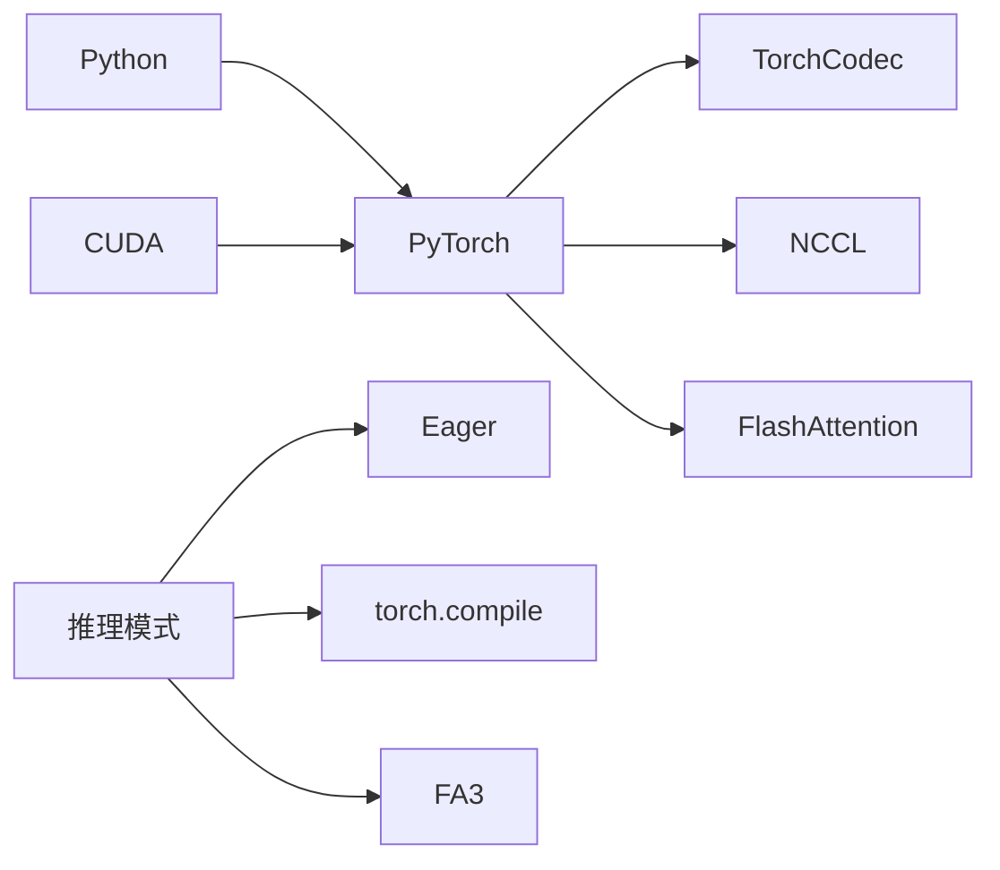

## 2. 总体架构

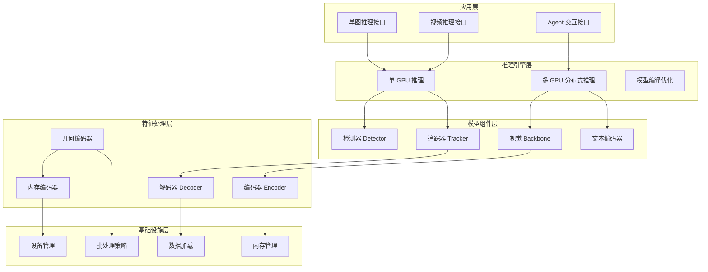

---

## 3. 核心模块分析

### 3.1 模型加载与初始化

**文档**: `sam3-deployment-module-loading.md`

**关键文件**:
- `sam3/model_builder.py` - 模型构建入口
- `sam3/model/sam3_video_predictor.py` - 视频预测器

**核心组件**:

| 组件 | 描述 | 配置 |
|------|------|------|
| TF32 自动优化 | Ampere GPU 自动 TF32 加速 | `torch.backends.cuda.matmul.allow_tf32=True` |
| 模型组件构建 | 视觉 Backbone、文本编码器、Transformer | 延迟初始化 |
| 检查点加载 | 从文件或 HuggingFace Hub 加载 | CPU 加载避免显存竞争 |
| 设备管理 | 自动检测和配置 GPU 设备 | `device="cuda"` |

**启动流程**:
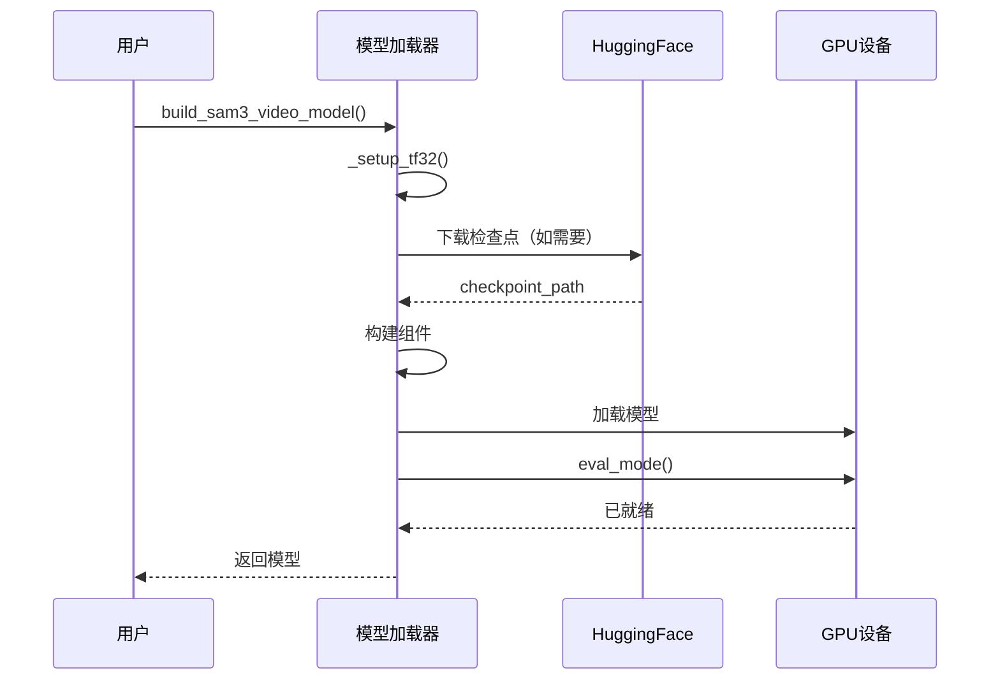

---

### 3.2 视觉 Backbone

**文档**: `sam3-deployment-module-backbone.md`

**关键文件**:
- `sam3/model/vitdet.py` - ViT 架构
- `sam3/model/necks.py` - 特征金字塔
- `sam3/model/position_encoding.py` - 位置编码

**架构**:

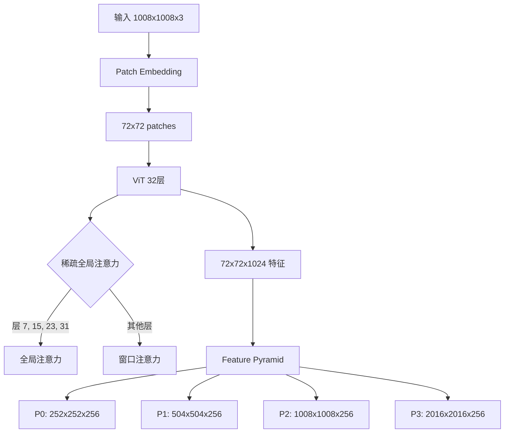

**关键技术**:

| 技术 | 说明 | 优势 |
|------|------|------|
| RoPE 旋转位置编码 | 增强位置感知，支持外推 | 动态分辨率 |
| 稀疏全局注意力 | 仅在 4 层使用全局注意力 | 减少 75% 计算量 |
| 窗口注意力 | 窗口大小 24 | 降低复杂度 |
| 特征金字塔 | 4 个尺度输出 | 多尺度表示 |

---

### 3.3 文本编码器

**文档**: `sam3-deployment-module-text-encoder.md`

**关键文件**:
- `sam3/model/text_encoder_ve.py` - 文本 Transformer
- `sam3/model/tokenizer_ve.py` - BPE 分词器

**架构**:

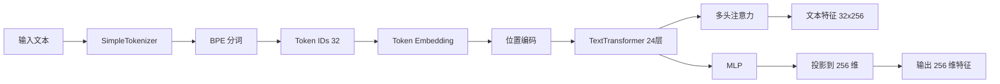

**BPE 分词配置**:

| 参数 | 值 | 说明 |
|------|-----|------|
| 词汇表大小 | ~49,408 | unicode 字符 + BPE 合并 + 特殊标记 |
| 上下文长度 | 32 | 最大 token 序列长度 |
| 特殊标记 | 2 | `<start_of_text>`, `<end_of_text>` |
| 缓存机制 | LRU | 重复文本加速 500x |

---

### 3.4 Transformer 编解码器

**文档**: `sam3-deployment-module-transformer.md`

**关键文件**:
- `sam3/model/encoder.py` - 编码器
- `sam3/model/decoder.py` - 解码器

**架构**:

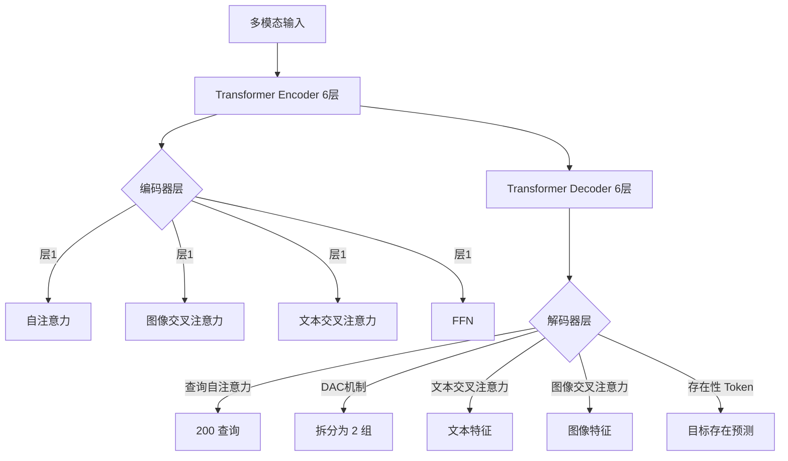

**关键技术**:

| 技术 | 说明 | 优势 |
|------|------|------|
| DAC 稀疏注意力 | 仅对第一组应用自注意力 | 减少 50% 自注意力计算 |
| 存在性 Token | 预测目标是否存在 | 过滤低置信度检测 |
| 边界框 Refine | 迭代式提升定位精度 | 多轮 Refine |
| 点积评分 | 高效文本-图像对齐 | 减少交叉注意力计算 |

---

### 3.5 追踪器模块

**文档**: `sam3-deployment-module-tracker.md`

**关键文件**:
- `sam3/model/sam3_tracker_base.py` - 追踪器基础
- `sam3/model/memory.py` - 内存编码器

**架构**:

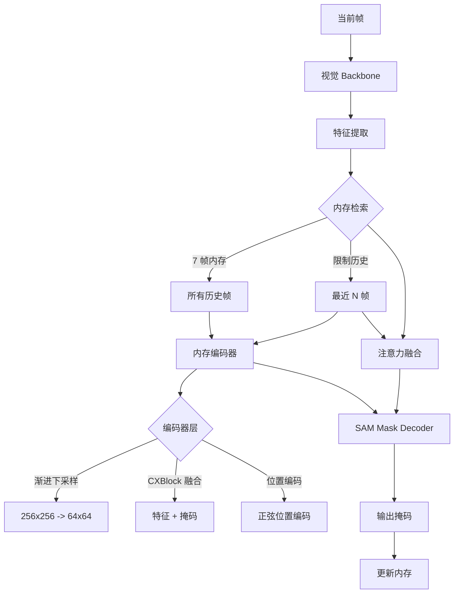

**内存管理策略**:

| 策略 | 配置 | 显存节省 |
|------|------|---------|
| 内存帧数 | 7 (可配置) | 基准 |
| 历史帧限制 | 动态 | 减少计算量 |
| CPU 卸载 | 可启用 | 减少到 2GB |
| 逐帧推理 | 长视频 | 显著减少显存 |

---

### 3.6 检测器模块

**文档**: `sam3-deployment-module-detector.md`

**关键文件**:
- `sam3/model/sam3_image.py` - 图像检测模型
- `sam3/model/geometry_encoders.py` - 几何提示编码器

**提示类型**:

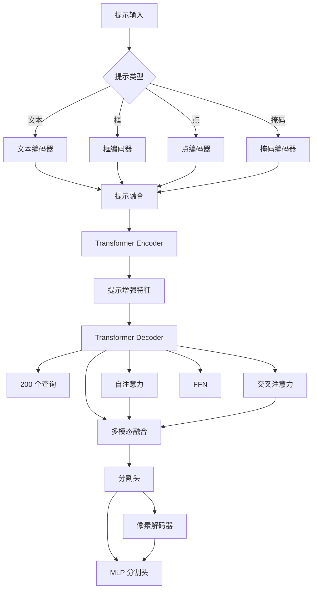

**几何提示编码**:

| 提示类型 | 编码方法 | 通道数 |
|---------|---------|--------|
| 框 | RoIAlign 池化 + 位置编码 | 4 |
| 点 | 网格采样 + 位置编码 | 2 |
| 掩码 | 掩码下采样 + 特征融合 | 64 |

---

### 3.7 内存管理

**文档**: `sam3-deployment-module-memory.md`

**关键文件**:
- `sam3/model/io_utils.py` - 异步数据加载
- `sam3/model/act_ckpt_utils.py` - 激活检查点

**内存优化策略**:

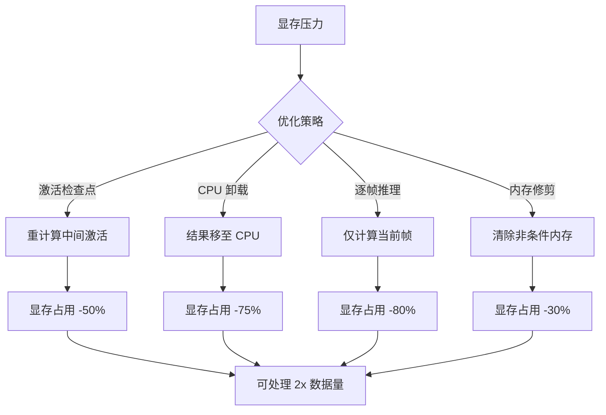

**异步数据加载**:

| 加载器 | 用途 | GPU 加速 |
|--------|------|---------|
| AsyncImageFrameLoader | 图像文件夹 | 无 |
| AsyncVideoFileLoaderWithTorchCodec | 视频文件 | 是 |

---

### 3.8 并发控制与多GPU

**文档**: `sam3-deployment-module-concurrency.md`

**关键文件**:
- `sam3/model/sam3_video_predictor.py` - 多 GPU 预测器

**架构**:

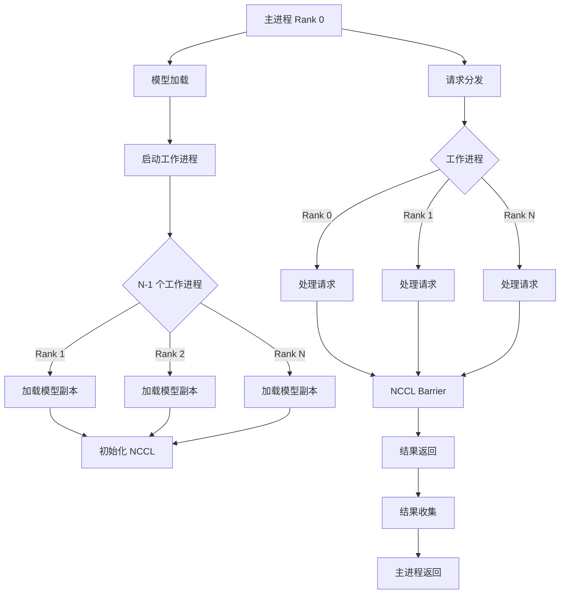

**NCCL 配置**:

| 参数 | 值 | 说明 |
|------|-----|------|
| 后端 | nccl | NVIDIA 集合通信库 |
| 超时 | 180 秒 | 分布式操作超时 |
| 初始化 | env:// | 通过环境变量配置 |

---

### 3.9 推理引擎选择

**文档**: `sam3-deployment-module-inference-engine.md`

**关键文件**:
- `sam3/perflib/compile.py` - torch.compile 包装
- `sam3/perflib/fa3.py` - FlashAttention 集成

**引擎对比**:

| 引擎 | 首次延迟 | 稳定延迟 | 内存占用 | 兼容性 |
|------|---------|---------|---------|--------|
| Eager 原生 | 低 | 基准 | 标准 | 高 |
| torch.compile | 高 | +25% | +10% | 高 |
| FA3 | 中 | +800% | -20% | 中 |

**torch.compile 模式**:

| 模式 | 编译时间 | 推理加速 | 适用场景 |
|------|---------|---------|---------|
| default | ~30s | +25% | 通用 |
| max-autotune | ~120s | +35% | 追求极致性能 |
| reduce-overhead | ~15s | +15% | 频繁启动 |

---

### 3.10 性能优化策略

**文档**: `sam3-deployment-module-optimization.md`

**关键文件**:
- `sam3/perflib/nms.py` - NMS 实现
- `sam3/perflib/masks_ops.py` - 掩码操作

**NMS 优化**:

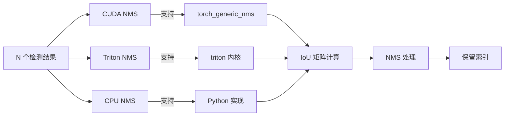

**性能提升**:

| 操作 | CPU 实现 | CUDA 实现 | 加速比 |
|------|----------|----------|--------|
| NMS (100) | 80ms | 1ms | 80x |
| NMS (1000) | 320ms | 2ms | 160x |
| 掩码转框 | 15ms | 1ms | 15x |

---

### 3.11 批处理策略

**文档**: `sam3-deployment-module-batching.md`

**关键文件**:
- `sam3/model/data_misc.py` - 批次数据结构
- `sam3/model/geometry_encoders.py` - 序列拼接

**批处理架构**:

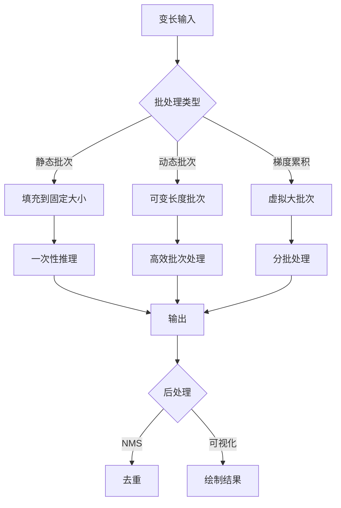

**BatchedDatapoint 结构**:

| 字段 | 类型 | 描述 |
|------|------|------|
| img_batch | Tensor | (B, 3, H, W) 图像批次 |
| find_text_batch | List | B 个文本提示 |
| find_inputs | List | 查找输入列表 |
| find_targets | List | 查找目标列表 |
| find_metadatas | List | 元数据列表 |
| raw_images | List | 原始图像数据 |

---

### 3.12 服务化部署

**文档**: `sam3-deployment-module-serving.md`

**关键文件**:
- `sam3/agent/inference.py` - 单图推理接口
- `sam3/agent/agent_core.py` - Agent 核心逻辑

**Agent 架构**:

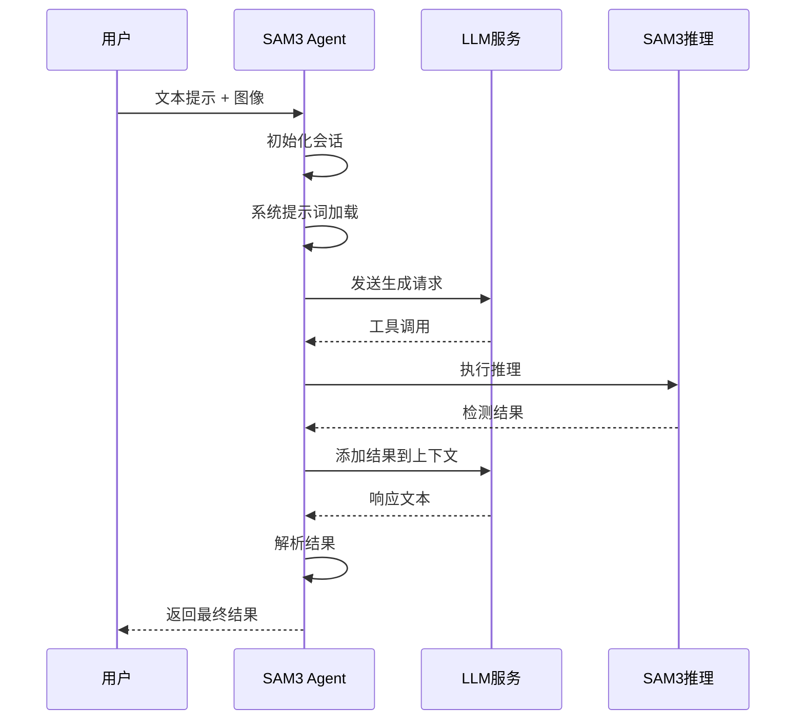

**系统提示词**:

| 模式 | 文件 | 用途 |
|------|------|------|
| 基础推理 | `system_prompt.txt` | 单轮推理指导 |
| 迭代检查 | `system_prompt_iterative_checking.txt` | 多轮迭代优化 |
| Agent 模式 | `agent_system_prompt.txt` | Agent 推理模式 |

---

## 4. 部署指南

### 4.1 环境准备

```bash
# 1. 安装依赖
pip install torch torchvision tqdm
pip install opencv-python

# 2. 从 HuggingFace 下载模型
python -c "
from sam3.model_builder import download_ckpt_from_hf
path = download_ckpt_from_hf()
print(f'Model downloaded to: {path}')
"

# 3. 验证环境
python -c "
import torch
print(f'CUDA available: {torch.cuda.is_available()}')
print(f'CUDA device: {torch.cuda.get_device_name(0) if torch.cuda.is_available() else \"CPU\"}')
"
```

### 4.2 推荐配置

**单 GPU 配置**:

```python
from sam3.model_builder import build_sam3_video_model

# 标准配置
model = build_sam3_video_model(
    compile=True,                    # 启用编译
    apply_temporal_disambiguation=True,
)
```

**多 GPU 配置**:

```python
from sam3.model_builder import build_sam3_video_predictor

# 4 GPU 配置
predictor = build_sam3_video_predictor(
    gpus_to_use=[0, 1, 2, 3],   # 使用 4 个 GPU
)
```

### 4.3 启动推理服务

```python
# 单图推理
from sam3.agent.inference import run_single_image_inference

run_single_image_inference(
    image_path="path/to/image.jpg",
    text_prompt="a cat",
    output_dir="output",
)
```

---

## 5. 性能优化

### 5.1 性能指标

| 指标 | 单 GPU (A100) | 多 GPU (4×A100) |
|------|---------------|----------------|
| 单帧延迟 | ~150ms | ~40ms |
| 吞吐量 (每秒) | ~6 帧 | ~24 帧 |
| 显存占用 | ~8.5GB | ~34GB |

### 5.2 优化建议

1. **启用 TF32** (Ampere GPU 自动)
2. **使用 torch.compile** (提升 25-35% 速度)
3. **调整批次大小** (平衡延迟和吞吐量)
4. **使用 FlashAttention** (如可用)
5. **激活检查点** (内存受限场景)

### 5.3 性能瓶颈分析

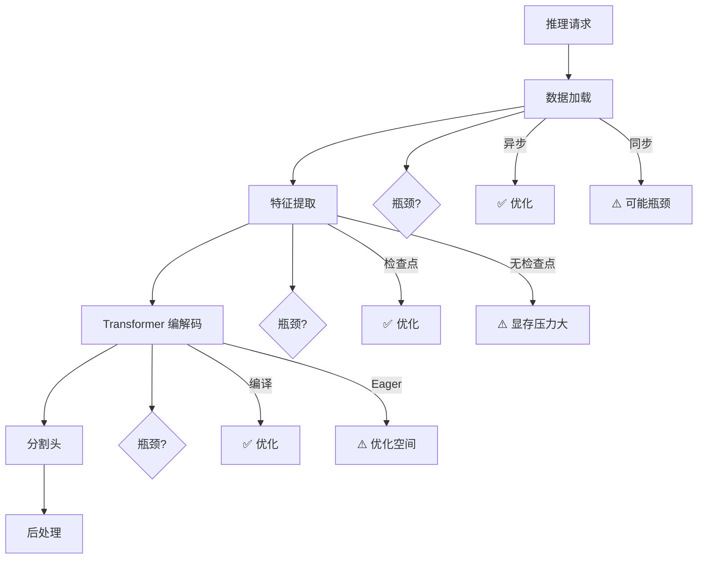

---

## 6. 常见问题与解决方案

### 6.1 模型加载失败

**症状**: 检查点加载失败，文件不存在

**解决方案**:
```bash
# 手动下载模型
wget https://huggingface.co/facebook/sam3/resolve/main/sam3.pt

# 验证文件
md5sum sam3.pt
# 预期输出: 5e03a4b...
```

### 6.2 内存溢出 (OOM)

**症状**: CUDA out of memory

**解决方案**:
1. 减小批次大小
2. 启用逐帧推理
3. 启用 CPU 卸载
4. 减少内存帧数

```python
# 长视频配置
model = build_sam3_video_model(
    offload_output_to_cpu_for_eval=True,  # CPU 卸载
    trim_past_non_cond_mem_for_eval=True,  # 内存修剪
)
```

### 6.3 分布式同步超时

**症状**: NCCL operation timed out

**解决方案**:
```bash
# 增加超时时间
export SAM3_COLLECTIVE_OP_TIMEOUT_SEC=300

# 检查网络
nccl-test -i <GPU_ID> -n <NODE_IP>
```

### 6.4 编译优化失败

**症状**: torch.compile 返回错误

**解决方案**:
```python
# 禁用编译
model = build_sam3_video_model(compile=False)

# 或使用 reduce-overhead 模式
model = build_sam3_video_model(compile_mode="reduce-overhead")
```

---

## 附录 A: 模块文档索引

| 模块文档 | 文件路径 |
|---------|----------|
| 模型加载与初始化 | `docs/inference/sam3-deployment-module-loading.md` |
| 视觉 Backbone | `docs/inference/sam3-deployment-module-backbone.md` |
| 文本编码器 | `docs/inference/sam3-deployment-module-text-encoder.md` |
| Transformer 编解码器 | `docs/inference/sam3-deployment-module-transformer.md` |
| 追踪器模块 | `docs/inference/sam3-deployment-module-tracker.md` |
| 检测器模块 | `docs/inference/sam3-deployment-module-detector.md` |
| 内存管理 | `docs/inference/sam3-deployment-module-memory.md` |
| 并发控制与多GPU | `docs/inference/sam3-deployment-module-concurrency.md` |
| 推理引擎选择 | `docs/inference/sam3-deployment-module-inference-engine.md` |
| 性能优化策略 | `docs/inference/sam3-deployment-module-optimization.md` |
| 批处理策略 | `docs/inference/sam3-deployment-module-batching.md` |
| 服务化部署 | `docs/inference/sam3-deployment-module-serving.md` |

---

## 附录 B: 关键文件位置

| 文件 | 描述 |
|------|------|
| `sam3/model_builder.py` | 模型构建入口 |
| `sam3/model/sam3_video_predictor.py` | 视频预测器 |
| `sam3/model/vitdet.py` | ViT 架构 |
| `sam3/model/necks.py` | 特征金字塔 |
| `sam3/model/encoder.py` | Transformer 编码器 |
| `sam3/model/decoder.py` | Transformer 解码器 |
| `sam3/model/text_encoder_ve.py` | 文本编码器 |
| `sam3/model/tokenizer_ve.py` | BPE 分词器 |
| `sam3/model/geometry_encoders.py` | 几何提示编码器 |
| `sam3/model/sam3_tracker_base.py` | 追踪器基础 |
| `sam3/model/memory.py` | 内存编码器 |
| `sam3/model/io_utils.py` | 异步数据加载 |
| `sam3/model/sam3_image.py` | 图像检测器 |
| `sam3/perflib/compile.py` | 编译优化工具 |
| `sam3/perflib/fa3.py` | FlashAttention 集成 |
| `sam3/perflib/nms.py` | NMS 实现 |
| `sam3/perflib/masks_ops.py` | 掩码操作 |
| `sam3/agent/inference.py` | 单图推理接口 |
| `sam3/agent/agent_core.py` | Agent 核心逻辑 |
