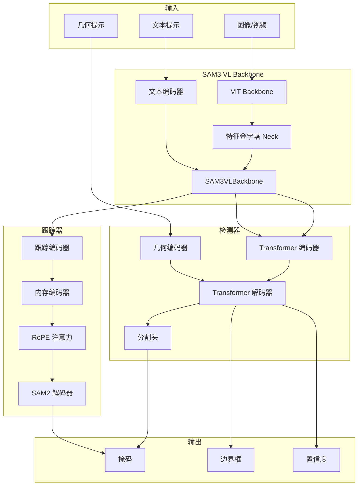

# SAM 3 核心架构总览

## 1. 项目概述

SAM 3 (Segment Anything with Concepts) 是 Meta 发布的统一基础模型，用于图像和视频中的可提示分割。它能够使用文本或视觉提示（如点、框和掩码）来检测、分割和跟踪对象。

### 1.1 关键特性

- **848M 参数规模**：检测器-跟踪器解耦架构
- **开放词汇支持**：支持 270K+ 独特概念
- **多模态输入**：文本、点、框、掩码等多种提示类型
- **双任务设计**：图像分割和视频跟踪统一架构
- **高性能推理**：支持多 GPU 分布式推理

### 1.2 设计理念

SAM 3 采用了**检测器-跟踪器解耦**的设计理念：

1. **检测器 (Detector)**：负责识别图像/视频中的对象，基于文本提示生成初始检测
2. **跟踪器 (Tracker)**：负责跨帧跟踪已识别对象，处理时间一致性

这种设计最小化了任务干扰，提高了模型的可扩展性和训练效率。

## 2. 整体架构

### 2.1 架构图



### 2.2 数据流向

```
输入图像 (1008x1008)
    ↓
ViT Backbone (32层 Transformer)
    ↓
特征金字塔 Neck (4个尺度)
    ↓
文本编码 (24层 Transformer)
    ↓
特征融合 (SAM3VLBackbone)
    ↓
    ├─→ 检测器路径
    │     ↓
    │  Transformer 编码器 (6层)
    │     ↓
    │  Transformer 解码器 (6层)
    │     ↓
    │  Presence Token + 边界框细化
    │     ↓
    │  分割头
    │     ↓
    │  掩码/边界框/置信度
    │
    └─→ 跟踪器路径
          ↓
       内存编码器 (7帧历史)
          ↓
       RoPE 注意力 (4层)
          ↓
       SAM2 解码器
          ↓
       掩码传播
```

## 3. 核心组件

### 3.1 SAM3VLBackbone (`sam3/model/vl_combiner.py`)

视觉-语言骨干网络，负责独立处理视觉和文本特征：

```python
class SAM3VLBackbone(nn.Module):
    def __init__(
        self,
        visual: Sam3DualViTDetNeck,    # 视觉编码器
        text: VETextEncoder,            # 文本编码器
        compile_visual: bool = False,
        act_ckpt_whole_vision_backbone: bool = False,
        act_ckpt_whole_language_backbone: bool = False,
        scalp=0,                       # 特征层级控制
    ):
```

**关键参数：**
- `scalp`: 控制特征金字塔的输出层级，丢弃最低的 `scalp` 个层级
- 支持激活检查点，减少显存占用
- 支持 torch.compile 优化

### 3.2 Sam3Image (`sam3/model/sam3_image.py`)

图像分割模型的核心实现：

```python
class Sam3Image(nn.Module):
    def forward(self, input: BatchedDatapoint):
        # 1. 提取图像和文本特征
        backbone_out = self.backbone.forward_image(input.img_batch)
        text_outputs = self.backbone.forward_text(input.find_text_batch)

        # 2. 处理几何提示
        geometric_prompt = self._prepare_geometric_prompt(...)

        # 3. 编码提示
        prompt, prompt_mask = self._encode_prompt(
            backbone_out, find_input, geometric_prompt, ...
        )

        # 4. 编码器前向传播
        memory = self.transformer.encoder(...)

        # 5. 解码器前向传播
        outputs = self.transformer.decoder(...)

        # 6. 分割头
        if self.segmentation_head is not None:
            masks, pred_logits = self.segmentation_head(...)

        return {
            "pred_masks": masks,
            "pred_boxes": boxes,
            "pred_logits": pred_logits,
        }
```

### 3.3 Sam3VideoInferenceWithInstanceInteractivity (`sam3/model/sam3_video_inference.py`)

视频推理引擎，支持检测器-跟踪器协作：

```python
class Sam3VideoInferenceWithInstanceInteractivity(Sam3VideoInference):
    def __init__(
        self,
        detector: Sam3ImageOnVideoMultiGPU,
        tracker: Sam3TrackerPredictor,
        score_threshold_detection: float = 0.5,
        assoc_iou_thresh: float = 0.1,
        det_nms_thresh: float = 0.1,
        new_det_thresh: float = 0.7,
        hotstart_delay: int = 15,
        ...
    ):
```

**关键机制：**
- **Hotstart**：延迟前15帧输出，稳定跟踪质量
- **检测-跟踪关联**：通过 IoU 匹配检测和跟踪结果
- **对象生命周期管理**：处理对象的新生、跟踪、遮挡和移除

## 4. 模型构建流程

### 4.1 图像模型构建 (`sam3/model_builder.py`)

```python
def build_sam3_image_model(
    bpe_path=None,
    device="cuda" if torch.cuda.is_available() else "cpu",
    eval_mode=True,
    checkpoint_path=None,
    enable_segmentation=True,
    enable_inst_interactivity=False,
    compile=False,
):
    # 1. 创建视觉编码器
    vision_encoder = _create_vision_backbone(compile_mode=compile_mode)

    # 2. 创建文本编码器
    text_encoder = _create_text_encoder(bpe_path)

    # 3. 创建 VL Backbone
    backbone = _create_vl_backbone(vision_encoder, text_encoder)

    # 4. 创建 Transformer
    transformer = _create_sam3_transformer()

    # 5. 创建分割头
    segmentation_head = _create_segmentation_head(compile_mode=compile_mode)

    # 6. 创建几何编码器
    input_geometry_encoder = _create_geometry_encoder()

    # 7. 创建实例交互预测器（可选）
    if enable_inst_interactivity:
        sam3_pvs_base = build_tracker(apply_temporal_disambiguation=False)
        inst_predictor = SAM3InteractiveImagePredictor(sam3_pvs_base)

    # 8. 创建最终模型
    model = Sam3Image(
        backbone=backbone,
        transformer=transformer,
        input_geometry_encoder=input_geometry_encoder,
        segmentation_head=segmentation_head,
        ...
    )

    return model
```

### 4.2 视频模型构建

```python
def build_sam3_video_model(
    checkpoint_path: Optional[str] = None,
    bpe_path: Optional[str] = None,
    has_presence_token: bool = True,
    apply_temporal_disambiguation: bool = True,
    ...
):
    # 1. 构建跟踪器
    tracker = build_tracker(apply_temporal_disambiguation=apply_temporal_disambiguation)

    # 2. 构建检测器组件
    visual_neck = _create_vision_backbone()
    text_encoder = _create_text_encoder(bpe_path)
    backbone = SAM3VLBackbone(scalp=1, visual=visual_neck, text=text_encoder)
    transformer = _create_sam3_transformer(has_presence_token=has_presence_token)
    segmentation_head = _create_segmentation_head()
    input_geometry_encoder = _create_geometry_encoder()

    # 3. 构建检测器
    detector = Sam3ImageOnVideoMultiGPU(
        backbone=backbone,
        transformer=transformer,
        segmentation_head=segmentation_head,
        input_geometry_encoder=input_geometry_encoder,
        ...
    )

    # 4. 构建视频推理引擎
    model = Sam3VideoInferenceWithInstanceInteractivity(
        detector=detector,
        tracker=tracker,
        ...
    )

    return model
```

## 5. 关键创新点

### 5.1 检测器-跟踪器解耦

**优势：**
- 最小化任务干扰：检测和跟踪独立训练
- 提高可扩展性：可以单独优化检测或跟踪
- 更好的数据利用：检测和跟踪可以使用不同的数据集

### 5.2 Presence Token 机制

**作用：**
- 改善相关文本提示之间的区分度（如"穿着白衣服的球员" vs "穿着红衣服的球员"）
- 提供全局存在性判断
- 作为解码器的初始化状态

### 5.3 双任务统一架构

**设计：**
- 共享视觉编码器：检测器和跟踪器共享 ViT Backbone
- 分离任务特定组件：检测器使用 DETR 解码器，跟踪器使用 SAM2 解码器
- 统一的接口：相同的输入/输出格式

### 5.4 多 GPU 分布式推理

**实现：**
- Sam3VideoPredictorMultiGPU：支持多 GPU 协同推理
- NCCL 通信：使用 NCCL 进行 GPU 间通信
- 负载均衡：动态分配对象到不同 GPU

## 6. 文件组织

```
sam3/
├── model_builder.py              # 模型构建入口
├── model/
│   ├── vitdet.py                 # ViT 视觉编码器
│   ├── vl_combiner.py            # VL 特征融合
│   ├── text_encoder_ve.py         # 文本编码器
│   ├── encoder.py                # Transformer 编码器
│   ├── decoder.py                # Transformer 解码器
│   ├── geometry_encoders.py      # 几何提示编码器
│   ├── maskformer_segmentation.py # 分割头
│   ├── sam3_image.py             # 图像模型
│   ├── sam3_video_predictor.py   # 视频预测器
│   ├── sam3_video_inference.py   # 视频推理引擎
│   ├── sam3_tracking_predictor.py # 跟踪器
│   └── memory.py                # 内存编码器
├── sam/
│   ├── prompt_encoder.py         # 提示编码器
│   ├── mask_decoder.py           # 掩码解码器
│   └── transformer.py           # SAM2 Transformer
├── agent/                        # Agent 系统
├── perflib/                      # 性能优化库
└── eval/                         # 评估工具
```

## 7. 总结

SAM 3 通过检测器-跟踪器解耦架构实现了强大的多模态分割能力：

1. **统一接口**：图像和视频任务使用相同的 API
2. **高效推理**：多 GPU 支持和多种优化策略
3. **灵活提示**：支持文本、点、框、掩码等多种提示类型
4. **高精度**：在多个基准上达到 75-80% 人类性能

这种设计使得 SAM 3 能够在各种视觉理解任务中表现出色，从简单的图像分割到复杂的视频密集跟踪。
