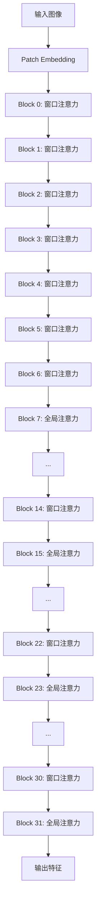
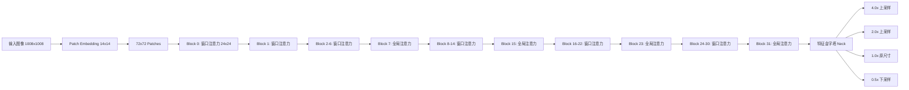

# SAM 3 视觉编码器模块深度分析

## 1. 模块概述

SAM 3 的视觉编码器基于 Vision Transformer (ViT) 架构，负责从输入图像中提取多层次的特征表示。该模块是整个模型的核心视觉理解基础，为后续的检测和跟踪任务提供丰富的视觉特征。

### 1.1 核心组件

| 组件 | 文件路径 | 功能 |
|------|----------|------|
| ViT Backbone | `sam3/model/vitdet.py` | 视觉特征提取 |
| 特征金字塔 Neck | `sam3/model/necks.py` | 多尺度特征融合 |
| 位置编码 | `sam3/model/position_encoding.py` | 位置信息注入 |

## 2. ViT Backbone (`sam3/model/vitdet.py`)

### 2.1 类定义与初始化

```python
class ViT(nn.Module):
    def __init__(
        self,
        img_size: int = 1024,              # 输入图像尺寸
        patch_size: int = 16,              # Patch 大小
        embed_dim: int = 768,              # 嵌入维度
        depth: int = 12,                   # Transformer 层数
        num_heads: int = 12,               # 注意力头数
        mlp_ratio: float = 4.0,            # MLP 隐藏层比例
        use_abs_pos: bool = True,          # 使用绝对位置编码
        tile_abs_pos: bool = True,         # 平铺绝对位置编码
        rel_pos_blocks: Tuple[int, ...] = (), # 相对位置编码层
        global_att_blocks: Tuple[int, ...] = (7, 15, 23, 31),  # 全局注意力层
        window_size: int = 24,             # 窗口大小
        use_rope: bool = True,             # 使用 RoPE
        use_interp_rope: bool = True,      # 插值 RoPE
        rope_theta: float = 10000.0,      # RoPE 频率参数
        pretrain_img_size: int = 336,      # 预训练图像尺寸
        drop_path_rate: float = 0.1,       # DropPath 比率
        ...
    ):
```

**SAM 3 配置参数：**
```python
img_size=1008,
pretrain_img_size=336,
patch_size=14,
embed_dim=1024,
depth=32,
num_heads=16,
mlp_ratio=4.625,
global_att_blocks=(7, 15, 23, 31),
window_size=24,
use_rope=True,
use_interp_rope=True,
```

### 2.2 Patch Embedding

将图像分割为 patch 并映射到嵌入空间：

```python
class PatchEmbed(nn.Module):
    def __init__(
        self,
        kernel_size: Tuple[int, int] = (16, 16),
        stride: Tuple[int, int] = (16, 16),
        in_chans: int = 3,
        embed_dim: int = 768,
    ):
        self.proj = nn.Conv2d(
            in_chans, embed_dim,
            kernel_size=kernel_size,
            stride=stride,
            padding=(0, 0),
            bias=True,
        )

    def forward(self, x: Tensor) -> Tensor:
        # B C H W -> B H W C
        x = self.proj(x)
        x = x.permute(0, 2, 3, 1)
        return x
```

**SAM 3 配置：**
- `patch_size=14`：14×14 的 patch
- 输入 1008×1008 → 输出 72×72 patch 网格

### 2.3 混合注意力机制

#### 2.3.1 设计原则

SAM 3 采用了**全局注意力和窗口注意力混合**的策略：

- **浅层**：使用窗口注意力，专注局部特征
- **深层**：使用全局注意力，建模长距离依赖
- **全局注意力层**：第 7、15、23、31 层使用全局注意力



#### 2.3.2 窗口分区实现

```python
def window_partition(x, window_size):
    """
    将特征图划分为窗口。
    Args:
        x: (B, H, W, C)
        window_size: 窗口大小
    Returns:
        windows: (num_windows*B, window_size, window_size, C)
    """
    B, H, W, C = x.shape
    x = x.view(B, H // window_size, window_size,
               W // window_size, window_size, C)
    windows = x.permute(0, 1, 3, 2, 4, 5).contiguous()
    windows = windows.view(-1, window_size, window_size, C)
    return windows

def window_unpartition(windows, window_size, pad_hw, hw):
    """
    将窗口还原为特征图。
    """
    B, H, W = hw
    pad_h, pad_w = pad_hw
    x = windows.view(
        B, H // window_size, W // window_size,
        window_size, window_size, -1
    )
    x = x.permute(0, 1, 3, 2, 4, 5).contiguous()
    x = x.view(B, H + pad_h, W + pad_w, -1)
    x = x[:, :H, :W, :].contiguous()
    return x
```

### 2.4 RoPE (Rotary Position Embedding)

#### 2.4.1 原理

RoPE 通过旋转操作将位置信息注入到注意力计算中，具有强外推能力：

```python
def apply_rotary_enc(
    xq: Tensor, xk: Tensor, freqs_cis: Tensor
) -> Tuple[Tensor, Tensor]:
    """
    应用旋转位置编码。
    将 Q/K 转换为复数形式，与复数频率相乘，然后转回实数。
    """
    # 转换为复数: (B, H, S, D/2, 2)
    xq_ = torch.view_as_complex(xq.float().reshape(*xq.shape[:-1], -1, 2))
    xk_ = torch.view_as_complex(xk.float().reshape(*xk.shape[:-1], -1, 2))

    # 应用旋转
    xq_out = torch.view_as_real(xq_ * freqs_cis).flatten(-2)
    xk_out = torch.view_as_real(xk_ * freqs_cis).flatten(-2)

    return xq_out.type_as(xq), xk_out.type_as(xk)
```

#### 2.4.2 轴向频率计算

```python
def compute_axial_cis(dim, end_x, end_y, theta=10000.0):
    """
    计算 2D 轴向旋转频率。
    """
    # 计算频率: 1 / (theta^(2i/d))
    freqs_x = 1.0 / (theta ** (
        torch.arange(0, dim, 4, device=device)[: (dim // 4)].float() / dim
    ))
    freqs_y = 1.0 / (theta ** (
        torch.arange(0, dim, 4, device=device)[: (dim // 4)].float() / dim
    ))

    # 生成位置索引
    t_x, t_y = init_t_xy(end_x, end_y)

    # 计算复数频率
    freqs_cis_x = torch.polar(
        torch.ones_like(freqs_x),
        torch.outer(t_x, freqs_x)
    )
    freqs_cis_y = torch.polar(
        torch.ones_like(freqs_y),
        torch.outer(t_y, freqs_y)
    )

    return torch.cat([freqs_cis_x, freqs_cis_y], dim=-1)
```

**RoPE 参数：**
- `rope_theta=10000.0`：旋转频率基础
- `use_interp_rope=True`：支持 RoPE 插值，处理不同分辨率输入

### 2.5 Transformer Block

```python
class Block(nn.Module):
    def __init__(
        self,
        dim: int,
        num_heads: int,
        mlp_ratio: float = 4.0,
        drop_path: float = 0.0,
        window_size: int = 0,
        use_rel_pos: bool = False,
        use_rope: bool = False,
        ...
    ):
        super().__init__()
        self.norm1 = nn.LayerNorm(dim)
        self.attn = Attention(
            dim, num_heads, use_rel_pos, use_rope, ...
        )
        self.norm2 = nn.LayerNorm(dim)
        self.mlp = Mlp(in_features=dim, hidden_features=int(dim * mlp_ratio))
        self.drop_path = DropPath(drop_path) if drop_path > 0 else nn.Identity()

    def forward(self, x):
        shortcut = x

        # 窗口分区
        if self.window_size > 0:
            H, W = x.shape[1], x.shape[2]
            x, pad_hw = window_partition(x, self.window_size)

        # 注意力 + 残差
        x = x + self.drop_path(self.attn(self.norm1(x)))

        # 窗口还原
        if self.window_size > 0:
            x = window_unpartition(x, self.window_size, pad_hw, (H, W))

        # MLP + 残差
        x = x + self.drop_path(self.mlp(self.norm2(x)))

        return x
```

### 2.6 输出管理

```python
class ViT(nn.Module):
    def forward(self, x):
        # Patch Embedding
        x = self.patch_embed(x)

        # 添加 CLS token（如果需要）
        if self.retain_cls_token:
            cls_token = self.cls_embedding.expand(x.shape[0], -1, -1)
            x = torch.cat([cls_token, x.flatten(1, 2)], dim=1)

        # 添加绝对位置编码
        if self.pos_embed is not None:
            x = x + get_abs_pos(self.pos_embed, self.pretrain_img_size, (x.shape[1], x.shape[2]))

        # Transformer Blocks
        outputs = []
        for i, blk in enumerate(self.blocks):
            x = blk(x)

            # 保存全局注意力层的输出
            if i in self.full_attn_ids:
                outputs.append(x)

            # 保存最后一层输出
            if i == len(self.blocks) - 1:
                outputs.append(x)

        return outputs
```

## 3. 特征金字塔 Neck (`sam3/model/necks.py`)

### 3.1 Sam3DualViTDetNeck

```python
class Sam3DualViTDetNeck(nn.Module):
    def __init__(
        self,
        trunk: nn.Module,                  # ViT 主干网络
        position_encoding: nn.Module,      # 位置编码
        d_model: int = 256,                # 模型维度
        scale_factors=(4.0, 2.0, 1.0, 0.5), # 缩放因子
        add_sam2_neck: bool = False,      # 添加 SAM2 颈部
    ):
```

### 3.2 多尺度特征融合

#### 3.2.1 Scale Factors 作用

| Scale Factor | 操作 | 输出尺寸 | 用途 |
|--------------|------|----------|------|
| 4.0 | 上采样 4 倍 | stride 3.5 | 高分辨率特征 |
| 2.0 | 上采样 2 倍 | stride 7 | 中高分辨率特征 |
| 1.0 | 保持原尺寸 | stride 14 | 标准分辨率特征 |
| 0.5 | 下采样 2 倍 | stride 28 | 低分辨率特征 |

```python
# 4.0x 上采样：双反卷积
current.add_module("dconv_2x2_0", nn.ConvTranspose2d(dim, dim//2, 2, 2))
current.add_module("gelu", nn.GELU())
current.add_module("dconv_2x2_1", nn.ConvTranspose2d(dim//2, dim//4, 2, 2))

# 2.0x 上采样：单反卷积
current.add_module("dconv_2x2", nn.ConvTranspose2d(dim, dim//2, 2, 2))

# 1.0x 原尺寸：1x1 卷积
current.add_module("conv_1x1", nn.Conv2d(out_dim, d_model, 1))

# 0.5x 下采样：最大池化
current.add_module("maxpool_2x2", nn.MaxPool2d(2, 2))
```

#### 3.2.2 双分支设计

SAM 3 同时维护 SAM3 和 SAM2 两个特征分支：

```python
def forward(self, tensor_list):
    # ViT 输出
    xs = self.trunk(tensor_list)
    x = xs[-1]

    sam3_out, sam3_pos = [], []
    sam2_out, sam2_pos = [], []

    # 处理每个尺度
    for i in range(len(self.convs)):
        # SAM3 分支
        sam3_x_out = self.convs[i](x)
        sam3_pos_out = self.position_encoding(sam3_x_out)
        sam3_out.append(sam3_x_out)
        sam3_pos.append(sam3_pos_out)

        # SAM2 分支（如果启用）
        if self.sam2_convs is not None:
            sam2_x_out = self.sam2_convs[i](x)
            sam2_pos_out = self.position_encoding(sam2_x_out)
            sam2_out.append(sam2_x_out)
            sam2_pos.append(sam2_pos_out)

    return (sam3_out, sam3_pos), (sam2_out, sam2_pos)
```

## 4. 位置编码 (`sam3/model/position_encoding.py`)

### 4.1 PositionEmbeddingSine

```python
class PositionEmbeddingSine(nn.Module):
    def __init__(
        self,
        num_pos_feats: int = 64,
        temperature: int = 10000,
        normalize: bool = True,
        scale: Optional[float] = None,
        precompute_resolution: Optional[int] = None,
    ):
```

### 4.2 正弦位置编码公式

```
pos_x = x_embed / (10000^(2i/d)) * scale
pos_y = y_embed / (10000^(2i/d)) * scale

# 交替使用 sin 和 cos
pos_x = [sin(pos_x[:, 0::2]), cos(pos_x[:, 1::2])]
pos_y = [sin(pos_y[:, 0::2]), cos(pos_y[:, 1::2])]
```

```python
def _encode_xy(self, x, y):
    x_embed = x * self.scale
    y_embed = y * self.scale

    dim_t = torch.arange(
        0, self.num_pos_feats, dtype=torch.float32, device=x.device
    )
    dim_t = self.temperature ** (2 * (dim_t // 2) / self.num_pos_feats)

    pos_x = x_embed[:, None] / dim_t
    pos_y = y_embed[:, None] / dim_t

    # 交替 sin/cos
    pos_x = torch.stack((pos_x[:, 0::2].sin(), pos_x[:, 1::2].cos()), dim=2)
    pos_y = torch.stack((pos_y[:, 0::2].sin(), pos_y[:, 1::2].cos()), dim=2)

    return pos_x, pos_y
```

### 4.3 预计算优化

```python
if precompute_resolution is not None:
    # 预计算常用分辨率的编码
    precompute_sizes = [
        (precompute_resolution // 4, precompute_resolution // 4),
        (precompute_resolution // 8, precompute_resolution // 8),
        (precompute_resolution // 16, precompute_resolution // 16),
        (precompute_resolution // 32, precompute_resolution // 32),
    ]

    for size in precompute_sizes:
        tensors = torch.zeros((1, 1) + size, device="cuda")
        self.forward(tensors)
        self.cache[size] = self.output.flatten(1, 2).clone().detach()
```

## 5. 性能优化

### 5.1 激活检查点

```python
def forward(self, x):
    if self.use_act_checkpoint and self.training:
        x = checkpoint.checkpoint(self._forward, x, use_reentrant=False)
    else:
        x = self._forward(x)
    return x
```

### 5.2 Torch Compile 支持

```python
if compile_mode is not None:
    self.forward = torch.compile(
        self.forward, mode=compile_mode, fullgraph=True
    )
```

### 5.3 LayerScale

```python
class LayerScale(nn.Module):
    def __init__(self, dim: int, init_values: float = 1e-5):
        self.gamma = nn.Parameter(init_values * torch.ones(dim))

    def forward(self, x: Tensor) -> Tensor:
        return x * self.gamma
```

## 6. 数据流向图



## 7. 总结

SAM 3 的视觉编码器通过以下设计实现了高效的特征提取：

1. **混合注意力机制**：结合全局和窗口注意力，平衡长距离依赖和计算效率
2. **RoPE 编码**：提供强外推能力，支持不同分辨率输入
3. **特征金字塔**：多尺度特征提取，增强不同粒度的特征表示
4. **双分支设计**：同时服务于 SAM3 和 SAM2，共享主干但特征处理独立
5. **性能优化**：激活检查点、预计算、Torch Compile 等多种优化手段

这种设计使得 SAM 3 能够高效处理各种视觉任务，从图像分割到目标检测，展现出强大的通用性和灵活性。
