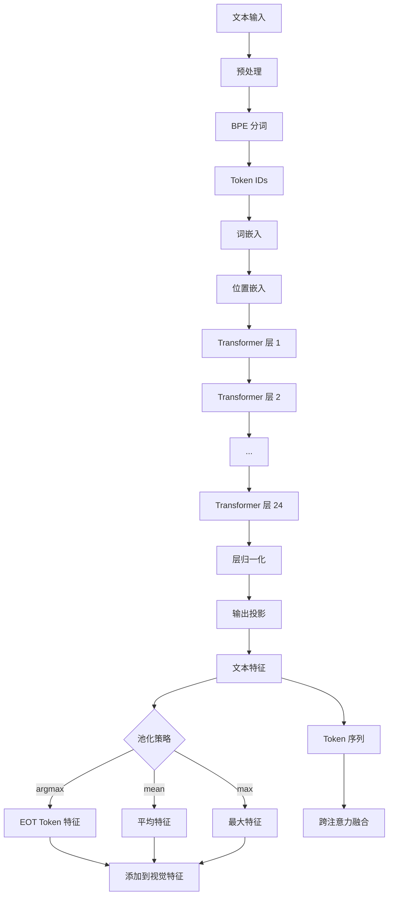

# SAM 3 文本编码器模块深度分析

## 1. 模块概述

SAM 3 的文本编码器负责将自然语言提示转换为可计算的向量表示，实现文本引导的视觉分割。该模块支持开放词汇分割，能够理解数千种不同的概念。

### 1.1 核心组件

| 组件 | 文件路径 | 功能 |
|------|----------|------|
| VETextEncoder | `sam3/model/text_encoder_ve.py` | 文本 Transformer 编码器 |
| SimpleTokenizer | `sam3/model/tokenizer_ve.py` | BPE 分词器 |
| SAM3VLBackbone | `sam3/model/vl_combiner.py` | 视觉-语言特征融合 |

## 2. 文本编码器 (`sam3/model/text_encoder_ve.py`)

### 2.1 VETextEncoder 架构

```python
class VETextEncoder(nn.Module):
    def __init__(
        self,
        d_model: int,              # 目标维度
        tokenizer: Callable,       # 分词器
        width: int = 1024,         # Transformer 宽度
        heads: int = 16,           # 注意力头数
        layers: int = 24,          # Transformer 层数
        context_length: int = 32,  # 上下文长度
        vocab_size: int = 49408,   # 词汇表大小
        embed_dim: int = 1024,     # 嵌入维度
        output_dim: int = None,    # 输出维度（默认与 d_model 相同）
        ...
    ):
```

**SAM 3 配置：**
```python
d_model=256,      # 输出到检测器的维度
width=1024,       # Transformer 内部维度
heads=16,
layers=24,
context_length=32,
vocab_size=49408,
```

### 2.2 Transformer 架构

#### 2.2.1 ResidualAttentionBlock

```python
class ResidualAttentionBlock(nn.Module):
    def __init__(
        self,
        d_model: int,
        n_head: int,
        mlp_ratio: float = 4.0,
        use_ln_post: bool = True,
        ...
    ):
        super().__init__()
        self.attn = nn.MultiheadAttention(d_model, n_head, batch_first=True)
        self.ln_1 = nn.LayerNorm(d_model)
        self.mlp = Mlp(d_model, d_model * mlp_ratio)
        self.ln_2 = nn.LayerNorm(d_model)

    def forward(self, x: torch.Tensor, attn_mask: Optional[torch.Tensor] = None):
        # 自注意力 + 残差
        attn_out, _ = self.attn(x, x, x, attn_mask=attn_mask, need_weights=False)
        x = x + attn_out

        # MLP + 残差
        x = x + self.mlp(x)

        return x
```

#### 2.2.2 TextTransformer

```python
class TextTransformer(nn.Module):
    def __init__(
        self,
        embed_dim: int = 1024,
        context_length: int = 32,
        vocab_size: int = 49408,
        width: int = 1024,
        layers: int = 24,
        heads: int = 16,
        output_dim: int = None,
    ):
        super().__init__()

        # 词嵌入
        self.token_embedding = nn.Embedding(vocab_size, width)

        # 位置嵌入
        self.positional_embedding = nn.Parameter(
            torch.empty(context_length, width)
        )

        # Transformer 层
        self.layers = nn.ModuleList([
            ResidualAttentionBlock(width, heads) for _ in range(layers)
        ])

        # 输出投影
        self.ln_final = nn.LayerNorm(width)
        if output_dim is not None:
            self.text_projection = nn.Linear(width, output_dim)

    def forward(
        self,
        text: torch.Tensor,
        attn_mask: Optional[torch.Tensor] = None,
    ):
        # 词嵌入 + 位置嵌入
        x = self.token_embedding(text)
        x = x + self.positional_embedding

        # Transformer 层
        for layer in self.layers:
            x = layer(x, attn_mask=attn_mask)

        # 层归一化
        x = self.ln_final(x)

        # 输出投影
        if hasattr(self, 'text_projection'):
            x = self.text_projection(x)

        return x
```

### 2.3 文本池化策略

```python
def text_global_pool(
    x: torch.Tensor,
    text: torch.Tensor = None,
    pool_type: str = "argmax"
) -> Tuple[torch.Tensor, torch.Tensor]:
    """
    文本全局池化，将序列特征聚合为单个向量。
    """
    if pool_type == "argmax":
        # 从 EOT (End of Text) token 获取特征
        pooled = x[torch.arange(x.shape[0]), text.argmax(dim=-1)]
        tokens = x
    elif pool_type == "mean":
        # 平均池化
        pooled = x.mean(dim=1)
        tokens = x
    elif pool_type == "max":
        # 最大池化
        pooled = x.max(dim=1).values
        tokens = x

    return pooled, tokens
```

### 2.4 前向传播

```python
def forward(
    self,
    text: Union[str, List[str], torch.Tensor],
    input_boxes: Optional[torch.Tensor] = None,
    device: Optional[str] = None,
):
    # 字符串输入：分词
    if isinstance(text, str) or (isinstance(text, list) and isinstance(text[0], str)):
        tokenized = self.tokenizer(
            text,
            context_length=self.context_length,
            device=device,
        )
        text_tokens = tokenized
    # Tensor 输入：直接使用
    else:
        text_tokens = text

    # 注意力掩码
    attn_mask = (text_tokens != self.tokenizer.pad_token_id)

    # Transformer 编码
    text_features = self.encoder(
        text_tokens,
        attn_mask=~attn_mask if attn_mask is not None else None,
    )

    # 池化
    pooled, tokens = text_global_pool(
        text_features,
        text_tokens,
        pool_type="argmax" if isinstance(text, str) else "mean",
    )

    return {
        "pooled_text": pooled,
        "text_tokens": tokens,
        "text_attention_mask": attn_mask,
    }
```

## 3. 分词器 (`sam3/model/tokenizer_ve.py`)

### 3.1 SimpleTokenizer

```python
class SimpleTokenizer:
    def __init__(
        self,
        bpe_path: str,
        context_length: int = 32,
        vocab_size: int = 49408,
        special_tokens: Dict[str, str] = None,
    ):
        self.vocab_size = vocab_size
        self.context_length = context_length

        # 特殊标记
        self.sot_token_id = 49406  # Start of Text
        self.eot_token_id = 49407  # End of Text
        self.pad_token_id = 0

        # 加载 BPE 词汇表
        if bpe_path is not None:
            with open(bpe_path, 'r') as f:
                self.bpe_ranks = {
                    tuple(k.split()): v for k, v in json.load(f).items()
                }
```

### 3.2 BPE (Byte Pair Encoding)

BPE 是一种子词分词算法，通过迭代合并最频繁的字符对来构建词汇表。

```python
def bpe(self, token: str) -> List[str]:
    """
    BPE 分词算法。
    """
    if token in self.cache:
        return self.cache[token]

    # 添加结束标记
    word = tuple(token) + ('</w>',)

    # 计算所有字符对及其频率
    pairs = self.get_pairs(word)

    # 迭代合并最频繁的字符对
    while True:
        # 找到频率最高的字符对
        bigram = min(
            pairs,
            key=lambda pair: self.bpe_ranks.get(pair, float('inf'))
        )

        # 如果字符对不在词汇表中，停止
        if bigram not in self.bpe_ranks:
            break

        # 合并字符对
        first, second = bigram
        new_word = []
        i = 0
        while i < len(word):
            try:
                j = word.index(first, i)
                new_word.extend(word[i:j])
                i = j
            except ValueError:
                new_word.extend(word[i:])
                break

            if word[i] == first and i < len(word) - 1 and word[i+1] == second:
                new_word.append(first + second)
                i += 2
            else:
                new_word.append(word[i])
                i += 1

        word = tuple(new_word)

        if len(word) == 1:
            break
        else:
            pairs = self.get_pairs(word)

    self.cache[token] = word
    return word
```

### 3.3 文本预处理

```python
def basic_clean(text: str) -> str:
    """基础文本清理。"""
    text = ftfy.fix_text(text)
    text = html.unescape(html.unescape(text))
    return text.strip()

def whitespace_clean(text: str) -> str:
    """去除多余空格。"""
    text = re.sub(r'\s+', ' ', text)
    text = text.strip()
    return text

def canonicalize(text: str) -> str:
    """规范化：去除标点，小写化。"""
    text = text.lower()
    text = text.translate(TRANSLATION_TABLE)
    text = whitespace_clean(text)
    return text
```

### 3.4 编码解码

```python
def encode(self, text: str) -> List[int]:
    """
    将文本编码为 token IDs。
    """
    # 预处理
    text = whitespace_clean(basic_clean(text))

    # BPE 分词
    tokens = self.bpe(text)

    # 转换为 token IDs
    token_ids = []
    for token in tokens:
        if token in self.encoder:
            token_ids.append(self.encoder[token])
        else:
            # 处理未知 token：分解为字符
            for c in token:
                if c in self.encoder:
                    token_ids.append(self.encoder[c])
                else:
                    token_ids.append(self.unk_token_id)

    return token_ids

def decode(self, token_ids: List[int]) -> str:
    """
    将 token IDs 解码为文本。
    """
    text = ''
    for token_id in token_ids:
        if token_id == self.eot_token_id:
            break
        if token_id in self.decoder:
            text += self.decoder[token_id]
        elif token_id == self.pad_token_id:
            continue
        else:
            text += self.decoder[self.unk_token_id]
    return text.replace('</w>', ' ')
```

### 3.5 批处理调用

```python
def __call__(
    self,
    texts: Union[str, List[str]],
    context_length: Optional[int] = None,
    device: Optional[str] = None,
) -> torch.Tensor:
    """
    批处理文本分词。
    """
    if isinstance(texts, str):
        texts = [texts]

    context_length = context_length or self.context_length

    all_tokens = []
    for text in texts:
        # 添加 SOT 和 EOT 标记
        tokens = [self.sot_token_id]
        tokens.extend(self.encode(text))
        tokens.append(self.eot_token_id)

        # 填充或截断
        if len(tokens) > context_length:
            tokens = tokens[:context_length-1] + [self.eot_token_id]
        else:
            tokens.extend([self.pad_token_id] * (context_length - len(tokens)))

        all_tokens.append(tokens)

    return torch.tensor(all_tokens, device=device)
```

## 4. 视觉-语言融合 (`sam3/model/vl_combiner.py`)

### 4.1 SAM3VLBackbone

```python
class SAM3VLBackbone(nn.Module):
    """
    组合视觉骨干和语言骨干，独立处理，不进行融合。
    """
    def __init__(
        self,
        visual: Sam3DualViTDetNeck,    # 视觉编码器
        text: VETextEncoder,            # 文本编码器
        compile_visual: bool = False,
        act_ckpt_whole_vision_backbone: bool = False,
        act_ckpt_whole_language_backbone: bool = False,
        scalp=0,                       # 关键参数：特征层级控制
    ):
```

### 4.2 Scalp 参数

**功能**：控制特征金字塔的输出层级，丢弃最低的 `scalp` 个层级。

```python
def forward_image(self, samples: torch.Tensor):
    """
    视觉特征前向传播。
    """
    # 双 ViT 编码器
    sam3_features, sam3_pos, sam2_features, sam2_pos = self.vision_backbone(samples)

    # Scalp 参数控制：移除最低分辨率特征
    if self.scalp > 0:
        sam3_features = sam3_features[:-self.scalp]
        sam3_pos = sam3_pos[:-self.scalp]

    return sam3_features, sam3_pos
```

**应用场景：**
- 内存受限时，减少特征层级以降低显存占用
- 平衡性能和计算资源

### 4.3 文本特征处理

```python
def forward_text(
    self,
    captions: Union[str, List[str]],
    input_boxes: Optional[torch.Tensor] = None,
    additional_text: Optional[List[str]] = None,
):
    """
    文本特征前向传播。
    """
    # 文本编码
    text_output = self.language_backbone(
        text=captions,
        input_boxes=input_boxes,
        device=samples.device,
    )

    # 提取文本特征
    text_attention_mask = text_output["text_attention_mask"]
    text_memory = text_output["text_tokens"]  # (B, T, D)

    # 支持额外文本（如否定词、属性等）
    if additional_text is not None:
        additional_output = self.language_backbone(
            text=additional_text,
            device=samples.device,
        )
        output["additional_text_features"] = additional_output["text_tokens"]

    return {
        "language_mask": text_attention_mask,
        "language_features": text_memory,
        "pooled_text": text_output["pooled_text"],
    }
```

## 5. 文本特征在模型中的应用

### 5.1 编码器融合

```python
def _encode_prompt(
    self,
    backbone_out,
    find_input,
    geometric_prompt,
    encode_text=True,
    encode_geometry=True,
    encode_visual_prompt=True,
):
    """
    编码多模态提示。
    """
    prompt_list = []
    mask_list = []

    # 文本特征
    if encode_text and find_input.text_ids is not None:
        txt_ids = find_input.text_ids
        txt_feats = backbone_out["language_features"][:, txt_ids]  # [B, N, D]
        txt_masks = ~backbone_out["language_mask"][txt_ids]       # [B, N]

        prompt_list.append(txt_feats)
        mask_list.append(txt_masks)

    # 几何特征
    if encode_geometry:
        geo_feats = self.input_geometry_encoder(geometric_prompt)
        geo_masks = geometric_prompt.get_padding_mask()
        prompt_list.append(geo_feats)
        mask_list.append(geo_masks)

    # 视觉提示（如示例掩码）
    if encode_visual_prompt:
        visual_prompt_embed = self._encode_visual_prompt(...)
        prompt_list.append(visual_prompt_embed)

    # 拼接所有提示
    if len(prompt_list) > 0:
        prompt = torch.cat(prompt_list, dim=0)  # [N_total, B, D]
        prompt_mask = torch.cat(mask_list, dim=1)  # [B, N_total]
    else:
        prompt = None
        prompt_mask = None

    return prompt, prompt_mask
```

### 5.2 文本特征注入

在 TransformerEncoderFusion 中，文本特征通过两种方式注入到视觉特征中：

```python
class TransformerEncoderFusion(TransformerEncoder):
    def forward(
        self,
        src: List[torch.Tensor],
        prompt: torch.Tensor = None,
        prompt_key_padding_mask: torch.Tensor = None,
        ...
    ):
        # 方式 1：池化文本特征并添加到视觉特征
        if self.add_pooled_text_to_img_feat:
            # 池化文本特征
            pooled_text = pool_text_feat(
                prompt,
                prompt_key_padding_mask,
                self.pool_text_with_mask,
            )
            # 投影到图像维度
            pooled_text = self.text_pooling_proj(pooled_text)[..., None, None]
            # 添加到所有视觉特征层
            src = [x.add_(pooled_text) for x in src]

        # 方式 2：跨注意力融合
        # 文本作为 cross-attention 的 memory
        src = self.layer(src, prompt=prompt, prompt_mask=prompt_mask)

        return src
```

### 5.3 池化策略

```python
def pool_text_feat(
    prompt: torch.Tensor,
    prompt_mask: torch.Tensor,
    pool_with_mask: bool = True,
) -> torch.Tensor:
    """
    文本特征池化。
    """
    if pool_with_mask:
        # 基于掩码的加权平均
        mask_float = (~prompt_mask).float().unsqueeze(-1)
        pooled = (prompt * mask_float).sum(dim=0) / mask_float.sum(dim=0, keepdim=True).clamp(min=1)
    else:
        # 简单平均
        pooled = prompt.mean(dim=0)

    return pooled  # [B, D]
```

## 6. 数据流向图



## 7. 关键技术创新

### 7.1 延迟融合设计

视觉和文本特征独立编码，在更高层进行融合：
- 保留更多原始信息
- 减少早期融合的信息损失
- 更灵活的模态组合

### 7.2 开放词汇支持

通过大词汇表 (49408) 和 BPE 分词：
- 支持稀有词和组合词
- 处理未见过的概念
- 灵应对多样化的用户查询

### 7.3 多粒度池化

支持多种池化策略：
- `argmax`: 从 EOT token 获取（适合完整句子）
- `mean`: 平均池化（适合多 token 概念）
- `max`: 最大池化（突出关键信息）

## 8. 总结

SAM 3 的文本编码器通过以下设计实现了强大的文本理解能力：

1. **24 层 Transformer**：深层次语义理解
2. **BPE 分词**：高效处理开放词汇
3. **灵活池化**：适应不同类型文本提示
4. **延迟融合**：保留原始信息，提高准确性
5. **Scalp 控制**：动态调整特征层级，平衡性能和资源

这种设计使 SAM 3 能够理解复杂的文本提示，实现精确的开放词汇视觉分割。
