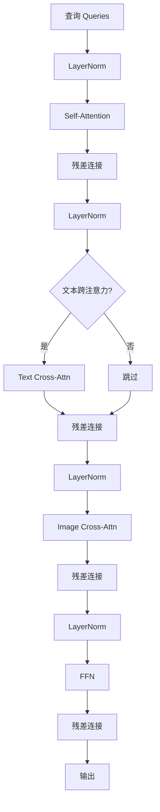
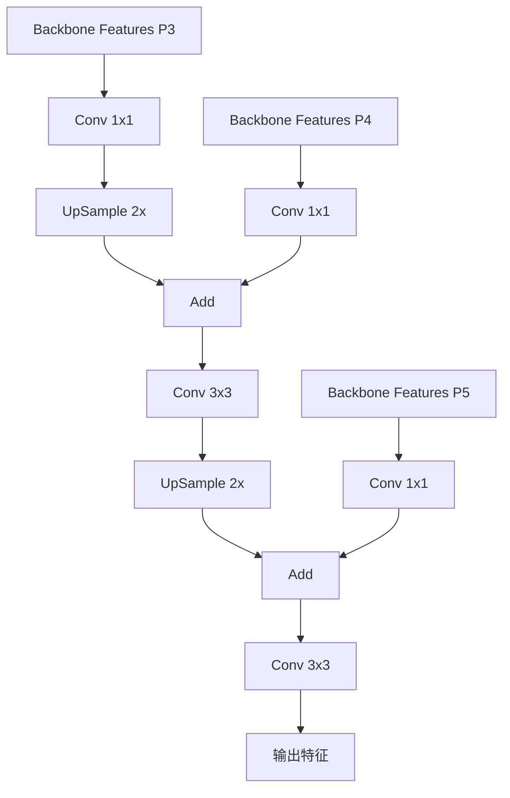
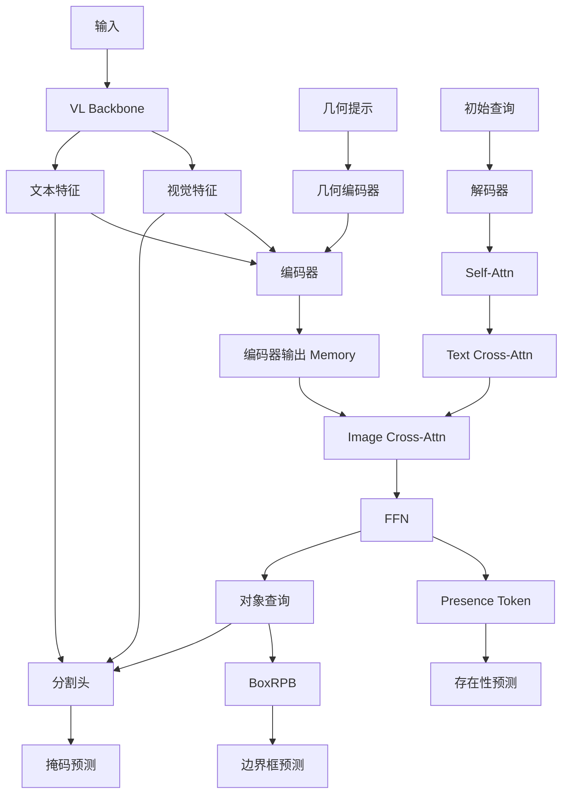

# SAM 3 检测器模块深度分析

## 1. 模块概述

SAM 3 的检测器是基于 DETR (DEtection TRansformer) 架构设计的文本条件化目标检测器，负责在图像/视频中识别和定位与文本提示匹配的对象。检测器输出初始的对象掩码、边界框和置信度分数。

### 1.1 核心组件

| 组件 | 文件路径 | 功能 |
|------|----------|------|
| TransformerEncoderFusion | `sam3/model/encoder.py` | 多模态特征编码 |
| TransformerDecoder | `sam3/model/decoder.py` | 对象查询解码 |
| SequenceGeometryEncoder | `sam3/model/geometry_encoders.py` | 几何提示编码 |
| UniversalSegmentationHead | `sam3/model/maskformer_segmentation.py` | 掩码分割头 |

## 2. Transformer 编码器 (`sam3/model/encoder.py`)

### 2.1 TransformerEncoderFusion

```python
class TransformerEncoderFusion(TransformerEncoder):
    """
    融合文本和图像特征的 Transformer 编码器。
    """
    def __init__(
        self,
        layer: TransformerEncoderLayer,
        num_layers: int = 6,
        d_model: int = 256,
        num_feature_levels: int = 1,
        frozen: bool = False,
        use_act_checkpoint: bool = True,
        add_pooled_text_to_img_feat: bool = False,
        pool_text_with_mask: bool = True,
    ):
```

### 2.2 TransformerEncoderLayer

```python
class TransformerEncoderLayer(nn.Module):
    """
    带有自注意力和跨注意力的编码器层。
    """
    def __init__(
        self,
        d_model: int = 256,
        self_attention: nn.Module = None,
        cross_attention: nn.Module = None,
        ffn_dim: int = 2048,
        dropout: float = 0.1,
        activation: str = "relu",
        pre_norm: bool = True,
        pos_enc_at_attn: bool = True,
        pos_enc_at_cross_attn_keys: bool = False,
        pos_enc_at_cross_attn_queries: bool = False,
    ):
```

**关键组件：**


### 2.3 位置编码配置

| 参数 | 作用 |
|------|------|
| `pos_enc_at_attn` | 自注意力是否使用位置编码 |
| `pos_enc_at_cross_attn_keys` | 跨注意力 key 是否使用位置编码 |
| `pos_enc_at_cross_attn_queries` | 跨注意力 query 是否使用位置编码 |

### 2.4 前向传播

```python
def forward(
    self,
    src: List[torch.Tensor],
    prompt: torch.Tensor = None,
    prompt_mask: torch.Tensor = None,
    pos: List[torch.Tensor] = None,
    ...
):
    """
    编码器前向传播。
    """
    # 预处理多级特征
    if len(src) > 1:
        src, pos, reference_points, valid_ratios = self._prepare_multilevel_features(
            src, pos
        )
    else:
        src = src[0]
        pos = pos[0] if pos is not None else None

    # 文本特征池化并添加到图像特征
    if self.add_pooled_text_to_img_feat and prompt is not None:
        pooled_text = pool_text_feat(prompt, prompt_mask, self.pool_text_with_mask)
        pooled_text = self.text_pooling_proj(pooled_text)[..., None, None]
        src = [x.add_(pooled_text) for x in src] if isinstance(src, list) else src.add_(pooled_text)

    # 编码器层堆叠
    for layer in self.layers:
        if self.use_act_checkpoint and self.training:
            src = checkpoint.checkpoint(layer, src, prompt, prompt_mask, pos)
        else:
            src = layer(src, prompt=prompt, prompt_mask=prompt_mask, pos=pos)

    return src
```

## 3. Transformer 解码器 (`sam3/model/decoder.py`)

### 3.1 TransformerDecoder

```python
class TransformerDecoder(nn.Module):
    """
    对象查询解码器。
    """
    def __init__(
        self,
        layer: TransformerDecoderLayer,
        num_layers: int = 6,
        num_queries: int = 200,
        return_intermediate: bool = True,
        box_refine: bool = True,
        num_o2m_queries: int = 0,
        dac: bool = True,
        boxRPB: str = "log",
        d_model: int = 256,
        frozen: bool = False,
        use_act_checkpoint: bool = True,
        presence_token: bool = True,
        interaction_layer: int = None,
        dac_use_selfatt_ln: bool = True,
        resolution: int = 1008,
        stride: int = 14,
    ):
```

**SAM 3 配置：**
```python
num_layers=6,
num_queries=200,
box_refine=True,
dac=True,
boxRPB="log",
presence_token=True,
```

### 3.2 TransformerDecoderLayer

```python
class TransformerDecoderLayer(nn.Module):
    """
    解码器层：自注意力 → 文本跨注意力 → 图像跨注意力 → FFN
    """
    def __init__(
        self,
        d_model: int = 256,
        self_attention: nn.Module = None,
        cross_attention: nn.Module = None,
        ffn_dim: int = 2048,
        dropout: float = 0.1,
        activation: str = "relu",
        pre_norm: bool = True,
        n_heads: int = 8,
        use_text_cross_attention: bool = True,
    ):
```

**解码器层架构：**



### 3.3 Presence Token 机制

Presence Token 是 SAM 3 的关键创新之一，用于：

1. 判断目标是否存在于图像中
2. 改善相关提示之间的区分度（如"穿白衣服的球员" vs "穿红衣服的球员"）
3. 作为解码器的初始状态

```python
class TransformerDecoder(nn.Module):
    def __init__(self, ..., presence_token: bool = True):
        super().__init__()
        self.presence_token = presence_token
        if presence_token:
            self.presence_token_embedding = nn.Embedding(1, d_model)

    def forward(
        self,
        tgt: torch.Tensor,
        memory: torch.Tensor,
        memory_mask: torch.Tensor = None,
        ...
    ):
        # 生成 presence token
        if self.presence_token:
            presence_token = self.presence_token_embedding.weight[None]  # [1, 1, D]
            presence_token = presence_token.expand(1, tgt.shape[1], -1)  # [1, B, D]
            # 拼接到查询序列
            tgt = torch.cat([presence_token, tgt], dim=0)  # [N+1, B, D]

        # 解码器层堆叠
        for i, layer in enumerate(self.layers):
            tgt = layer(
                tgt, memory,
                tgt_mask=tgt_mask,
                memory_mask=memory_mask,
                pos=pos,
                query_pos=query_pos,
            )

        # 分离 presence token
        if self.presence_token:
            presence_out = tgt[0]  # [B, D]
            tgt = tgt[1:]  # [N, B, D]

        return tgt, presence_out
```

### 3.4 查询位置生成

```python
def gen_sineembed_for_position(pos_tensor: torch.Tensor, d_model: int):
    """
    为位置生成正弦嵌入。
    """
    scale = 2 * math.pi
    dim_t = torch.arange(d_model, dtype=torch.float32, device=pos_tensor.device)
    dim_t = 10000 ** (2 * (dim_t // 2) / d_model)

    x_embed = pos_tensor[:, :, 0] * scale
    y_embed = pos_tensor[:, :, 1] * scale

    pos_x = x_embed[:, None] / dim_t
    pos_y = y_embed[:, None] / dim_t

    pos_x = torch.stack((pos_x[:, 0::2].sin(), pos_x[:, 1::2].cos()), dim=2).flatten(1)
    pos_y = torch.stack((pos_y[:, 0::2].sin(), pos_y[:, 1::2].cos()), dim=2).flatten(1)

    pos = torch.cat((pos_y, pos_x), dim=1)
    return pos
```

### 3.5 Box Reference Point Bias (BoxRPB)

BoxRPB 是一个关键创新，将边界框信息融入注意力机制：

```python
def _get_box_attention_bias(
    self,
    reference_points: torch.Tensor,
    spatial_shapes: torch.Tensor,
    key_padding_mask: torch.Tensor = None,
):
    """
    计算边界框注意力偏置。
    """
    # reference_points: [B, N, 2] (归一化的中心坐标)
    B, N = reference_points.shape[:2]

    # 转换为像素坐标
    H, W = self.resolution // self.stride, self.resolution // self.stride
    ref_points_px = reference_points * torch.tensor([W, H]).to(reference_points)

    # 计算与每个空间位置的相对距离
    y_coords = torch.arange(H).float().to(reference_points)
    x_coords = torch.arange(W).float().to(reference_points)
    yy, xx = torch.meshgrid(y_coords, x_coords, indexing='ij')  # [H, W]
    grid = torch.stack([xx, yy], dim=-1)  # [H, W, 2]

    # 计算相对距离
    # [B, N, H, W, 2] - [H, W, 2] = [B, N, H, W, 2]
    rel_dist = ref_points_px.unsqueeze(2).unsqueeze(3) - grid.unsqueeze(0).unsqueeze(0)

    # 根据模式变换
    if self.boxRPB == "log":
        # 对数变换
        rel_dist = torch.log(torch.abs(rel_dist) + 1) * torch.sign(rel_dist)
    elif self.boxRPB == "linear":
        # 线性变换
        rel_dist = rel_dist

    # 通过 MLP 投影为注意力偏置
    attn_bias = self.box_bias_proj(rel_dist)  # [B, N, H, W]

    # 应用掩码
    if key_padding_mask is not None:
        attn_bias = attn_bias.masked_fill(
            key_padding_mask.unsqueeze(1).unsqueeze(1), float('-inf')
        )

    return attn_bias
```

### 3.6 DAC (Divide-and-Conquer) 机制

DAC 将查询分为两部分处理，减少计算量：

```python
if self.dac:
    # o2o: object-to-object 查询（用于掩码预测）
    # o2m: object-to-memory 查询（用于内存编码）
    num_o2o = self.num_queries
    num_o2m = self.num_o2m_queries

    tgt_o2o = tgt[:num_o2o]
    tgt_o2m = tgt[num_o2o:num_o2o + num_o2m]

    # 分别处理
    tgt_o2o = self.layers[0](tgt_o2o, memory, ...)
    tgt_o2m = self.layers[0](tgt_o2m, memory, ...)

    tgt = torch.cat([tgt_o2o, tgt_o2m], dim=0)
```

## 4. 几何提示编码器 (`sam3/model/geometry_encoders.py`)

### 4.1 SequenceGeometryEncoder

```python
class SequenceGeometryEncoder(nn.Module):
    """
    编码几何提示（点、框）。
    """
    def __init__(
        self,
        pos_enc: nn.Module,
        d_model: int = 256,
        num_layers: int = 3,
        layer: nn.Module = None,
        encode_boxes_as_points: bool = False,
        # 点编码选项
        points_direct_project: bool = True,
        points_pool: bool = True,
        points_pos_enc: bool = True,
        # 框编码选项
        boxes_direct_project: bool = True,
        boxes_pool: bool = True,
        boxes_pos_enc: bool = True,
        use_act_ckpt: bool = True,
        add_cls: bool = True,
        add_post_encode_proj: bool = True,
    ):
```

### 4.2 多种编码策略

#### 4.2.1 直接投影

```python
# 点：坐标 → 特征
points_direct_project = nn.Linear(2, d_model)

# 框：4 个坐标 → 特征
boxes_direct_project = nn.Linear(4, d_model)
```

#### 4.2.2 特征池化

```python
# 从 backbone 特征池化点位置
def pool_point_features(
    img_feats: torch.Tensor,
    points: torch.Tensor,
    image_size: Tuple[int, int],
):
    """
    使用 grid_sample 从图像特征池化点特征。
    """
    B, C, H, W = img_feats.shape
    points_norm = points / torch.tensor([image_size[1], image_size[0]]).to(points)
    points_norm = points_norm * 2 - 1  # 归一化到 [-1, 1]

    grid = points_norm.view(B, -1, 1, 2)  # [B, N, 1, 2]
    pooled = F.grid_sample(img_feats, grid, align_corners=False)  # [B, C, N, 1]
    pooled = pooled.squeeze(-1).permute(0, 2, 1)  # [B, N, C]

    return pooled

# 从 backbone 特征池化框区域
def pool_box_features(
    img_feats: torch.Tensor,
    boxes: torch.Tensor,  # [N, 4] (x1, y1, x2, y2)
    image_size: Tuple[int, int],
):
    """
    使用 ROI Align 从图像特征池化框特征。
    """
    boxes_norm = boxes / torch.tensor([image_size[1], image_size[0], image_size[1], image_size[0]]).to(boxes)

    pooled = ops.roi_align(
        img_feats,
        [boxes_norm],
        output_size=(7, 7),
        spatial_scale=1.0,
        aligned=True,
    )  # [N, C, 7, 7]

    return pooled
```

#### 4.2.3 位置编码

```python
# 点位置编码
def encode_points_with_position(
    points: torch.Tensor,
    pos_enc: nn.Module,
    image_size: Tuple[int, int],
):
    """
    使用正弦位置编码编码点位置。
    """
    points_norm = points / torch.tensor([image_size[1], image_size[0]]).to(points)

    pos_embed = pos_enc._encode_xy(
        points_norm[:, 0] * image_size[1],
        points_norm[:, 1] * image_size[0],
    )

    pos_embed_x, pos_embed_y = pos_embed
    pos_embed = torch.cat([pos_embed_x, pos_embed_y], dim=-1)  # [N, D]

    return pos_embed
```

### 4.3 前向传播

```python
def forward(
    self,
    input: BatchedDatapoint,
    backbone_feats: torch.Tensor,
):
    """
    编码几何提示。
    """
    device = backbone_feats.device
    B, C, H, W = backbone_feats.shape

    # 编码点
    point_embeddings = []
    if len(input.point_coords) > 0:
        points = input.point_coords  # [N, 2]
        labels = input.point_labels  # [N]

        # 方式 1: 直接投影
        if self.points_direct_project:
            proj = self.points_direct_project(points)
            point_embeddings.append(proj)

        # 方式 2: 特征池化
        if self.points_pool:
            pooled = pool_point_features(backbone_feats, points, self.image_size)
            pooled = self.points_pool_project(pooled)
            point_embeddings.append(pooled)

        # 方式 3: 位置编码
        if self.points_pos_enc:
            pos = self.pos_enc._encode_xy(
                points[:, 0] * self.image_size[1],
                points[:, 1] * self.image_size[0],
            )
            pos = torch.cat([pos[0], pos[1]], dim=-1)
            point_embeddings.append(pos)

    # 编码框
    box_embeddings = []
    if len(input.boxes) > 0:
        boxes = input.boxes  # [N, 4] (x1, y1, x2, y2)
        labels = input.box_labels  # [N]

        # 方式 1: 直接投影
        if self.boxes_direct_project:
            proj = self.boxes_direct_project(boxes)
            box_embeddings.append(proj)

        # 方式 2: 特征池化
        if self.boxes_pool:
            pooled = pool_box_features(backbone_feats, boxes, self.image_size)
            pooled = self.boxes_pool_project(pooled.flatten(1))
            box_embeddings.append(pooled)

        # 方式 3: 位置编码
        if self.boxes_pos_enc:
            centers = (boxes[:, :2] + boxes[:, 2:]) / 2
            wh = boxes[:, 2:] - boxes[:, :2]
            pos_center = self.pos_enc._encode_xy(
                centers[:, 0] * self.image_size[1],
                centers[:, 1] * self.image_size[0],
            )
            pos_wh = self.pos_enc._encode_xy(
                wh[:, 0] * self.image_size[1] / 1000,
                wh[:, 1] * self.image_size[0] / 1000,
            )
            pos = torch.cat([pos_center[0], pos_center[1], pos_wh[0], pos_wh[1]], dim=-1)
            box_embeddings.append(pos)

    # 组合所有嵌入
    all_embeddings = point_embeddings + box_embeddings
    if len(all_embeddings) > 0:
        combined = torch.cat(all_embeddings, dim=-1)  # [N, D']

        # 后编码投影
        if self.add_post_encode_proj:
            combined = self.post_encode_proj(combined)

        # 添加 CLS token
        if self.add_cls:
            cls_token = self.cls_token.expand(1, B, -1)
            combined = torch.cat([cls_token, combined], dim=0)  # [N+1, B, D]

        return combined

    return None
```

## 5. 分割头 (`sam3/model/maskformer_segmentation.py`)

### 5.1 PixelDecoder

```python
class PixelDecoder(nn.Module):
    """
    像 FPN 一样上采样多尺度特征。
    """
    def __init__(
        self,
        in_channels: int = 256,
        hidden_dim: int = 256,
        num_upsampling_stages: int = 3,
        interpolation_mode: str = "nearest",
        use_shared_conv: bool = True,
        compile_mode: str = None,
    ):
```

**PixelDecoder 架构：**



### 5.2 UniversalSegmentationHead

```python
class UniversalSegmentationHead(nn.Module):
    """
    通用分割头，预测掩码和存在性。
    """
    def __init__(
        self,
        hidden_dim: int = 256,
        upsampling_stages: int = 3,
        aux_masks: bool = False,
        presence_head: bool = False,
        dot_product_scorer: nn.Module = None,
        act_ckpt: bool = True,
        cross_attend_prompt: nn.Module = None,
        pixel_decoder: nn.Module = None,
    ):
```

### 5.3 Cross-Attend Prompt

```python
def forward(
    self,
    image_features: torch.Tensor,
    pixel_decoder_features: torch.Tensor,
    prompt: torch.Tensor = None,
    prompt_mask: torch.Tensor = None,
):
    """
    分割头前向传播。
    """
    # Pixel decoder 生成像素级特征
    pixel_features = self.pixel_decoder(pixel_decoder_features)

    # 跨注意力融合提示
    if self.cross_attend_prompt is not None:
        tgt = pixel_features
        tgt = self.cross_attn_norm(tgt)
        tgt = self.cross_attend_prompt(
            query=tgt,
            key=prompt,
            value=prompt,
            key_padding_mask=prompt_mask,
        )[0]
        pixel_features = tgt + pixel_features

    # 掩码预测
    masks = self.mask_predictor(pixel_features)

    return masks
```

## 6. 数据流向图



## 7. 关键创新点

### 7.1 Presence Token

- 提供全局存在性判断
- 改善相关提示之间的区分度
- 作为解码器的初始状态

### 7.2 Box Reference Point Bias

- 将边界框信息融入注意力机制
- 支持对数和线性两种变换模式
- 提高定位精度

### 7.3 灵活的几何提示编码

- 支持直接投影、特征池化和位置编码三种方式
- 可自由组合不同策略
- 适应不同类型的提示

### 7.4 DAC 机制

- 将查询分为 o2o 和 o2m 两部分
- 减少计算量
- 提高内存效率

## 8. 总结

SAM 3 的检测器模块通过以下设计实现了强大的文本条件化检测能力：

1. **多模态融合**：文本、几何和视觉提示的统一处理
2. **Presence Token**：优雅的目标存在性判断
3. **BoxRPB**：边界框信息的注意力偏置
4. **灵活的提示编码**：多种几何编码策略
5. **DAC 机制**：高效的查询处理

这些设计使得 SAM 3 能够准确理解复杂的文本提示，实现精确的对象检测和分割。
