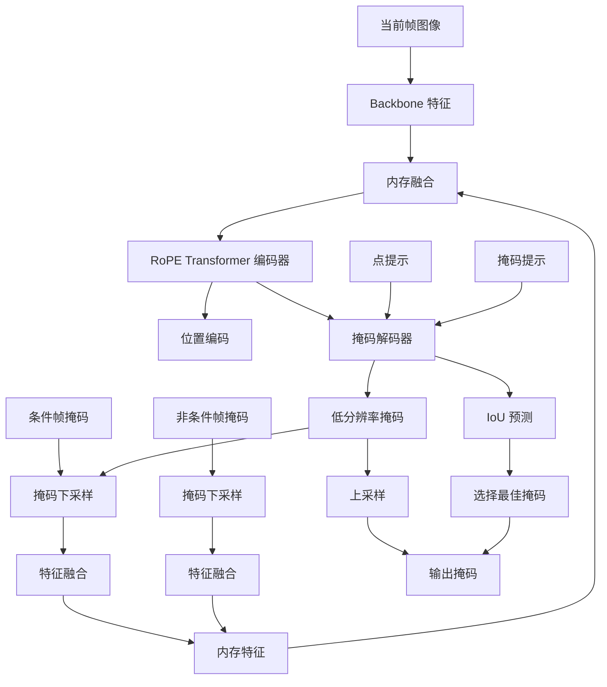

# SAM 3 跟踪器模块深度分析

## 1. 模块概述

SAM 3 的跟踪器基于 SAM2 的 Transformer 编码器-解码器架构，负责在视频中跨帧跟踪已识别的对象。跟踪器处理时间一致性，处理对象遮挡、外观变化等挑战。

### 1.1 核心组件

| 组件 | 文件路径 | 功能 |
|------|----------|------|
| Sam3TrackerPredictor | `sam3/model/sam3_tracking_predictor.py` | 跟踪器预测器 |
| SimpleMaskEncoder | `sam3/model/memory.py` | 内存编码器 |
| RoPEAttention | `sam3/sam/transformer.py` | 旋转位置编码注意力 |

## 2. 跟踪器预测器 (`sam3/model/sam3_tracking_predictor.py`)

### 2.1 Sam3TrackerPredictor

```python
class Sam3TrackerPredictor(Sam3TrackerBase):
    """
    SAM3 跟踪器预测器，处理用户交互和多目标跟踪。
    """
    def __init__(
        self,
        image_size: int = 1008,
        num_maskmem: int = 7,              # 内存中保存的掩码历史帧数量
        backbone: nn.Module = None,
        backbone_stride: int = 14,
        transformer: nn.Module = None,
        maskmem_backbone: nn.Module = None,
        # SAM 参数
        multimask_output_in_sam: bool = True,
        # 评估
        forward_backbone_per_frame_for_eval: bool = True,
        trim_past_non_cond_mem_for_eval: bool = False,
        # 多掩码
        multimask_output_for_tracking: bool = True,
        multimask_min_pt_num: int = 0,
        multimask_max_pt_num: int = 1,
        # 对象管理
        always_start_from_first_ann_frame: bool = False,
        # 掩码重叠
        non_overlap_masks_for_mem_enc: bool = False,
        non_overlap_masks_for_output: bool = False,
        max_cond_frames_in_attn: int = 4,   # 参与内存注意力的最大条件帧数
        offload_output_to_cpu_for_eval: bool = False,
        # SAM 解码器设置
        sam_mask_decoder_extra_args: Dict = None,
        clear_non_cond_mem_around_input: bool = True,
        fill_hole_area: int = 0,
        use_memory_selection: bool = False,    # 使用帧过滤
    ):
```

### 2.2 关键参数详解

| 参数 | 默认值 | 作用 |
|------|--------|------|
| `num_maskmem` | 7 | 内存中保存的掩码历史帧数量 |
| `max_cond_frames_in_attn` | 4 | 参与内存注意力的最大条件帧数 |
| `multimask_output_for_tracking` | True | 跟踪时输出多掩码 |
| `use_memory_selection` | False | 是否使用帧过滤 |

### 2.3 推理状态初始化

```python
def init_state(
    self,
    video_height: int,
    video_width: int,
    num_frames: int,
    video_path: str,
    offload_video_to_cpu: bool = True,
):
    """
    初始化推理状态。
    """
    state = {
        # 对象管理
        "point_inputs_per_obj": defaultdict(list),
        "mask_inputs_per_obj": defaultdict(list),
        "obj_ids": [],

        # 缓存
        "cached_features": {},
        "output_dict": defaultdict(list),

        # 帧信息
        "num_frames": num_frames,
        "video_height": video_height,
        "video_width": video_width,

        # 内存管理
        "cond_frame_outputs": {},  # 条件帧输出
        "non_cond_frame_outputs": {},  # 非条件帧输出
    }

    return state
```

### 2.4 跟踪步骤

```python
def track_step(
    self,
    frame_idx: int,
    is_init_cond_frame: bool,
    state: Dict,
    **kwargs
):
    """
    单帧跟踪步骤。
    """
    device = next(self.parameters()).device
    B, _, H_in, W_in = state["images"][frame_idx].shape

    # 1. 准备输入特征
    backbone_features = self._prepare_backbone_features(state, frame_idx)

    # 2. 准备内存条件化特征
    pix_feat_with_mem = self._prepare_memory_conditioned_features(
        backbone_features,
        state,
        frame_idx,
        is_init_cond_frame=is_init_cond_frame,
    )

    # 3. 准备点输入
    point_inputs, point_labels = self._prepare_point_inputs(state, frame_idx)

    # 4. 准备掩码输入
    mask_inputs = self._prepare_mask_inputs(state, frame_idx)

    # 5. SAM 分割头处理
    if self.multimask_output_for_tracking:
        low_res_masks, iou_predictions, _, sam_output_tokens = self.sam_mask_decoder(
            image_embeddings=pix_feat_with_mem["vision_features"],
            image_pe=pix_feat_with_mem["vision_pos_enc"],
            sparse_prompt_embeddings=point_inputs,
            dense_prompt_embeddings=mask_inputs,
            multimask_output=True,
        )

        # 选择最佳掩码（基于 IoU）
        best_mask_idx = iou_predictions.argmax(dim=-1)
        low_res_masks = low_res_masks[
            torch.arange(len(best_mask_idx)), best_mask_idx
        ]
        iou_predictions = iou_predictions[
            torch.arange(len(best_mask_idx)), best_mask_idx
        ]

    # 6. 更新内存
    if is_init_cond_frame:
        # 条件帧：将掩码编码为内存
        mem_out = self.maskmem_backbone(
            pix_feat=pix_feat_with_mem["vision_features"],
            masks=low_res_masks,
        )
        state["cond_frame_outputs"][frame_idx] = {
            "maskmem_features": mem_out["vision_features"],
            "maskmem_pos_enc": mem_out["vision_pos_enc"],
            "obj_ptr": sam_output_tokens,
            "low_res_masks": low_res_masks,
        }
    else:
        # 非条件帧：保存输出
        state["non_cond_frame_outputs"][frame_idx] = {
            "low_res_masks": low_res_masks,
            "obj_ptr": sam_output_tokens,
        }

    return low_res_masks, iou_predictions
```

### 2.5 内存条件化特征准备

```python
def _prepare_memory_conditioned_features(
    self,
    backbone_features: Dict,
    state: Dict,
    frame_idx: int,
    is_init_cond_frame: bool,
):
    """
    准备与历史内存融合的特征。
    """
    device = next(self.parameters()).device
    B, _, H, W = backbone_features["high_res_feats"][0].shape

    # 1. 选择条件帧
    selected_cond_outputs, unselected_cond_outputs = select_closest_cond_frames(
        frame_idx,
        state["cond_frame_outputs"],
        self.max_cond_frames_in_attn,
        keep_first_cond_frame=self.keep_first_cond_frame,
    )

    # 2. 准备非条件帧内存
    non_cond_mem_list = []
    for t_pos, prev in enumerate(state["non_cond_frame_outputs"].values()):
        if t_pos >= self.num_maskmem - 1:
            break

        mem_feat = prev["maskmem_features"].to(device, non_blocking=True)
        mem_pos = prev["maskmem_pos_enc"].to(device, non_blocking=True)
        non_cond_mem_list.append((mem_feat, mem_pos, False))

    # 3. 组合所有内存
    to_cat_mem_feats = []
    to_cat_mem_pos = []
    to_cat_mem_mask = []

    # 添加条件帧内存
    for out in selected_cond_outputs.values():
        to_cat_mem_feats.append(out["maskmem_features"])
        to_cat_mem_pos.append(out["maskmem_pos_enc"])
        to_cat_mem_mask.append(torch.zeros(B, 1, device=device, dtype=torch.bool))

    # 添加非条件帧内存
    for feat, pos, is_cond in non_cond_mem_list:
        to_cat_mem_feats.append(feat)
        to_cat_mem_pos.append(pos)
        to_cat_mem_mask.append(torch.ones(B, 1, device=device, dtype=torch.bool))

    # 拼接内存特征
    if len(to_cat_mem_feats) > 0:
        mem_feats = torch.cat(to_cat_mem_feats, dim=1)  # [B, T, C, H', W']
        mem_pos = torch.cat(to_cat_mem_pos, dim=1)
        mem_mask = torch.cat(to_cat_mem_mask, dim=1)
    else:
        mem_feats = None
        mem_pos = None
        mem_mask = None

    # 4. 通过 Transformer 融合内存
    if mem_feats is not None:
        # 展平空间维度
        C, Hm, Wm = mem_feats.shape[-3:]
        mem_feats_flat = mem_feats.flatten(-2, -1).permute(1, 2, 0)  # [T, B, C*Hm*Wm]

        # Transformer 编码器
        mem_features_out = self.transformer(
            src=mem_feats_flat,
            mask=mem_mask,
            pos=mem_pos.flatten(-2, -1) if mem_pos is not None else None,
        )

        # 转换回空间维度
        mem_features_out = mem_features_out.permute(1, 0, 2).view(B, -1, C, Hm, Wm)

        # 与当前帧特征融合
        pix_feat = backbone_features["high_res_feats"][0]
        pix_feat = pix_feat + mem_features_out.mean(dim=1)  # 平均融合
    else:
        pix_feat = backbone_features["high_res_feats"][0]

    return {
        "vision_features": pix_feat,
        "vision_pos_enc": backbone_features["high_res_pos"][0],
    }
```

## 3. 内存编码器 (`sam3/model/memory.py`)

### 3.1 SimpleMaskEncoder

```python
class SimpleMaskEncoder(nn.Module):
    """
    掩码编码器，将掩码编码为内存特征。
    """
    def __init__(
        self,
        out_dim: int = 64,             # 输出维度
        position_encoding: nn.Module,   # 位置编码
        mask_downsampler: nn.Module,    # 掩码下采样器
        fuser: nn.Module,               # 融合器
        in_dim: int = 256,
    ):
```

### 3.2 SimpleMaskDownSampler

```python
class SimpleMaskDownSampler(nn.Module):
    """
    掩码渐进式下采样器。
    """
    def __init__(
        self,
        embed_dim: int = 256,
        kernel_size: int = 4,
        stride: int = 4,
        total_stride: int = 16,
        extra_dims: int = 0,
    ):
        super().__init__()
        self.extra_dims = extra_dims
        self.num_layers = int(math.log2(total_stride) // math.log2(stride))

        layers = []
        in_ch = 1 + extra_dims  # 掩码通道 + 额外通道
        out_ch = embed_dim

        for i in range(self.num_layers):
            # 计算当前层的输出通道数
            layers_per_stride = int(math.log2(stride))
            current_layer_idx = i * layers_per_stride

            # 第一层：1x1 卷积 + LayerNorm + GELU
            layers.append(
                nn.Sequential(
                    nn.Conv2d(in_ch, out_ch, kernel_size=1, stride=1, padding=0),
                    nn.LayerNorm(out_ch),
                    nn.GELU(),
                )
            )

            # 中间层：1x1 卷积 + LayerNorm + GELU
            for _ in range(layers_per_stride - 2):
                layers.append(
                    nn.Sequential(
                        nn.Conv2d(out_ch, out_ch, kernel_size=1, stride=1, padding=0),
                        nn.LayerNorm(out_ch),
                        nn.GELU(),
                    )
                )

            # 最后一层：1x1 卷积
            layers.append(
                nn.Conv2d(out_ch, out_ch, kernel_size=1, stride=1, padding=0)
            )

            # 调整输入输出通道
            in_ch = out_ch
            out_ch = out_ch * stride // 2 if i < self.num_layers - 1 else out_ch

        self.layers = nn.ModuleList(layers)

    def forward(self, x: torch.Tensor):
        """
        前向传播。
        """
        # x: [B, 1, H, W]
        for layer in self.layers:
            x = layer(x)

        return x  # [B, C, H/16, W/16]
```

### 3.3 SimpleFuser

```python
class SimpleFuser(nn.Module):
    """
    使用 CXBlock 堆叠的融合器。
    """
    def __init__(
        self,
        layer: nn.Module,
        num_layers: int = 2,
        dim: int = None,
        input_projection: bool = False,
    ):
        super().__init__()
        self.layers = nn.ModuleList([copy.deepcopy(layer) for _ in range(num_layers)])

        if input_projection:
            self.input_proj = nn.Conv2d(dim * 2, dim, kernel_size=1)
        else:
            self.input_proj = None

    def forward(self, x: torch.Tensor, cond: torch.Tensor = None):
        """
        融合图像特征和掩码特征。
        """
        if cond is not None:
            # 拼接特征
            x = torch.cat([x, cond], dim=1)
            if self.input_proj is not None:
                x = self.input_proj(x)

        # 通过 CXBlock 层
        for layer in self.layers:
            x = layer(x)

        return x
```

### 3.4 CXBlock

```python
class CXBlock(nn.Module):
    """
    ConvNeXt 风格的卷积块。
    """
    def __init__(
        self,
        dim: int,
        kernel_size: int = 7,
        padding: int = 3,
        layer_scale_init_value: float = 1e-6,
        use_dwconv: bool = True,
        drop_path: float = 0.0,
    ):
        super().__init__()

        # 深度卷积
        self.dwconv = nn.Conv2d(
            dim, dim,
            kernel_size=kernel_size,
            padding=padding,
            groups=dim if use_dwconv else 1,
        )

        # LayerNorm（在通道维度上）
        self.norm = LayerNorm2d(dim)

        # 逐点卷积（通过 permute 实现）
        self.pwconv1 = nn.Linear(dim, 4 * dim)
        self.act = nn.GELU()
        self.pwconv2 = nn.Linear(4 * dim, dim)

        # Layer Scale
        self.gamma = nn.Parameter(
            layer_scale_init_value * torch.ones(dim),
            requires_grad=True,
        ) if layer_scale_init_value > 0 else None

    def forward(self, x: torch.Tensor) -> torch.Tensor:
        """
        前向传播。
        """
        input = x

        # 深度卷积
        x = self.dwconv(x)

        # LayerNorm
        x = self.norm(x)

        # 逐点卷积（转换为通道最后格式）
        B, C, H, W = x.shape
        x = x.permute(0, 2, 3, 1)  # [B, H, W, C]
        x = self.pwconv1(x)
        x = self.act(x)
        x = self.pwconv2(x)
        x = x.permute(0, 3, 1, 2)  # [B, C, H, W]

        # Layer Scale
        if self.gamma is not None:
            x = self.gamma.view(1, C, 1, 1) * x

        # 残差连接
        x = input + x

        return x
```

### 3.5 SimpleMaskEncoder 前向传播

```python
def forward(
    self,
    pix_feat: torch.Tensor,   # [B, C, H, W]
    masks: torch.Tensor,       # [B, 1, H, W] 或 [B, K, H, W]
    skip_mask_sigmoid: bool = False,
):
    """
    掩码编码前向传播。
    """
    # 1. 处理掩码
    if not skip_mask_sigmoid:
        masks = F.sigmoid(masks)

    # 2. 下采样掩码
    masks = self.mask_downsampler(masks)  # [B, C, H/16, W/16]

    # 3. 融合视觉特征和掩码
    x = self.pix_feat_proj(pix_feat)  # 投影到统一维度
    x = x + masks  # 残差相加
    x = self.fuser(x)  # 通过融合器

    # 4. 位置编码
    pos = self.position_encoding(x).to(x.dtype)

    return {
        "vision_features": x,     # [B, C, H/16, W/16]
        "vision_pos_enc": pos,    # [B, C, H/16, W/16]
    }
```

## 4. RoPE 注意力 (`sam3/sam/transformer.py`)

### 4.1 RoPEAttention

```python
class RoPEAttention(Attention):
    """
    带旋转位置编码的注意力。
    """
    def __init__(
        self,
        embedding_dim: int,
        num_heads: int,
        downsample_rate: int = 1,
        dropout: float = 0.0,
        rope_theta: float = 10000.0,
        feat_sizes: Tuple[int, int] = (64, 64),
        use_fa3: bool = False,
        use_rope_real: bool = False,
        rope_k_repeat: bool = False,
    ):
```

### 4.2 旋转位置编码计算

```python
def compute_axial_cis(
    dim: int,
    end_x: int,
    end_y: int,
    theta: float = 10000.0,
    scale_pos: float = 1.0,
    offset: int = 0,
    device: torch.device = None,
) -> torch.Tensor:
    """
    计算 2D 轴向旋转位置编码。
    """
    # 计算频率: 1 / (theta^(2i/d))
    freqs_x = 1.0 / (theta ** (
        torch.arange(0, dim, 4, device=device)[: (dim // 4)].float() / dim
    ))
    freqs_y = 1.0 / (theta ** (
        torch.arange(0, dim, 4, device=device)[: (dim // 4)].float() / dim
    ))

    # 生成位置索引
    t_x = torch.arange(
        offset, end_x * scale_pos + offset,
        device=device, dtype=torch.float32
    )
    t_y = torch.arange(
        offset, end_y * scale_pos + offset,
        device=device, dtype=torch.float32
    )
    freqs_x = torch.outer(t_x, freqs_x)  # [end_x, dim/4]
    freqs_y = torch.outer(t_y, freqs_y)  # [end_y, dim/4]

    # 计算复数频率
    freqs_cis_x = torch.polar(
        torch.ones_like(freqs_x),
        freqs_x
    )
    freqs_cis_y = torch.polar(
        torch.ones_like(freqs_y),
        freqs_y
    )

    # 拼接 x 和 y 方向
    return torch.cat([freqs_cis_x, freqs_cis_y], dim=-1)  # [max(end_x, end_y), dim/2]
```

### 4.3 RoPE 应用

```python
def apply_rotary_enc(
    xq: torch.Tensor,
    xk: torch.Tensor,
    freqs_cis: torch.Tensor,
) -> Tuple[torch.Tensor, torch.Tensor]:
    """
    应用旋转位置编码。
    """
    # 转换为复数形式
    xq_ = torch.view_as_complex(
        xq.float().reshape(*xq.shape[:-1], -1, 2)
    )
    xk_ = torch.view_as_complex(
        xk.float().reshape(*xk.shape[:-1], -1, 2)
    )

    # 应用旋转
    xq_out = torch.view_as_real(xq_ * freqs_cis).flatten(-2)
    xk_out = torch.view_as_real(xk_ * freqs_cis).flatten(-2)

    return xq_out.type_as(xq), xk_out.type_as(xk)
```

### 4.4 rope_k_repeat 机制

当查询和键的序列长度不同时（如跨注意力时）：

```python
def forward(
    self,
    q: torch.Tensor,
    k: torch.Tensor,
    v: torch.Tensor,
    freqs_cis: torch.Tensor,
    ...
):
    # 应用 RoPE
    xq, xk = apply_rotary_enc(q, k, freqs_cis)

    # 如果需要重复 k 的频率
    if self.rope_k_repeat and q.shape[-2] != k.shape[-2]:
        r = k.shape[-2] // q.shape[-2]
        # 重复 q 的频率以匹配 k 的长度
        xq = xq.repeat_interleave(r, dim=-2)

    # 注意力计算
    attn = (xq @ k.transpose(-2, -1)) / (q.shape[-1] ** 0.5)
    # ...
```

## 5. 时空建模策略

### 5.1 时间位置编码

```python
def _get_tpos_enc(
    self,
    pos_list: List[int],
    max_abs_pos: int,
    device: torch.device,
) -> torch.Tensor:
    """
    获取时间位置编码。
    """
    pos_tensor = torch.tensor(pos_list, dtype=torch.long, device=device)

    # 绝对位置编码
    abs_pos_enc = self.maskmem_tpos_enc[pos_tensor]  # [N, D]

    # 相对位置编码（从 -1 到 1）
    rel_pos = pos_tensor.float() / max_abs_pos * 2 - 1

    return abs_pos_enc, rel_pos
```

### 5.2 内存帧选择

```python
def select_closest_cond_frames(
    frame_idx: int,
    cond_outputs: Dict[int, Dict],
    max_cond_frames: int,
    keep_first_cond_frame: bool = True,
) -> Tuple[Dict, Dict]:
    """
    选择时间上最近的条件帧。
    """
    # 获取所有条件帧索引
    cond_frame_idxs = list(cond_outputs.keys())

    # 计算与当前帧的距离
    distances = [
        abs(frame_idx - idx) for idx in cond_frame_idxs
    ]

    # 按距离排序
    sorted_pairs = sorted(zip(distances, cond_frame_idxs))
    selected_idxs = [idx for _, idx in sorted_pairs[:max_cond_frames]]

    # 构建输出
    selected = {idx: cond_outputs[idx] for idx in selected_idxs}
    unselected = {
        idx: cond_outputs[idx]
        for idx in cond_frame_idxs
        if idx not in selected_idxs
    }

    return selected, unselected
```

### 5.3 正向和反向跟踪

```python
def propagate_in_video(
    self,
    is_init_cond_frame: torch.Tensor,
    init_frame_indices: List[int],
    tracking_mode: str = "forward",
):
    """
    在视频中传播。
    """
    if tracking_mode == "forward":
        # 正向传播：从前向后
        start_idx = min(init_frame_indices)
        end_idx = self.num_frames
        step = 1
        tpos_sign_mul = 1
    elif tracking_mode == "backward":
        # 反向传播：从后向前
        start_idx = max(init_frame_indices)
        end_idx = -1
        step = -1
        tpos_sign_mul = -1

    # 遍历帧
    for frame_idx in range(start_idx, end_idx, step):
        # 跟踪当前帧
        self.track_step(frame_idx, ...)
```

## 6. 数据流向图



## 7. 关键创新点

### 7.1 内存机制

- 保存 7 帧历史掩码信息
- 通过 Transformer 融合历史信息
- 支持条件帧和非条件帧的独立处理

### 7.2 RoPE 位置编码

- 2D 轴向旋转位置编码
- 强外推能力，处理不同分辨率
- 支持跨注意力时的频率重复

### 7.3 智能帧选择

- 根据时间距离选择最相关的帧
- 支持最大帧数限制
- 保留第一帧的条件化信息

### 7.4 多掩码输出

- 跟踪时生成多个候选掩码
- 基于 IoU 选择最佳掩码
- 支持动态多掩码（基于稳定性）

## 8. 总结

SAM 3 的跟踪器模块通过以下设计实现了强大的视频跟踪能力：

1. **内存机制**：保存和融合历史帧信息
2. **RoPE 编码**：高效的时空位置建模
3. **智能帧选择**：动态选择最相关的历史帧
4. **多掩码输出**：提高掩码质量
5. **双向跟踪**：支持正向和反向传播

这些设计使得 SAM 3 能够在视频中准确跟踪对象，处理遮挡、外观变化等挑战。
