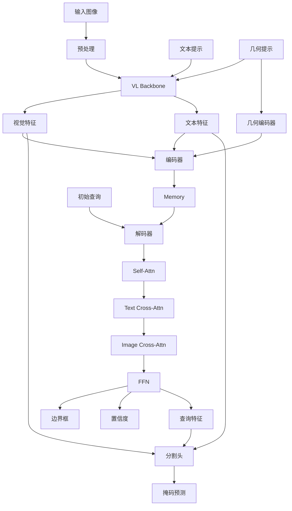

# SAM 3 图像分割流程深度分析

## 1. 概述

SAM 3 的图像分割流程将文本、几何和视觉提示整合为统一的分割任务，输出目标对象的掩码、边界框和置信度分数。该流程支持单步推理和多步交互式推理。

### 1.1 流程组件

| 组件 | 文件路径 | 功能 |
|------|----------|------|
| Sam3Image | `sam3/model/sam3_image.py` | 图像分割模型 |
| Sam3Processor | `sam3/model/sam3_image_processor.py` | 推理处理器 |
| SAM3InteractiveImagePredictor | `sam3/model/sam1_task_predictor.py` | 交互式预测器 |

## 2. Sam3Image 模型 (`sam3/model/sam3_image.py`)

### 2.1 类定义

```python
class Sam3Image(nn.Module):
    """
    SAM3 图像分割模型。
    """
    def __init__(
        self,
        backbone: nn.Module,                  # VL Backbone
        transformer: nn.Module,              # Transformer 编码器-解码器
        input_geometry_encoder: nn.Module,    # 几何提示编码器
        segmentation_head: nn.Module,       # 分割头
        num_feature_levels: int = 1,
        o2m_mask_predict: bool = True,
        dot_prod_scoring: nn.Module = None,
        use_instance_query: bool = False,
        multimask_output: bool = True,
        inst_interactive_predictor: nn.Module = None,
        matcher: nn.Module = None,
    ):
```

### 2.2 前向传播

```python
def forward(
    self,
    input: BatchedDatapoint,
    return_attn_weights: bool = False,
):
    """
    图像分割前向传播。
    """
    B = input.img_batch.shape[0]

    # 1. 提取图像和文本特征
    backbone_out = self.backbone.forward_image(input.img_batch)
    text_outputs = self.backbone.forward_text(input.find_text_batch)

    # 2. 准备几何提示
    geometric_prompt = Prompt(
        box_embeddings=input.input_boxes,
        box_mask=input.input_boxes_mask,
        box_labels=input.input_boxes_label,
    )

    # 3. 编码提示
    prompt, prompt_mask = self._encode_prompt(
        backbone_out,
        input.find_input,
        geometric_prompt,
        encode_text=True,
        encode_geometry=(input.input_boxes is not None),
        encode_visual_prompt=False,
    )

    # 4. 编码器前向传播
    memory = self.transformer.encoder(
        src=backbone_out["visual_features"],
        prompt=prompt,
        prompt_mask=prompt_mask,
        pos=backbone_out["visual_pos"],
    )

    # 5. 解码器前向传播
    query_embed = torch.zeros(B, self.transformer.num_queries, 256).to(
        backbone_out["visual_features"][0].device
    )

    outputs = self.transformer.decoder(
        tgt=query_embed,
        memory=memory,
        memory_mask=None,
        pos=backbone_out["visual_pos"],
        query_pos=backbone_out["visual_pos"][0],
        ref_points=None,
        prompt=prompt,
        prompt_mask=prompt_mask,
    )

    # 6. 提取输出
    pred_boxes = outputs["pred_boxes"]  # [B, N, 4]
    pred_logits = outputs["pred_logits"]  # [B, N]
    presence_logits = outputs.get("presence_logits", None)  # [B, 1]

    # 7. 分割头
    if self.segmentation_head is not None:
        masks, mask_logits = self.segmentation_head(
            image_features=backbone_out["visual_features"],
            pixel_decoder_features=backbone_out["visual_features"],
            query_features=outputs["query_features"],
            prompt=prompt,
            prompt_mask=prompt_mask,
        )

    # 8. 后处理
    if self.inst_interactive_predictor is not None:
        # 交互式推理（SAM1 任务）
        inst_outputs = self.inst_interactive_predictor(...)
    else:
        inst_outputs = None

    return {
        "pred_masks": masks,
        "pred_boxes": pred_boxes,
        "pred_logits": pred_logits,
        "presence_logits": presence_logits,
    }
```

### 2.3 提示编码

```python
def _encode_prompt(
    self,
    backbone_out: Dict,
    find_input: FindInput,
    geometric_prompt: Prompt,
    encode_text: bool = True,
    encode_geometry: bool = True,
    encode_visual_prompt: bool = False,
):
    """
    编码多模态提示。
    """
    device = backbone_out["visual_features"][0].device
    B = backbone_out["visual_features"][0].shape[0]

    prompt_list = []
    mask_list = []

    # 文本特征
    if encode_text and find_input.text_ids is not None:
        txt_ids = find_input.text_ids  # [N]
        txt_feats = backbone_out["language_features"][:, txt_ids]  # [B, N, D]
        txt_masks = ~backbone_out["language_mask"][txt_ids]  # [B, N]

        prompt_list.append(txt_feats)
        mask_list.append(txt_masks)

    # 几何特征
    if encode_geometry:
        geo_feats = self.input_geometry_encoder(
            input=find_input,
            backbone_feats=backbone_out["visual_features"][0],
        )
        geo_masks = geometric_prompt.get_padding_mask()

        prompt_list.append(geo_feats)
        mask_list.append(geo_masks)

    # 视觉提示（如示例掩码）
    if encode_visual_prompt:
        visual_prompt_embed = self._encode_visual_prompt(...)
        prompt_list.append(visual_prompt_embed)

    # 拼接所有提示
    if len(prompt_list) > 0:
        prompt = torch.cat(prompt_list, dim=0)  # [N_total, B, D]
        prompt_mask = torch.cat(mask_list, dim=1)  # [B, N_total]
    else:
        prompt = None
        prompt_mask = None

    return prompt, prompt_mask
```

## 3. Sam3Processor (`sam3/model/sam3_image_processor.py`)

### 3.1 类定义

```python
class Sam3Processor:
    """
    SAM3 图像分割处理器。
    """
    def __init__(
        self,
        model: Sam3Image,
        device: str = "cuda",
        image_size: int = 1008,
        image_mean: Tuple[float, ...] = (0.5, 0.5, 0.5),
        image_std: Tuple[float, ...] = (0.5, 0.5, 0.5),
    ):
```

### 3.2 图像预处理

```python
def _preprocess_image(
    self,
    image: Union[Image.Image, np.ndarray],
) -> torch.Tensor:
    """
    图像预处理。
    """
    # 转换为张量
    image = v2.functional.to_image(image).to(self.device)
    image = v2.functional.resize(
        image,
        [self.image_size, self.image_size],
        interpolation=v2.InterpolationMode.BILINEAR,
        antialias=True,
    )

    # 归一化
    image = v2.functional.normalize(
        image,
        mean=list(self.image_mean),
        std=list(self.image_std),
    )

    return image  # [3, H, W]
```

### 3.3 设置图像

```python
def set_image(
    self,
    image: Union[Image.Image, np.ndarray],
    state: Optional[Dict] = None,
) -> Dict:
    """
    设置图像并计算特征。
    """
    # 预处理图像
    image_tensor = self._preprocess_image(image)
    image_tensor = image_tensor.unsqueeze(0)  # [1, 3, H, W]

    # 记录原始尺寸
    if isinstance(image, Image.Image):
        orig_h, orig_w = image.size[1], image.size[0]
    else:
        orig_h, orig_w = image.shape[:2]

    # 计算特征
    backbone_out = self.model.backbone.forward_image(image_tensor)

    # 初始化状态
    if state is None:
        state = {
            "original_height": orig_h,
            "original_width": orig_w,
            "image_tensor": image_tensor,
            "backbone_out": backbone_out,
            "geometric_prompt": None,
        }

    return state
```

### 3.4 设置文本提示

```python
def set_text_prompt(
    self,
    prompt: str,
    state: Dict,
) -> Dict:
    """
    设置文本提示并执行推理。
    """
    # 编码文本
    text_output = self.model.backbone.forward_text([prompt])

    # 更新状态
    state["text_output"] = text_output
    state["text_prompt"] = prompt

    # 执行推理
    output = self._run_inference(state)

    # 更新状态
    state["masks"] = output["masks"]
    state["boxes"] = output["boxes"]
    state["scores"] = output["scores"]

    return output, state
```

### 3.5 添加几何提示

```python
def add_geometric_prompt(
    self,
    boxes: Optional[np.ndarray] = None,
    box_labels: Optional[np.ndarray] = None,
    state: Optional[Dict] = None,
):
    """
    添加几何提示（框）。
    """
    if state is None:
        raise ValueError("Must call set_image first")

    # 归一化框
    if boxes is not None:
        boxes = np.array(boxes)
        orig_h, orig_w = state["original_height"], state["original_width"]
        boxes[:, [0, 2]] /= orig_w  # x 坐标
        boxes[:, [1, 3]] /= orig_h  # y 坐标

    # 更新几何提示
    if state["geometric_prompt"] is None:
        state["geometric_prompt"] = {
            "boxes": [],
            "box_labels": [],
        }

    if boxes is not None:
        if "boxes" in state["geometric_prompt"]:
            state["geometric_prompt"]["boxes"].append(boxes)
        else:
            state["geometric_prompt"]["boxes"] = [boxes]

        if box_labels is not None:
            state["geometric_prompt"]["box_labels"].append(box_labels)

    return state
```

### 3.6 执行推理

```python
def _run_inference(
    self,
    state: Dict,
) -> Dict:
    """
    执行分割推理。
    """
    # 准备输入
    find_input = FindInput(
        text_ids=np.array([0]) if "text_output" in state else None,
    )

    batched_input = BatchedDatapoint(
        img_batch=state["image_tensor"],
        find_text_batch=[state.get("text_prompt", "")],
        find_input=find_input,
        input_boxes=state.get("geometric_prompt", {}).get("boxes"),
        input_boxes_label=state.get("geometric_prompt", {}).get("box_labels"),
    )

    # 模型前向传播
    with torch.no_grad():
        outputs = self.model(batched_input)

    # 后处理
    masks = outputs["pred_masks"]  # [B, N, H, W]
    boxes = outputs["pred_boxes"]  # [B, N, 4]
    scores = outputs["pred_logits"]  # [B, N]

    # 过滤低置信度结果
    if scores is not None:
        keep = scores > self.score_threshold
        masks = masks[keep]
        boxes = boxes[keep]
        scores = scores[keep]

    # 转换到原始图像尺寸
    orig_h, orig_w = state["original_height"], state["original_width"]
    boxes = boxes * torch.tensor([orig_w, orig_h, orig_w, orig_h]).to(boxes.device)

    # 上采样掩码
    if masks.shape[-2:] != (orig_h, orig_w):
        masks = F.interpolate(
            masks,
            size=(orig_h, orig_w),
            mode="bilinear",
            align_corners=False,
        )

    return {
        "masks": masks.cpu().numpy(),
        "boxes": boxes.cpu().numpy(),
        "scores": scores.cpu().numpy(),
    }
```

## 4. SAM3InteractiveImagePredictor (`sam3/model/sam1_task_predictor.py`)

### 4.1 类定义

```python
class SAM3InteractiveImagePredictor(nn.Module):
    """
    交互式图像预测器（SAM1 任务）。
    """
    def __init__(
        self,
        model: Sam3TrackerPredictor,
        sam_mask_decoder_extra_args: Dict = None,
    ):
```

### 4.2 设置图像

```python
def set_image(
    self,
    image: Union[Image.Image, np.ndarray],
):
    """
    设置图像并计算特征。
    """
    # 预处理图像
    input_image = self._transforms(image)
    input_image = input_image.to(self.device)

    # 计算嵌入
    backbone_out = self.model.forward_image(input_image)
    vision_feats = self.model._prepare_backbone_features(backbone_out)

    # 组织特征
    self._features = {
        "image_embed": vision_feats[-1],  # 高分辨率特征
        "high_res_feats": vision_feats[:-1],  # 低分辨率特征
    }

    self._original_size = image.shape[:2] if isinstance(image, np.ndarray) else image.size[::-1]
```

### 4.3 掩码预测

```python
def _predict(
    self,
    point_coords: Optional[np.ndarray] = None,
    point_labels: Optional[np.ndarray] = None,
    boxes: Optional[np.ndarray] = None,
    mask_input: Optional[np.ndarray] = None,
    multimask_output: bool = True,
):
    """
    预测掩码。
    """
    # 1. 嵌入点提示
    if point_coords is not None:
        point_coords = torch.as_tensor(point_coords, dtype=torch.float, device=self.device)
        point_labels = torch.as_tensor(point_labels, dtype=torch.int, device=self.device)
    else:
        point_coords = torch.zeros((0, 2), dtype=torch.float, device=self.device)
        point_labels = torch.zeros((0,), dtype=torch.int, device=self.device)

    # 2. 嵌入框提示
    if boxes is not None:
        boxes = torch.as_tensor(boxes, dtype=torch.float, device=self.device)
        box_labels = torch.ones(boxes.shape[0], dtype=torch.int, device=self.device)
    else:
        boxes = torch.zeros((0, 4), dtype=torch.float, device=self.device)

    # 3. 稀疏提示嵌入
    sparse_embeddings, dense_embeddings = self.model.sam_prompt_encoder(
        points=(point_coords, point_labels),
        boxes=boxes,
        masks=mask_input,
    )

    # 4. 掩码解码器
    low_res_masks, iou_predictions, _, _ = self.model.sam_mask_decoder(
        image_embeddings=self._features["image_embed"],
        image_pe=self.model.sam_prompt_encoder.get_dense_pe(),
        sparse_prompt_embeddings=sparse_embeddings,
        dense_prompt_embeddings=dense_embeddings,
        multimask_output=multimask_output,
    )

    # 5. 后处理
    orig_h, orig_w = self._original_size
    masks = self._transforms.postprocess_masks(low_res_masks, orig_h, orig_w)

    return masks, iou_predictions
```

## 5. 掩码解码器 (`sam3/sam/mask_decoder.py`)

### 5.1 MaskDecoder

```python
class MaskDecoder(nn.Module):
    """
    SAM 掩码解码器。
    """
    def __init__(
        self,
        transformer_dim: int,
        transformer: nn.Module,
        num_multimask_outputs: int = 3,
        activation: nn.Module = nn.GELU,
        iou_head_depth: int = 3,
        iou_head_hidden_dim: int = 256,
    ):
```

### 5.2 前向传播

```python
def forward(
    self,
    image_embeddings: torch.Tensor,       # [B, C, H, W]
    image_pe: torch.Tensor,               # [C, H, W]
    sparse_prompt_embeddings: torch.Tensor,  # [N, B, C]
    dense_prompt_embeddings: torch.Tensor,  # [B, C, H, W]
    multimask_output: bool = True,
):
    """
    掩码解码器前向传播。
    """
    # 1. 准备输出令牌
    output_tokens = torch.cat([
        self.iou_token.weight,
        self.mask_tokens.weight,
    ], dim=0)

    output_tokens = output_tokens.unsqueeze(1).repeat(1, image_embeddings.shape[0], 1)  # [N+1, B, C]

    # 2. 添加提示嵌入
    if sparse_prompt_embeddings is not None:
        tokens = torch.cat([output_tokens, sparse_prompt_embeddings], dim=0)
    else:
        tokens = output_tokens

    # 3. Transformer 解码
    src = torch.repeat_interleave(image_embeddings, tokens.shape[0], dim=0)
    src = src + dense_prompt_embeddings
    H, W = image_embeddings.shape[-2:]

    # 位置编码
    pos_src = torch.repeat_interleave(image_pe, tokens.shape[0], dim=0)

    # Transformer
    hs, src = self.transformer(src, pos_src, tokens)

    # 4. IoU 预测
    iou_token_out = hs[:, 0, :, :]
    iou_pred = self.iou_prediction_head(iou_token_out)

    # 5. 掩码预测
    masks_tokens = hs[:, 1 : (1 + self.num_mask_tokens), :, :]

    # 上采样特征
    upscaled_embedding = self.output_upscaling(src)

    # 超网络预测掩码
    hyper_in_list = []
    for i in range(self.num_mask_tokens):
        hyper_in_list.append(self.output_hypernetworks_mlps[i](masks_tokens[:, i, :, :]))

    hyper_in = torch.stack(hyper_in_list, dim=1)  # [B, num_tokens, C]

    masks = (hyper_in @ upscaled_embedding.view(B, -1, H * W)).view(
        B, -1, H, W
    )

    # 6. 选择掩码
    if multimask_output:
        # 返回所有掩码
        mask_slice = slice(1, None)
    else:
        # 返回最佳掩码
        best_idx = torch.argmax(iou_pred, dim=-1)
        mask_slice = best_idx

    masks = masks[:, mask_slice]
    iou_pred = iou_pred[:, mask_slice]

    # 7. 上采样到原始分辨率
    masks = F.interpolate(
        masks,
        size=(image_embeddings.shape[-2] * 4, image_embeddings.shape[-1] * 4),
        mode="bilinear",
        align_corners=False,
    )

    return masks, iou_pred
```

## 6. 提示编码器 (`sam3/sam/prompt_encoder.py`)

### 6.1 PromptEncoder

```python
class PromptEncoder(nn.Module):
    """
    SAM 提示编码器。
    """
    def __init__(
        self,
        embed_dim: int,
        image_embedding_size: Tuple[int, int],
        input_image_size: Tuple[int, int],
        mask_in_chans: int,
        activation: nn.Module,
    ):
```

### 6.2 点编码

```python
def _embed_points(
    self,
    points: torch.Tensor,
    labels: torch.Tensor,
    pad: bool,
):
    """
    编码点提示。
    """
    # 偏移到像素中心
    points = points + 0.5

    # 点嵌入（坐标）
    point_embedding = self.pe_layer.forward_with_coords(
        points, self.input_image_size
    )

    # 标签嵌入
    point_labels = labels.clone()
    point_labels[point_labels == -1] = 0  # 忽略的点
    point_labels = point_labels.unsqueeze(-1).expand(-1, point_embedding.shape[-1])

    # 应用标签嵌入
    for label in range(self.num_point_embeddings):
        point_embedding[labels == label] += self.point_embeddings[label].weight

    if pad:
        padding_point = torch.zeros(
            (point_embedding.shape[0], 1, point_embedding.shape[-1]),
            device=point_embedding.device,
        )
        padding_label = torch.full(
            (point_embedding.shape[0], 1),
            -1,
            dtype=torch.long,
            device=labels.device,
        )
        point_embedding = torch.cat([point_embedding, padding_point], dim=1)
        labels = torch.cat([labels, padding_label], dim=1)

    return point_embedding
```

### 6.3 框编码

```python
def _embed_boxes(
    self,
    boxes: torch.Tensor,
):
    """
    编码框提示。
    """
    # 偏移到像素中心
    boxes = boxes + 0.5

    # 转换为角点
    coords = boxes.reshape(-1, 2, 2)

    # 角点嵌入
    corner_embedding = self.pe_layer.forward_with_coords(
        coords, self.input_image_size
    )

    # 添加角点标记
    corner_embedding[:, 0] += self.point_embeddings[2].weight  # 左上角
    corner_embedding[:, 1] += self.point_embeddings[3].weight  # 右下角

    return corner_embedding.flatten(1)
```

## 7. 数据流向图



## 8. 总结

SAM 3 的图像分割流程通过以下设计实现了强大的多模态分割能力：

1. **统一接口**：文本和几何提示的统一处理
2. **多模态融合**：视觉、文本和几何特征的深度融合
3. **交互式推理**：支持多步骤用户交互
4. **灵活输出**：支持单掩码和多掩码输出
5. **高效后处理**：智能过滤和坐标转换

这种设计使得 SAM 3 能够准确理解复杂的提示，实现精确的图像分割。
