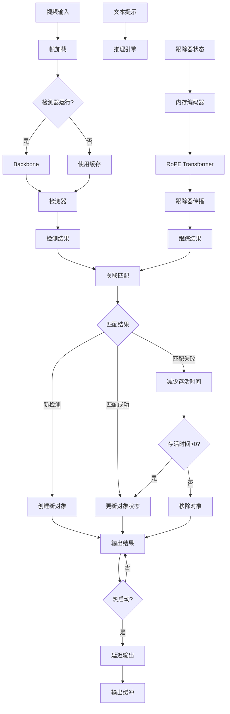

# SAM 3 视频跟踪流程深度分析

## 1. 概述

SAM 3 的视频跟踪系统采用检测器-跟踪器协作架构，实现密集的视频对象跟踪。系统支持文本、点、框等多种提示类型，处理对象遮挡、外观变化等挑战。

### 1.1 核心组件

| 组件 | 文件路径 | 功能 |
|------|----------|------|
| Sam3VideoPredictor | `sam3/model/sam3_video_predictor.py` | 视频预测器接口 |
| Sam3VideoInference | `sam3/model/sam3_video_inference.py` | 视频推理引擎 |
| Sam3VideoPredictorMultiGPU | `sam3/model/sam3_video_predictor.py` | 多 GPU 分布式推理 |

## 2. Sam3VideoPredictor (`sam3/model/sam3_video_predictor.py`)

### 2.1 类定义

```python
class Sam3VideoPredictor:
    """
    SAM3 视频预测器。
    """
    _ALL_INFERENCE_STATES = {}  # 全局推理状态

    def __init__(
        self,
        checkpoint: str = None,
        gpus_to_use: Optional[List[int]] = None,
        compile_model: bool = False,
        offload_state_to_cpu: bool = True,
        offload_video_to_cpu: bool = True,
    ):
```

### 2.2 会话管理

```python
_ALL_INFERENCE_STATES = {}

def start_session(
    self,
    resource_path: str,
    session_id: Optional[str] = None,
):
    """
    启动新的视频会话。
    """
    # 生成会话 ID
    if session_id is None:
        session_id = str(uuid.uuid4())

    # 初始化状态
    state = {
        "session_id": session_id,
        "resource_path": resource_path,
        "video_frames": [],
        "obj_ids": [],
        "track_results": {},
    }

    # 加载视频
    if resource_path.endswith(('.mp4', '.avi', '.mov')):
        # 视频文件
        frames = self._load_video_frames(resource_path)
    elif os.path.isdir(resource_path):
        # 图像文件夹
        frames = self._load_image_folder(resource_path)

    state["video_frames"] = frames
    state["num_frames"] = len(frames)

    # 保存状态
    self._ALL_INFERENCE_STATES[session_id] = state

    return {"session_id": session_id, "num_frames": len(frames)}
```

### 2.3 请求处理接口

```python
def handle_request(
    self,
    request: Dict,
) -> Dict:
    """
    处理各种推理请求。
    """
    request_type = request["type"]

    if request_type == "start_session":
        return self.start_session(
            resource_path=request["resource_path"],
            session_id=request.get("session_id"),
        )

    elif request_type == "add_prompt":
        return self.add_prompt(
            session_id=request["session_id"],
            frame_index=request["frame_index"],
            text=request.get("text"),
            point_coords=request.get("point_coords"),
            point_labels=request.get("point_labels"),
            boxes=request.get("boxes"),
        )

    elif request_type == "remove_object":
        return self.remove_object(
            session_id=request["session_id"],
            obj_id=request["obj_id"],
        )

    elif request_type == "reset_session":
        return self.reset_session(
            session_id=request["session_id"],
        )

    elif request_type == "close_session":
        return self.close_session(
            session_id=request["session_id"],
        )

    else:
        raise ValueError(f"Unknown request type: {request_type}")
```

## 3. Sam3VideoInference (`sam3/model/sam3_video_inference.py`)

### 3.1 类定义

```python
class Sam3VideoInference(Sam3VideoBase):
    """
    SAM3 视频推理引擎。
    """
    def __init__(
        self,
        detector: Sam3ImageOnVideoMultiGPU,
        tracker: Sam3TrackerPredictor,
        score_threshold_detection: float = 0.5,
        assoc_iou_thresh: float = 0.1,
        det_nms_thresh: float = 0.1,
        new_det_thresh: float = 0.7,
        hotstart_delay: int = 15,
        hotstart_unmatch_thresh: int = 8,
        hotstart_dup_thresh: int = 8,
        max_trk_keep_alive: int = 30,
        min_trk_keep_alive: int = -1,
        init_trk_keep_alive: int = 30,
        image_size: int = 1008,
        image_mean: Tuple[float, ...] = (0.5, 0.5, 0.5),
        image_std: Tuple[float, ...] = (0.5, 0.5, 0.5),
    ):
```

### 3.2 单帧推理

```python
def _det_track_one_frame(
    self,
    frame_idx: int,
    inference_state: Dict,
    run_mem_encoder: bool = True,
    run_tracker: bool = True,
):
    """
    单帧检测和跟踪。
    """
    device = next(self.parameters()).device
    B = 1

    # 1. 运行 backbone 和检测器
    if self._should_run_detector(frame_idx, inference_state):
        det_out = self.run_backbone_and_detection(
            frame_idx,
            inference_state,
        )
    else:
        det_out = None

    # 2. 运行跟踪器传播
    if run_tracker:
        tracker_low_res_masks_global, tracker_obj_scores_global = \
            self.run_tracker_propagation(
                frame_idx,
                inference_state,
            )

        # 3. 更新规划
        tracker_update_plan, tracker_metadata_new = \
            self.run_tracker_update_planning_phase(
                frame_idx,
                inference_state,
                tracker_low_res_masks_global,
            )

        # 4. 执行更新
        tracker_states_local_new = self.run_tracker_update_execution_phase(
            frame_idx,
            inference_state,
            tracker_update_plan,
        )

        # 5. 构建输出
        if self.rank == 0:
            obj_id_to_mask = self.build_outputs(
                tracker_states_local_new,
                inference_state,
            )
        else:
            obj_id_to_mask = None

    return {
        "frame_idx": frame_idx,
        "detector_output": det_out,
        "tracker_outputs": obj_id_to_mask,
    }
```

### 3.3 检测器运行

```python
def run_backbone_and_detection(
    self,
    frame_idx: int,
    inference_state: Dict,
):
    """
    运行 backbone 和检测器。
    """
    # 1. 获取当前帧
    image = inference_state["images"][frame_idx]

    # 2. 预处理
    image_tensor = self._preprocess_image(image)

    # 3. Backbone 前向传播
    backbone_out = self.detector.backbone.forward_image(image_tensor)

    # 4. 文本编码
    text_out = self.detector.backbone.forward_text(
        inference_state["text_prompts"]
    )

    # 5. 检测器前向传播
    det_out = self.detector(
        img_batch=image_tensor,
        find_text_batch=inference_state["text_prompts"],
    )

    # 6. 后处理
    # NMS
    keep = batched_nms(
        det_out["pred_boxes"],
        det_out["pred_logits"],
        self.det_nms_thresh,
    )

    det_out["pred_boxes"] = det_out["pred_boxes"][keep]
    det_out["pred_logits"] = det_out["pred_logits"][keep]
    det_out["pred_masks"] = det_out["pred_masks"][keep]

    return det_out
```

### 3.4 跟踪器传播

```python
def run_tracker_propagation(
    self,
    frame_idx: int,
    inference_state: Dict,
):
    """
    运行跟踪器传播。
    """
    device = next(self.parameters()).device

    # 1. 准备所有 GPU 的特征
    all_features = []
    all_pos = []
    all_obj_ids = []

    for obj_id, obj_state in inference_state["tracked_objects"].items():
        features = obj_state["features"].to(device)
        pos = obj_state["pos"].to(device)
        all_features.append(features)
        all_pos.append(pos)
        all_obj_ids.append(obj_id)

    # 2. 准备当前帧特征
    current_frame_features = self._get_current_frame_features(
        frame_idx,
        inference_state,
    )

    # 3. 跟踪器前向传播
    for obj_id in all_obj_ids:
        obj_state = inference_state["tracked_objects"][obj_id]

        # 跟踪器单帧推理
        masks, scores = self.tracker.track_step(
            frame_idx=frame_idx,
            is_init_cond_frame=False,
            state=obj_state,
        )

        # 保存结果
        obj_state["last_mask"] = masks
        obj_state["last_score"] = scores
        obj_state["last_frame_idx"] = frame_idx

    return masks, scores
```

## 4. Sam3VideoInferenceWithInstanceInteractivity

### 4.1 类定义

```python
class Sam3VideoInferenceWithInstanceInteractivity(Sam3VideoInference):
    """
    支持实例交互的视频推理引擎。
    """
    def __init__(
        self,
        use_prev_mem_frame: bool = False,
        use_stateless_refinement: bool = True,
        **kwargs,
    ):
```

### 4.2 对象管理

```python
def add_tracker_new_points(
    self,
    inference_state: Dict,
    frame_idx: int,
    obj_id: int,
    point_coords: np.ndarray,
    point_labels: np.ndarray,
):
    """
    添加新的跟踪对象。
    """
    # 1. 获取当前帧特征
    image = inference_state["images"][frame_idx]
    image_tensor = self._preprocess_image(image)

    # 2. 计算特征
    backbone_out = self.tracker.forward_image(image_tensor)

    # 3. 初始化跟踪器状态
    tracker_state = self.tracker.init_state(
        video_height=inference_state["video_height"],
        video_width=inference_state["video_width"],
        num_frames=inference_state["num_frames"],
        video_path=inference_state["video_path"],
    )

    # 4. 添加点提示
    tracker_state["point_inputs_per_obj"][obj_id] = [
        (frame_idx, point_coords, point_labels)
    ]

    # 5. 初始掩码预测
    masks, scores = self.tracker.track_step(
        frame_idx=frame_idx,
        is_init_cond_frame=True,
        state=tracker_state,
    )

    # 6. 保存对象状态
    inference_state["tracked_objects"][obj_id] = {
        "tracker_state": tracker_state,
        "last_mask": masks,
        "last_score": scores,
        "last_frame_idx": frame_idx,
        "point_inputs": [(frame_idx, point_coords, point_labels)],
    }

    inference_state["obj_ids"].append(obj_id)

    return {
        "obj_id": obj_id,
        "mask": masks,
        "score": scores,
    }
```

## 5. 多 GPU 分布式推理

### 5.1 Sam3VideoPredictorMultiGPU

```python
class Sam3VideoPredictorMultiGPU(Sam3VideoPredictor):
    """
    多 GPU 视频预测器。
    """
    def __init__(
        self,
        *model_args,
        gpus_to_use: Optional[List[int]] = None,
        **model_kwargs,
    ):
        if gpus_to_use is None:
            gpus_to_use = list(range(torch.cuda.device_count()))

        self.gpus_to_use = gpus_to_use
        self.world_size = len(gpus_to_use)

        # 设置多 GPU 环境
        os.environ["MASTER_ADDR"] = "localhost"
        os.environ["MASTER_PORT"] = f"{self._find_free_port()}"
        os.environ["RANK"] = "0"
        os.environ["WORLD_SIZE"] = f"{self.world_size}"

        # 启动工作进程
        self._start_worker_processes()

        # 启动 NCCL 进程组
        self._start_nccl_process_group()

        # 创建主进程模型
        super().__init__(*model_args, **model_kwargs)
```

### 5.2 GPU 间通信

```python
def _all_gather_features(
    self,
    local_features: torch.Tensor,
    metadata: Dict,
):
    """
    收集所有 GPU 的特征。
    """
    # 准备所有 GPU 的特征列表
    all_features = [
        local_features.new_zeros(
            metadata["num_obj_per_gpu"][gpu_id],
            *local_features.shape[1:],
        )
        for gpu_id in range(self.world_size)
    ]

    # All-gather
    dist.all_gather(all_features, local_features)

    # 拼接
    global_features = torch.cat(all_features, dim=0)

    return global_features
```

### 5.3 负载均衡

```python
def _assign_new_det_to_gpus(
    self,
    new_det_num: int,
    prev_workload_per_gpu: List[int],
) -> List[int]:
    """
    根据当前负载分配新检测到 GPU。
    """
    # 找到负载最轻的 GPU
    min_workload = min(prev_workload_per_gpu)
    candidates = [
        gpu_id for gpu_id, workload in enumerate(prev_workload_per_gpu)
        if workload == min_workload
    ]

    # 分配到候选 GPU（轮询）
    gpu_assignments = []
    for i in range(new_det_num):
        gpu_id = candidates[i % len(candidates)]
        gpu_assignments.append(gpu_id)

    return gpu_assignments
```

## 6. 检测器-跟踪器协作

### 6.1 关联算法

```python
def associate_det_to_track(
    self,
    det_boxes: torch.Tensor,
    det_masks: torch.Tensor,
    det_scores: torch.Tensor,
    trk_boxes: torch.Tensor,
    trk_masks: torch.Tensor,
    trk_obj_ids: List[int],
    assoc_iou_thresh: float = 0.1,
):
    """
    将检测结果与跟踪结果关联。
    """
    num_det = det_boxes.shape[0]
    num_trk = trk_boxes.shape[0]

    # 1. 计算 IoU 矩阵
    iou_matrix = self._compute_iou_matrix(det_boxes, trk_boxes)

    # 2. 匹配检测和跟踪
    det_to_trk_matches = {}
    for det_idx in range(num_det):
        for trk_idx in range(num_trk):
            if iou_matrix[det_idx, trk_idx] > assoc_iou_thresh:
                # 找到最佳匹配
                if det_idx not in det_to_trk_matches:
                    det_to_trk_matches[det_idx] = (trk_idx, iou_matrix[det_idx, trk_idx])
                else:
                    # 选择 IoU 更高的
                    if iou_matrix[det_idx, trk_idx] > det_to_trk_matches[det_idx][1]:
                        det_to_trk_matches[det_idx] = (trk_idx, iou_matrix[det_idx, trk_idx])

    # 3. 处理匹配和未匹配
    matched_det_idxs = set(det_to_trk_matches.keys())
    unmatched_det_idxs = set(range(num_det)) - matched_det_idxs
    matched_trk_idxs = {v[0] for v in det_to_trk_matches.values()}
    unmatched_trk_idxs = set(range(num_trk)) - matched_trk_idxs

    return {
        "matches": det_to_trk_matches,
        "unmatched_dets": list(unmatched_det_idxs),
        "unmatched_trks": list(unmatched_trk_idxs),
    }
```

### 6.2 对象生命周期管理

```python
def _update_object_lifetime(
    self,
    obj_id: int,
    is_matched: bool,
    inference_state: Dict,
):
    """
    更新对象生命周期状态。
    """
    obj_state = inference_state["tracked_objects"][obj_id]

    if is_matched:
        # 匹配成功，重置计数器
        obj_state["unmatched_count"] = 0
        obj_state["keep_alive"] = self.max_trk_keep_alive
    else:
        # 匹配失败，增加计数器
        obj_state["unmatched_count"] = obj_state.get("unmatched_count", 0) + 1
        obj_state["keep_alive"] = obj_state.get("keep_alive", self.init_trk_keep_alive) - 1

    # 判断是否应该移除对象
    if obj_state["keep_alive"] <= 0:
        should_remove = True
    elif obj_state["unmatched_count"] > self.hotstart_unmatch_thresh:
        should_remove = True
    else:
        should_remove = False

    return should_remove
```

## 7. 热启动 (Hotstart) 机制

### 7.1 延迟输出

```python
def propagate_in_video(
    self,
    inference_state: Dict,
):
    """
    带热启动的视频传播。
    """
    processing_order = self._get_processing_order(inference_state)

    hotstart_buffer = []
    hotstart_removed_obj_ids = set()

    for frame_idx in processing_order:
        # 单帧推理
        output = self._det_track_one_frame(
            frame_idx,
            inference_state,
        )

        # 热启动缓冲
        if self.hotstart_delay > 0:
            hotstart_buffer.append({
                "frame_idx": frame_idx,
                "output": output,
            })

            # 检查是否需要输出
            if len(hotstart_buffer) >= self.hotstart_delay:
                # 输出最早的帧
                to_yield = hotstart_buffer.pop(0)
                yield self._prepare_final_output(to_yield)
        else:
            # 直接输出
            yield self._prepare_final_output(output)

    # 输出剩余帧
    for entry in hotstart_buffer:
        yield self._prepare_final_output(entry)
```

### 7.2 重复检测抑制

```python
def _suppress_duplicate_detections(
    self,
    det_boxes: torch.Tensor,
    trk_boxes: torch.Tensor,
    dup_thresh: float = 8,
):
    """
    抑制重复检测（在热启动期间）。
    """
    for trk_box in trk_boxes:
        for i, det_box in enumerate(det_boxes):
            # 计算中心距离
            trk_center = (trk_box[:2] + trk_box[2:]) / 2
            det_center = (det_box[:2] + det_box[2:]) / 2
            distance = torch.norm(trk_center - det_center)

            if distance < dup_thresh:
                # 标记为重复
                det_boxes[i] = None
                break

    # 移除标记的检测
    keep = [box is not None for box in det_boxes]
    det_boxes = det_boxes[keep]

    return det_boxes
```

## 8. 数据流向图



## 9. 关键创新点

### 9.1 检测器-跟踪器协作

- 检测器发现新对象
- 跟踪器维护已有对象
- 通过 IoU 匹配关联结果

### 9.2 热启动机制

- 延迟前 15 帧输出
- 稳定跟踪质量
- 抑制重复检测

### 9.3 对象生命周期管理

- 动态调整对象存活时间
- 处理对象遮挡和重现
- 自动移除无效对象

### 9.4 多 GPU 分布式推理

- NCCL 通信协议
- 负载均衡分配
- 特征共享和融合

## 10. 总结

SAM 3 的视频跟踪系统通过以下设计实现了强大的密集跟踪能力：

1. **双路架构**：检测器和跟踪器各司其职
2. **智能关联**：基于 IoU 的检测-跟踪匹配
3. **热启动**：延迟输出提高稳定性
4. **生命周期管理**：动态对象状态管理
5. **多 GPU 支持**：分布式推理提高效率

这些设计使得 SAM 3 能够在视频中准确跟踪多个对象，处理复杂的跟踪场景。
