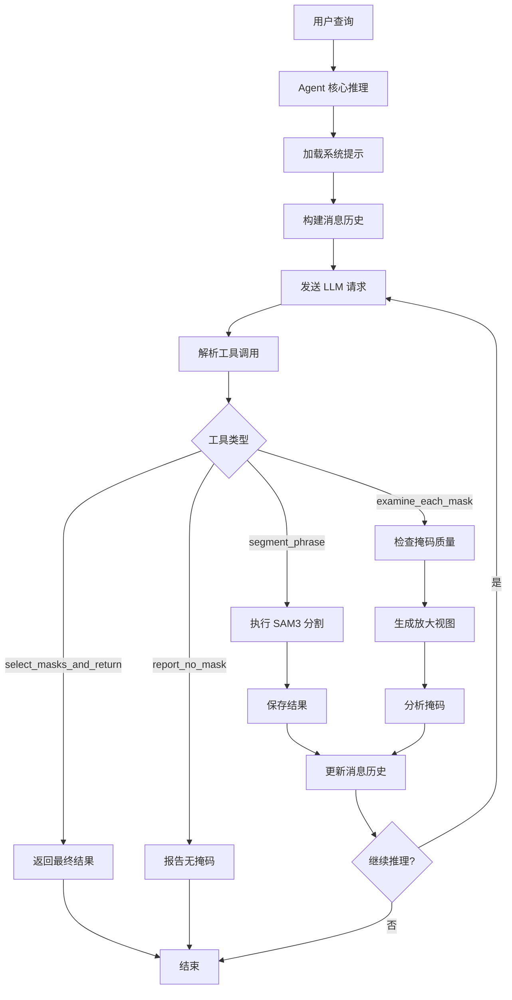

# SAM 3 Agent 系统深度分析

## 1. 概述

SAM 3 Agent 系统是一个智能视觉-语言代理，通过结合大语言模型 (LLM) 的推理能力和 SAM3 的分割能力，实现对复杂文本提示的理解和精确分割。Agent 支持多轮推理、自我检查和迭代优化。

### 1.1 核心组件

| 组件 | 文件路径 | 功能 |
|------|----------|------|
| agent_inference | `sam3/agent/agent_core.py` | Agent 核心推理逻辑 |
| client_llm | `sam3/agent/client_llm.py` | LLM 客户端 |
| inference | `sam3/agent/inference.py` | 推理引擎 |
| helpers/ | `sam3/agent/helpers/` | 辅助工具集合 |

## 2. Agent 核心架构 (`sam3/agent/agent_core.py`)

### 2.1 Agent 推理流程

```python
def agent_inference(
    img_path: str,
    initial_text_prompt: str,
    debug: bool = False,
    max_generations: int = 100,
    output_dir: str = "../../sam3_agent_out",
):
    """
    Agent 推理主函数。
    """
    # 1. 创建输出目录
    sam_out_dir = os.path.join(output_dir, "sam_out")
    none_out_dir = os.path.join(output_dir, "none_out")
    agent_debug_out_dir = os.path.join(output_dir, "agent_debug_out")
    os.makedirs(sam_out_dir, exist_ok=True)
    os.makedirs(none_out_dir, exist_ok=True)
    os.makedirs(agent_debug_out_dir, exist_ok=True)

    # 2. 加载系统提示
    system_prompt = load_system_prompt("system_prompt.txt")
    system_prompt_iterative_checking = load_system_prompt(
        "system_prompt_iterative_checking.txt"
    )

    # 3. 初始化消息历史
    messages = [
        {
            "role": "system",
            "content": system_prompt,
        },
        {
            "role": "user",
            "content": [
                {"type": "text", "text": initial_text_prompt},
                {"type": "image_url", "image_url": {"url": get_image_url(img_path)}},
            ],
        },
    ]

    # 4. 初始化状态
    USED_TEXT_PROMPTS = set()
    LATEST_SAM3_TEXT_PROMPT = None
    PATH_TO_LATEST_OUTPUT_JSON = None
    generation_count = 0

    # 5. 推理循环
    while generation_count < max_generations:
        generation_count += 1

        # 发送 LLM 请求
        response = send_generate_request(
            messages=messages,
            model=LLM_MODEL,
            max_tokens=4096,
        )

        # 解析工具调用
        tool_calls = parse_tool_calls(response)

        # 执行工具
        for tool_call in tool_calls:
            tool_name = tool_call["name"]
            tool_args = tool_call["arguments"]

            if tool_name == "segment_phrase":
                # 执行 SAM3 分割
                output = execute_segment_phrase(img_path, tool_args, sam_out_dir)
                LATEST_SAM3_TEXT_PROMPT = tool_args.get("text_prompt", "")

            elif tool_name == "examine_each_mask":
                # 检查每个掩码
                output = execute_examine_each_mask(
                    img_path,
                    tool_args,
                    agent_debug_out_dir,
                )

            elif tool_name == "select_masks_and_return":
                # 选择掩码并返回
                output = execute_select_masks_and_return(tool_args)
                # 结束循环
                return output

            elif tool_name == "report_no_mask":
                # 报告无掩码
                output = {"masks": [], "message": "No masks found"}
                return output

        # 更新消息历史
        messages.append({
            "role": "assistant",
            "content": response,
        })

        # 压缩消息历史
        messages = prune_messages_for_next_round(
            messages,
            USED_TEXT_PROMPTS,
            LATEST_SAM3_TEXT_PROMPT,
            img_path,
            initial_text_prompt,
        )

    return {"error": "Max generations reached"}
```

### 2.2 工具调用解析

```python
def parse_tool_calls(response: str) -> List[Dict]:
    """
    解析 LLM 响应中的工具调用。
    """
    tool_calls = []

    # 查找 JSON 格式的工具调用
    pattern = r'\{"type":\s*"([^"]+)",\s*"arguments":\s*({[^}]+})\}'
    matches = re.finditer(pattern, response)

    for match in matches:
        tool_type = match.group(1)
        arguments_str = match.group(2)

        try:
            arguments = json.loads(arguments_str)
            tool_calls.append({
                "name": tool_type,
                "arguments": arguments,
            })
        except json.JSONDecodeError:
            continue

    return tool_calls
```

### 2.3 消息历史压缩

```python
def prune_messages_for_next_round(
    messages_list: List[Dict],
    used_text_prompts: Set[str],
    latest_sam3_text_prompt: str,
    img_path: str,
    initial_text_prompt: str,
):
    """
    压缩消息历史以节省 token。
    """
    # 第一部分：保留前两条消息
    part1 = messages_list[:2]

    # 第二部分：保留包含 segment_phrase 的最新助手消息
    part2 = []
    for msg in reversed(messages_list[2:]):
        if msg["role"] == "assistant":
            content = msg.get("content", "")
            if "segment_phrase" in content:
                part2.append(msg)
                break

    # 第三部分：添加警告信息
    if len(used_text_prompts) > 0:
        warning = f"注意：已经使用了以下文本提示：{', '.join(used_text_prompts)}"
        part2.append({
            "role": "system",
            "content": warning,
        })

    # 组合
    pruned = part1 + list(reversed(part2))

    return pruned
```

## 3. LLM 客户端 (`sam3/agent/client_llm.py`)

### 3.1 请求发送

```python
def send_generate_request(
    messages: List[Dict],
    server_url: Optional[str] = None,
    model: str = "meta-llama/Llama-4-Maverick-17B-128E-Instruct-FP8",
    api_key: Optional[str] = None,
    max_tokens: int = 4096,
    temperature: float = 0.7,
    top_p: float = 0.9,
):
    """
    发送生成请求到 LLM。
    """
    # 处理图像
    for msg in messages:
        if isinstance(msg.get("content"), list):
            for content in msg["content"]:
                if content.get("type") == "image_url":
                    img_path = content["image_url"]["url"]
                    if not img_path.startswith("data:"):
                        # 转换为 base64
                        base64_image = image_to_base64(img_path)
                        mime_type = get_mime_type(img_path)
                        content["image_url"]["url"] = f"data:{mime_type};base64,{base64_image}"

    # 构建请求
    request_data = {
        "model": model,
        "messages": messages,
        "max_tokens": max_tokens,
        "temperature": temperature,
        "top_p": top_p,
    }

    # 发送请求
    if server_url:
        # OpenAI 兼容 API
        headers = {"Content-Type": "application/json"}
        if api_key:
            headers["Authorization"] = f"Bearer {api_key}"

        response = requests.post(
            f"{server_url}/v1/chat/completions",
            headers=headers,
            json=request_data,
            timeout=60,
        )
    else:
        # vLLM 直接推理
        from vllm import LLM, SamplingParams
        llm = LLM(model=model)
        sampling_params = SamplingParams(
            max_tokens=max_tokens,
            temperature=temperature,
            top_p=top_p,
        )
        outputs = llm.chat(messages, sampling_params)
        response = outputs[0].outputs[0].text

    return response
```

### 3.2 图像转 Base64

```python
def image_to_base64(img_path: str) -> str:
    """
    将图像转换为 base64 编码。
    """
    with open(img_path, "rb") as f:
        image_data = f.read()

    base64_image = base64.b64encode(image_data).decode("utf-8")

    return base64_image

def get_mime_type(img_path: str) -> str:
    """
    获取图像的 MIME 类型。
    """
    ext = os.path.splitext(img_path)[1].lower()
    mime_types = {
        ".jpg": "image/jpeg",
        ".jpeg": "image/jpeg",
        ".png": "image/png",
        ".gif": "image/gif",
        ".webp": "image/webp",
        ".bmp": "image/bmp",
    }
    return mime_types.get(ext, "image/jpeg")
```

## 4. 推理引擎 (`sam3/agent/inference.py`)

### 4.1 推理流程

```python
def run_inference(
    img_path: str,
    text_prompt: str,
    sam3_model: Sam3Image,
    output_dir: str,
):
    """
    运行 SAM3 推理。
    """
    # 1. 加载图像
    image = Image.open(img_path).convert("RGB")

    # 2. 设置图像
    state = sam3_model.set_image(image)

    # 3. 设置文本提示
    output, state = sam3_model.set_text_prompt(text_prompt, state)

    # 4. 后处理掩码
    masks = output["masks"]  # [N, H, W]
    boxes = output["boxes"]  # [N, 4]
    scores = output["scores"]  # [N]

    # 5. 保存结果
    os.makedirs(output_dir, exist_ok=True)

    for i, (mask, box, score) in enumerate(zip(masks, boxes, scores)):
        # 可视化掩码
        vis = visualize_mask(image, mask)

        # 保存
        output_path = os.path.join(output_dir, f"mask_{i}_{score:.2f}.png")
        vis.save(output_path)

    return {
        "num_masks": len(masks),
        "masks": masks,
        "boxes": boxes,
        "scores": scores,
        "output_dir": output_dir,
    }
```

### 4.2 掩码可视化

```python
def visualize_mask(
    image: Image.Image,
    mask: np.ndarray,
    alpha: float = 0.5,
):
    """
    可视化掩码。
    """
    # 转换掩码为 RGB
    mask_rgb = mask_to_rgb(mask)

    # 混合图像和掩码
    blended = Image.blend(
        image,
        mask_rgb,
        alpha,
    )

    return blended

def mask_to_rgb(mask: np.ndarray) -> Image.Image:
    """
    将掩码转换为彩色图像。
    """
    # 创建彩色掩码
    color = (255, 100, 100)  # 红色
    mask_rgb = np.zeros((*mask.shape, 3), dtype=np.uint8)
    mask_rgb[mask > 0] = color

    return Image.fromarray(mask_rgb)
```

## 5. 辅助工具

### 5.1 Zoom In (`sam3/agent/helpers/zoom_in.py`)

```python
def create_zoom_in_visualization(
    image: np.ndarray,
    mask: np.ndarray,
    output_path: str,
    zoom_ratio: float = 2.0,
):
    """
    创建放大的掩码可视化。
    """
    # 1. 计算掩码边界框
    mask_indices = np.where(mask > 0)
    if len(mask_indices[0]) == 0:
        return

    y_min, y_max = mask_indices[0].min(), mask_indices[0].max()
    x_min, x_max = mask_indices[1].min(), mask_indices[1].max()

    # 2. 计算缩放区域
    mask_area = (y_max - y_min) * (x_max - x_min)
    img_area = image.shape[0] * image.shape[1]
    relative_area = mask_area / img_area

    # 根据相对面积调整缩放比例
    if relative_area > 0.5:
        # 大掩码：减小缩放
        zoom_ratio = 1.5
    elif relative_area < 0.01:
        # 小掩码：增加缩放
        zoom_ratio = 4.0

    # 3. 裁剪和缩放
    crop_h = int((y_max - y_min) * zoom_ratio)
    crop_w = int((x_max - x_min) * zoom_ratio)

    # 确保裁剪在图像范围内
    y_center = (y_min + y_max) // 2
    x_center = (x_min + x_max) // 2

    y1 = max(0, y_center - crop_h // 2)
    y2 = min(image.shape[0], y_center + crop_h // 2)
    x1 = max(0, x_center - crop_w // 2)
    x2 = min(image.shape[1], x_center + crop_w // 2)

    crop = image[y1:y2, x1:x2]

    # 4. 上采样掩码
    mask_cropped = mask[y1:y2, x1:x2]
    mask_upsampled = cv2.resize(
        mask_cropped.astype(np.float32),
        (crop.shape[1], crop.shape[0]),
        interpolation=cv2.INTER_LINEAR,
    )
    mask_upsampled = (mask_upsampled > 0.5).astype(np.uint8)

    # 5. 创建双面板可视化
    fig, (ax1, ax2) = plt.subplots(1, 2, figsize=(12, 6))

    # 左侧：原始裁剪
    ax1.imshow(crop)
    ax1.set_title("Original Crop")
    ax1.axis('off')

    # 右侧：带掩码的放大
    ax2.imshow(crop)
    ax2.imshow(mask_upsampled, alpha=0.5, cmap='jet')
    ax2.set_title("Zoom with Mask")
    ax2.axis('off')

    plt.tight_layout()
    plt.savefig(output_path, dpi=150, bbox_inches='tight')
    plt.close()
```

### 5.2 掩码重叠移除 (`sam3/agent/helpers/mask_overlap_removal.py`)

```python
def mask_overlap_removal(
    masks: np.ndarray,
    scores: np.ndarray,
    iom_threshold: float = 0.3,
) -> Tuple[np.ndarray, np.ndarray]:
    """
    移除重叠过度的掩码。
    """
    keep = np.ones(len(masks), dtype=bool)

    # 按分数降序排序
    sorted_indices = np.argsort(scores)[::-1]

    for i in range(len(sorted_indices)):
        idx1 = sorted_indices[i]
        if not keep[idx1]:
            continue

        for j in range(i + 1, len(sorted_indices)):
            idx2 = sorted_indices[j]
            if not keep[idx2]:
                continue

            # 计算 IoM (Intersection over Minimum)
            iom = compute_iom(masks[idx1], masks[idx2])

            if iom > iom_threshold:
                # 移除重叠过度的掩码（分数较低的）
                keep[idx2] = False

    return masks[keep], scores[keep]

def compute_iom(mask1: np.ndarray, mask2: np.ndarray) -> float:
    """
    计算 IoM (Intersection over Minimum)。
    """
    intersection = np.logical_and(mask1, mask2).sum()
    min_area = min(mask1.sum(), mask2.sum())

    if min_area == 0:
        return 0.0

    return intersection / min_area
```

### 5.3 内存管理 (`sam3/agent/helpers/memory.py`)

```python
@contextmanager
def ignore_torch_cuda_oom():
    """
    忽略 CUDA OOM 异常。
    """
    try:
        yield
    except RuntimeError as e:
        if "CUDA out of memory" in str(e):
            print(f"Warning: CUDA OOM occurred: {e}")
            torch.cuda.empty_cache()
            # 重试
            yield
        else:
            raise

def safe_forward(
    model: nn.Module,
    *args,
    **kwargs,
):
    """
    安全的前向传播，处理 OOM。
    """
    with ignore_torch_cuda_oom():
        try:
            return model(*args, **kwargs)
        except RuntimeError as e:
            if "CUDA out of memory" in str(e):
                # 尝试转移到 CPU
                device = next(model.parameters()).device
                model.cpu()
                try:
                    output = model(*args, **kwargs)
                    model.to(device)
                    return output
                except:
                    model.to(device)
                    raise
            else:
                raise
```

## 6. 系统提示

### 6.1 主系统提示

```
你是一个专业的图像分析助手。你的任务是理解用户的文本查询，并使用 SAM3 模型来分割图像中与查询匹配的对象。

可用工具：
1. segment_phrase: 使用文本提示分割图像中的对象
   参数：text_prompt (str)
   返回：分割掩码

2. examine_each_mask: 检查每个掩码的质量
   参数：mask_indices (List[int])
   返回：每个掩码的分析

3. select_masks_and_return: 选择最终掩码并返回
   参数：selected_mask_indices (List[int])
   返回：最终结果

4. report_no_mask: 报告没有找到匹配的掩码
   返回：空结果

工作流程：
1. 首先使用 segment_phrase 工具进行初始分割
2. 如果有多个掩码，使用 examine_each_mask 检查每个掩码
3. 根据分析结果选择正确的掩码
4. 使用 select_masks_and_return 返回结果

注意事项：
- 避免重复使用相同的文本提示
- 检查掩码是否与查询匹配
- 处理否定查询（如"不包括..."）
```

### 6.2 迭代检查提示

```
检查掩码质量的标准：

1. 语义匹配：
   - 掩码是否与文本提示的语义一致
   - 是否包含错误的类型/属性

2. 完整性：
   - 掩码是否完整覆盖目标对象
   - 是否有明显的缺失部分

3. 精确度：
   - 边界是否准确
   - 是否包含过多背景

4. 多实例处理：
   - 如果提示要求所有实例，是否包含所有实例
   - 如果提示要求特定实例，是否只包含特定实例

请对每个掩码进行详细分析，并给出接受或拒绝的理由。
```

## 7. 数据流向图



## 8. 关键创新点

### 8.1 多轮推理

- 支持多轮 LLM 对话
- 迭代优化分割结果
- 自我检查和修正

### 8.2 智能工具调用

- LLM 选择合适的工具
- 工具参数自动生成
- 结果自动解析

### 8.3 消息历史压缩

- 压缩长对话历史
- 保留关键信息
- 节省 token 使用

### 8.4 放大检查

- 创建放大的掩码视图
- 辅助 LLM 准确判断
- 提高决策质量

## 9. 总结

SAM 3 Agent 系统通过以下设计实现了复杂的视觉-语言推理：

1. **LLM 集成**：利用 LLM 的强大推理能力
2. **工具调用**：模块化的工具系统
3. **多轮推理**：迭代优化和自我检查
4. **智能压缩**：高效的上下文管理
5. **辅助工具**：放大、重叠移除等实用功能

这种设计使得 SAM 3 能够理解复杂的自然语言查询，实现精确的图像分割。
