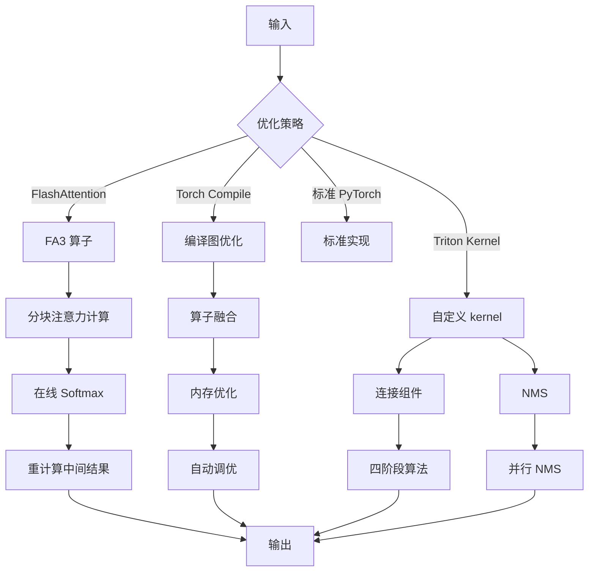

# SAM 3 性能优化模块深度分析

## 1. 概述

SAM 3 的性能优化模块 (`perflib`) 包含多种优化技术，用于提高模型的训练和推理效率。这些优化包括 FlashAttention、Triton kernel、编译优化、内存管理等。

### 1.1 核心组件

| 组件 | 文件路径 | 功能 |
|------|----------|------|
| fa3 | `sam3/perflib/fa3.py` | FlashAttention3 封装 |
| compile | `sam3/perflib/compile.py` | Torch Compile 封装 |
| triton/connected_components | `sam3/perflib/triton/connected_components.py` | 连接组件 Triton kernel |
| triton/nms | `sam3/perflib/triton/nms.py` | NMS Triton kernel |
| masks_ops | `sam3/perflib/masks_ops.py` | 掩码操作优化 |

## 2. FlashAttention3 (`sam3/perflib/fa3.py`)

### 2.1 自定义算子封装

```python
import torch
from torch import Tensor
from torch.library import Library

fa_lib = Library("flash", "FRAGMENT")

@torch.library.custom_op("flash::flash_attn_func", mutates_args=())
def flash_attn_func_op(
    q: Tensor,
    k: Tensor,
    v: Tensor,
) -> Tensor:
    """
    FlashAttention3 算子接口。
    """
    from flash_attn_interface import flash_attn_func as fa3

    # FlashAttention3 前向传播
    out = fa3(q, k, v)

    return out

@flash_attn_func_op.register_fake
def flash_attn_func_fake(q, k, v):
    """
    Fake 函数用于 torch.compile。
    """
    return torch.empty_like(q)
```

### 2.2 低精度计算

```python
def flash_attn_with_fp8(
    q: torch.Tensor,
    k: torch.Tensor,
    v: torch.Tensor,
) -> torch.Tensor:
    """
    使用 FP8 的 FlashAttention。
    """
    original_dtype = q.dtype

    # 转换为 FP8
    q_fp8 = q.to(torch.float8_e4m3fn)
    k_fp8 = k.to(torch.float8_e4m3fn)
    v_fp8 = v.to(torch.float8_e4m3fn)

    # FlashAttention 计算
    out = flash_attn_func_op(q_fp8, k_fp8, v_fp8)

    # 转换回原始精度
    out = out.to(original_dtype)

    return out
```

### 2.3 内存优化原理

FlashAttention 通过以下技术减少内存占用：

1. **分块计算**：将注意力计算分解为小块，避免存储完整的注意力矩阵
2. **在线 softmax**：逐步计算 softmax，不需要存储中间结果
3. **重计算**：在前向传播时丢弃中间结果，需要时重新计算

```python
def flash_attention_chunked(
    q: torch.Tensor,
    k: torch.Tensor,
    v: torch.Tensor,
    chunk_size: int = 128,
):
    """
    分块 FlashAttention（简化版）。
    """
    B, N, C = q.shape
    H, W = k.shape[-2:]

    # 初始化输出
    o = torch.zeros_like(q)
    l = torch.zeros(B, N, device=q.device)
    m = torch.full((B, N), float('-inf'), device=q.device)

    # 分块处理
    for j in range(0, H, chunk_size):
        # 获取当前块
        k_chunk = k[:, j:j+chunk_size]
        v_chunk = v[:, j:j+chunk_size]

        # 计算注意力分数
        s = torch.einsum('bnc,bkc->bnk', q, k_chunk) / (C ** 0.5)

        # 更新最大值
        m_new = torch.maximum(m, s.max(dim=-1).values)

        # 重新缩放
        alpha = torch.exp(m - m_new)
        beta = torch.exp(s - m_new.unsqueeze(-1))

        # 更新输出
        l_new = alpha * l + beta.sum(dim=-1)
        o_new = (o * alpha.unsqueeze(-1) +
                 torch.einsum('bnk,bkc->bnc', beta, v_chunk)) / l_new.unsqueeze(-1)

        # 更新状态
        o = o_new
        l = l_new
        m = m_new

    return o
```

## 3. 编译优化 (`sam3/perflib/compile.py`)

### 3.1 编译包装器

```python
def compile_wrapper(
    fn,
    *,
    mode: str = "max-autotune",
    fullgraph: bool = True,
    dynamic: bool = False,
    name: Optional[str] = None,
):
    """
    Torch Compile 包装器。
    """
    @wraps(fn)
    def wrapped(*args, **kwargs):
        # 确保张量是连续的
        args = recursive_contiguous(args)
        kwargs = recursive_contiguous(kwargs)

        # 调用编译后的函数
        return fn(*args, **kwargs)

    # 应用编译
    compiled = torch.compile(
        wrapped,
        mode=mode,
        fullgraph=fullgraph,
        dynamic=dynamic,
    )

    if name is not None:
        compiled.__name__ = name

    return compiled
```

### 3.2 递归连续化

```python
def recursive_contiguous(obj):
    """
    递归确保张量是连续的。
    """
    if isinstance(obj, torch.Tensor):
        if not obj.is_contiguous():
            return obj.contiguous()
        return obj
    elif isinstance(obj, (list, tuple)):
        return type(obj)(recursive_contiguous(x) for x in obj)
    elif isinstance(obj, dict):
        return {k: recursive_contiguous(v) for k, v in obj.items()}
    else:
        return obj
```

### 3.3 形状日志记录

```python
_shape_cache = threading.local()

@contextmanager
def shape_logging_wrapper(fn, name: str):
    """
    记录首次出现的输入形状。
    """
    # 初始化缓存
    if not hasattr(_shape_cache, 'cache'):
        _shape_cache.cache = {}

    def wrapped(*args, **kwargs):
        # 生成形状键
        shape_key = tuple(get_shape(x) for x in args)

        # 检查是否是首次出现
        if name not in _shape_cache.cache:
            _shape_cache.cache[name] = set()

        if shape_key not in _shape_cache.cache[name]:
            _shape_cache.cache[name].add(shape_key)
            # 记录到日志
            logger.info(f"[{name}] New shape: {shape_key}")

        # 调用原函数
        return fn(*args, **kwargs)

    yield wrapped
```

### 3.4 激活检查点

```python
def checkpoint_wrapper(
    fn,
    use_reentrant: bool = False,
):
    """
    激活检查点包装器。
    """
    @wraps(fn)
    def wrapped(*args, **kwargs):
        if torch.is_grad_enabled():
            # 使用激活检查点
            return torch.utils.checkpoint.checkpoint(
                fn,
                use_reentrant=use_reentrant,
            )
        else:
            # 推理模式，直接调用
            return fn(*args, **kwargs)

    return wrapped
```

## 4. Triton Kernel 优化

### 4.1 连接组件 (`triton/connected_components.py`)

#### 4.1.1 四阶段算法

```python
import triton
import triton.language as tl

@triton.jit
def _init_labels_kernel(
    input_ptr,
    labels_ptr,
    numel,
    BLOCK_SIZE: tl.constexpr,
):
    """
    阶段 1：初始化标签。
    """
    pid = tl.program_id(axis=0)
    offset = pid * BLOCK_SIZE

    # 加载输入
    input_mask = tl.load(input_ptr + offset, mask=offset < numel)

    # 前景像素获得唯一标签，背景像素设为 -1
    if input_mask:
        label = offset + pid
    else:
        label = -1

    # 存储标签
    tl.store(labels_ptr + offset, label, mask=offset < numel)
```

```python
@triton.jit
def _merge_labels_kernel(
    labels_ptr,
    labels_out_ptr,
    numel,
    BLOCK_SIZE: tl.constexpr,
):
    """
    阶段 2：局部合并标签。
    """
    pid = tl.program_id(axis=0)
    offset = pid * BLOCK_SIZE

    # 加载标签
    labels = tl.load(labels_ptr + offset, mask=offset < numel)

    # 8 邻域合并
    # 获取邻居标签
    h = tl.arange(0, BLOCK_SIZE)
    # ... 邻居访问逻辑

    # 并查集合并
    # 使用原子最小值操作
    min_label = tl.min(labels, axis=0)

    # 存储合并后的标签
    tl.store(labels_out_ptr + offset, min_label, mask=offset < numel)
```

```python
@triton.jit
def _pointer_jump_kernel(
    labels_in_ptr,
    labels_out_ptr,
    numel,
    BLOCK_SIZE: tl.constexpr,
):
    """
    阶段 3：指针跳跃（路径压缩）。
    """
    pid = tl.program_id(axis=0)
    offset = pid * BLOCK_SIZE

    # 加载标签
    labels = tl.load(labels_in_ptr + offset, mask=offset < numel)

    # 指针跳跃
    for _ in range(10):  # 固定迭代次数
        labels_out = tl.load(labels_in_ptr + labels, mask=labels >= 0)
        changed = labels != labels_out
        labels = tl.where(labels >= 0, labels_out, labels)

        if not tl.any(changed):
            break

    # 存储最终标签
    tl.store(labels_out_ptr + offset, labels, mask=offset < numel)
```

```python
@triton.jit
def _count_components_kernel(
    labels_ptr,
    counts_ptr,
    numel,
    BLOCK_SIZE: tl.constexpr,
):
    """
    阶段 4：计算组件大小。
    """
    pid = tl.program_id(axis=0)
    offset = pid * BLOCK_SIZE

    # 加载标签
    labels = tl.load(labels_ptr + offset, mask=offset < numel)

    # 原子计数
    # 每个标签对应一个计数器
    count = tl.where(labels >= 0, 1, 0)
    tl.atomic_add(counts_ptr + labels, count, mask=labels >= 0)
```

#### 4.1.2 配置自动调优

```python
def connected_components_triton(
    input_tensor: torch.Tensor,
) -> torch.Tensor:
    """
    Triton 连接组件（自动调优）。
    """
    assert input_tensor.is_cuda, "Input must be on CUDA"

    H, W = input_tensor.shape
    numel = H * W

    # 预定义配置
    configs = [
        triton.Config({"BLOCK_SIZE_H": 4, "BLOCK_SIZE_W": 16}, num_stages=1, num_warps=2),
        triton.Config({"BLOCK_SIZE_H": 4, "BLOCK_SIZE_W": 32}, num_stages=2, num_warps=4),
        triton.Config({"BLOCK_SIZE_H": 8, "BLOCK_SIZE_W": 16}, num_stages=2, num_warps=4),
        triton.Config({"BLOCK_SIZE_H": 8, "BLOCK_SIZE_W": 32}, num_stages=3, num_warps=8),
    ]

    # 运行最佳配置
    labels = torch.full((H, W), -1, dtype=torch.int32, device=input_tensor.device)

    _init_labels_kernel[(numel // 16,)](
        input_tensor,
        labels,
        numel,
    )

    # ... 其他阶段的调用

    return labels
```

### 4.2 NMS (`triton/nms.py`)

```python
@triton.jit
def _nms_suppression_kernel(
    iou_mask_ptr,
    keep_mask_ptr,
    num_boxes,
    iou_threshold: tl.constexpr,
    BLOCK_SIZE: tl.constexpr,
):
    """
    NMS 抑制 kernel。
    """
    pid = tl.program_id(axis=0)
    offset = pid * BLOCK_SIZE

    # 加载 IoU 矩阵
    iou_mask = tl.load(iou_mask_ptr + offset, mask=offset < num_boxes * num_boxes)

    # 计算保持掩码
    # 1. 按行检查：是否有超过阈值的 IoU（不包括自身）
    row_mask = tl.sum(iou_mask > iou_threshold, axis=1) <= 1

    # 2. 只处理上三角部分
    # ... 额外的逻辑

    # 存储结果
    tl.store(keep_mask_ptr + offset, row_mask, mask=offset < num_boxes)
```

## 5. 掩码操作优化 (`sam3/perflib/masks_ops.py`)

### 5.1 掩码到边界框

```python
def masks_to_boxes(
    masks: torch.Tensor,
    obj_ids: List[int],
) -> torch.Tensor:
    """
    优化的掩码到边界框转换。
    """
    N, H, W = masks.shape
    boxes = torch.zeros(N, 4, dtype=torch.float32, device=masks.device)

    for i in range(N):
        mask = masks[i]

        # 1. 找到前景像素
        mask_with_obj = mask != 0

        # 2. 水平方向的最小/最大
        x_coords = mask_with_obj.amax(dim=2)
        x_min = torch.min(x_coords.nonzero()[:, 1].float()) if x_coords.any() else 0
        x_max = torch.max(x_coords.nonzero()[:, 1].float()) if x_coords.any() else 0

        # 3. 垂直方向的最小/最大
        y_coords = mask_with_obj.amax(dim=1)
        y_min = torch.min(y_coords.nonzero()[:, 0].float()) if y_coords.any() else 0
        y_max = torch.max(y_coords.nonzero()[:, 0].float()) if y_coords.any() else 0

        boxes[i] = torch.tensor([x_min, y_min, x_max, y_max])

    return boxes
```

### 5.2 掩码 IoU

```python
def mask_iou(
    pred_masks: torch.Tensor,
    gt_masks: torch.Tensor,
) -> torch.Tensor:
    """
    掩码 IoU 计算。
    """
    N, H, W = pred_masks.shape
    M, _, _ = gt_masks.shape

    # 展平掩码
    pred_flat = pred_masks.view(N, 1, H * W).bool()
    gt_flat = gt_masks.view(1, M, H * W).bool()

    # 计算交集
    intersection = (pred_flat & gt_flat).sum(dim=2).float()  # [N, M]

    # 计算并集
    union = (pred_flat | gt_flat).sum(dim=2).float()  # [N, M]

    # IoU
    ious = intersection / union.clamp(min=1)

    return ious
```

### 5.3 连接组件（后备实现）

```python
def connected_components_cpu(
    input_tensor: np.ndarray,
) -> np.ndarray:
    """
    CPU 连接组件（使用 scipy）。
    """
    from scipy.ndimage import label

    # 标记连接组件
    labeled_array, num_features = label(input_tensor)

    return labeled_array

def connected_components(
    input_tensor: torch.Tensor,
) -> torch.Tensor:
    """
    连接组件（自动选择实现）。
    """
    # 尝试 CC_Torch
    try:
        from cc_torch import get_connected_components
        if input_tensor.is_cuda:
            return get_connected_components(input_tensor.to(torch.uint8))
    except ImportError:
        pass

    # 尝试 Triton
    if input_tensor.is_cuda:
        from sam3.perflib.triton.connected_components import connected_components_triton
        return connected_components_triton(input_tensor)

    # 后备到 CPU
    return torch.from_numpy(
        connected_components_cpu(input_tensor.cpu().numpy())
    ).to(input_tensor.device)
```

## 6. 内存优化策略

### 6.1 梯度检查点

```python
def make_checkpointed_module(module: nn.Module):
    """
    为模块添加梯度检查点。
    """
    original_forward = module.forward

    def checkpointed_forward(*args, **kwargs):
        return torch.utils.checkpoint.checkpoint(
            original_forward,
            *args,
            **kwargs,
            use_reentrant=False,
        )

    module.forward = checkpointed_forward
    return module
```

### 6.2 显存卸载

```python
class OffloadManager:
    """
    显存卸载管理器。
    """
    def __init__(self, offload_to_cpu: bool = True):
        self.offload_to_cpu = offload_to_cpu
        self.cache = {}

    def __call__(self, fn):
        @wraps(fn)
        def wrapped(*args, **kwargs):
            # 卸载到 CPU
            if self.offload_to_cpu:
                args = self._maybe_offload(args)
                kwargs = self._maybe_offload(kwargs)

            # 调用函数
            result = fn(*args, **kwargs)

            # 重新加载到 GPU
            if self.offload_to_cpu:
                result = self._maybe_reload(result)

            return result

        return wrapped

    def _maybe_offload(self, obj):
        if isinstance(obj, torch.Tensor) and obj.is_cuda:
            key = id(obj)
            self.cache[key] = obj.cpu()
            return key
        return obj

    def _maybe_reload(self, obj):
        if isinstance(obj, int) and obj in self.cache:
            tensor = self.cache[obj]
            del self.cache[obj]
            return tensor.to('cuda')
        return obj
```

## 7. 数据流向图



## 8. 关键优化技术

### 8.1 算法优化

- **分块计算**：FlashAttention 的分块策略
- **在线 Softmax**：避免存储完整注意力矩阵
- **路径压缩**：连接组件的并查集优化
- **分块 NMS**：并行化 NMS 计算

### 8.2 内存优化

- **激活检查点**：减少中间激活存储
- **显存卸载**：将不需要的数据转移到 CPU
- **梯度累积**：支持更大的批次大小
- **张量复用**：减少不必要的分配

### 8.3 计算优化

- **低精度计算**：FP8 和 FP16 支持
- **算子融合**：减少 kernel 启动开销
- **向量化操作**：充分利用 GPU 向量单元
- **并行化**：多 GPU 和多线程支持

## 9. 总结

SAM 3 的性能优化模块通过多种技术实现了高效的计算：

1. **FlashAttention3**：内存高效的注意力计算
2. **Triton Kernel**：自定义 GPU kernel 优化
3. **Torch Compile**：自动图优化和算子融合
4. **内存管理**：检查点、卸载、复用等策略
5. **后备机制**：优雅的降级处理

这些优化使得 SAM 3 能够在保持高精度的同时，实现高效的训练和推理。
