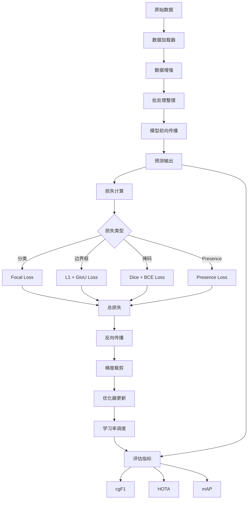

# SAM 3 训练与评估模块深度分析

## 1. 概述

SAM 3 的训练与评估模块包含数据加载、损失函数、评估指标等组件，支持模型的训练和性能评估。该模块使用大规模数据集和高效的训练策略。

### 1.1 核心组件

| 组件 | 目录 | 功能 |
|------|------|------|
| 数据加载 | `sam3/train/data/` | 数据集加载和预处理 |
| 损失函数 | `sam3/train/loss/` | 各种损失函数 |
| 优化器 | `sam3/train/optim/` | 优化器和调度器 |
| 变换 | `sam3/train/transforms/` | 数据增强 |
| 评估工具 | `sam3/eval/` | 评估指标和工具 |

## 2. 数据加载 (`sam3/train/data/`)

### 2.1 数据集基类

```python
class BaseDataset(torch.utils.data.Dataset):
    """
    数据集基类。
    """
    def __init__(
        self,
        image_dir: str,
        annotation_path: str,
        transforms: Optional[Callable] = None,
        is_train: bool = True,
    ):
        self.image_dir = image_dir
        self.annotation_path = annotation_path
        self.transforms = transforms
        self.is_train = is_train

        # 加载标注
        self.annotations = self._load_annotations()

    def _load_annotations(self) -> List[Dict]:
        """
        加载标注文件。
        """
        raise NotImplementedError

    def __len__(self):
        return len(self.annotations)

    def __getitem__(self, idx: int) -> Dict:
        """
        获取单个样本。
        """
        ann = self.annotations[idx]

        # 加载图像
        image_path = os.path.join(self.image_dir, ann["image_name"])
        image = Image.open(image_path).convert("RGB")

        # 加载标注
        masks = self._load_masks(ann)
        boxes = self._load_boxes(ann)
        text = ann.get("text", "")

        # 应用变换
        if self.transforms is not None:
            image, masks, boxes = self.transforms(image, masks, boxes)

        return {
            "image": image,
            "masks": masks,
            "boxes": boxes,
            "text": text,
        }
```

### 2.2 批处理数据

```python
@dataclass
class BatchedDatapoint:
    """
    批处理数据点。
    """
    img_batch: torch.Tensor              # [B, 3, H, W]
    find_text_batch: List[str]           # [B] 文本提示
    find_input: FindInput               # 查找输入

    # 图像标注
    input_boxes: Optional[torch.Tensor]  # [B, N, 4]
    input_boxes_label: Optional[torch.Tensor]  # [B, N]
    input_boxes_mask: Optional[torch.Tensor]  # [B, N, H, W]

    # 掩码标注
    input_masks: Optional[torch.Tensor]   # [B, N, H, W]
    input_labels: Optional[torch.Tensor]  # [B, N]

    # 文本标注
    text_ids: Optional[np.ndarray]        # [B, N] 文本 token IDs
```

### 2.3 数据整理器

```python
class SAM3Collator:
    """
    SAM3 数据整理器。
    """
    def __call__(
        self,
        batch: List[Dict],
    ) -> BatchedDatapoint:
        """
        整理批次数据。
        """
        # 1. 堆叠图像
        images = torch.stack([item["image"] for item in batch])

        # 2. 处理文本
        find_text_batch = [item["text"] for item in batch]

        # 3. 处理边界框
        if batch[0].get("boxes") is not None:
            boxes = self._pad_and_stack([item["boxes"] for item in batch])
            box_labels = self._pad_and_stack([item["box_labels"] for item in batch])
        else:
            boxes = None
            box_labels = None

        # 4. 处理掩码
        if batch[0].get("masks") is not None:
            masks = self._pad_and_stack([item["masks"] for item in batch])
            labels = self._pad_and_stack([item["labels"] for item in batch])
        else:
            masks = None
            labels = None

        return BatchedDatapoint(
            img_batch=images,
            find_text_batch=find_text_batch,
            input_boxes=boxes,
            input_boxes_label=box_labels,
            input_masks=masks,
            input_labels=labels,
        )

    def _pad_and_stack(
        self,
        tensors: List[torch.Tensor],
        padding_value: float = 0.0,
    ) -> torch.Tensor:
        """
        填充并堆叠张量。
        """
        # 找到最大长度
        max_len = max(t.shape[0] for t in tensors)

        # 填充
        padded = []
        for t in tensors:
            if t.shape[0] < max_len:
                pad_size = max_len - t.shape[0]
                pad = torch.full(
                    (pad_size, *t.shape[1:]),
                    padding_value,
                    dtype=t.dtype,
                    device=t.device,
                )
                t = torch.cat([t, pad], dim=0)
            padded.append(t)

        return torch.stack(padded)
```

## 3. 损失函数 (`sam3/train/loss/`)

### 3.1 分类损失

```python
class FocalLoss(nn.Module):
    """
    Focal Loss 用于分类。
    """
    def __init__(
        self,
        alpha: float = 0.25,
        gamma: float = 2.0,
        reduction: str = "mean",
    ):
        super().__init__()
        self.alpha = alpha
        self.gamma = gamma
        self.reduction = reduction

    def forward(
        self,
        pred: torch.Tensor,    # [B, N]
        target: torch.Tensor,  # [B, N]
    ) -> torch.Tensor:
        """
        前向传播。
        """
        # 计算二值交叉熵
        bce = F.binary_cross_entropy_with_logits(
            pred, target, reduction="none"
        )

        # 计算权重
        p_t = torch.sigmoid(pred) * target + (1 - torch.sigmoid(pred)) * (1 - target)
        focal_weight = (1 - p_t) ** self.gamma

        # Focal Loss
        loss = self.alpha * focal_weight * bce

        if self.reduction == "mean":
            return loss.mean()
        elif self.reduction == "sum":
            return loss.sum()
        else:
            return loss
```

### 3.2 边界框损失

```python
class BoxLoss(nn.Module):
    """
    边界框损失（L1 + GIoU）。
    """
    def __init__(
        self,
        weight_l1: float = 5.0,
        weight_giou: float = 2.0,
    ):
        super().__init__()
        self.weight_l1 = weight_l1
        self.weight_giou = weight_giou

    def forward(
        self,
        pred_boxes: torch.Tensor,  # [B, N, 4]
        target_boxes: torch.Tensor,  # [B, N, 4]
    ) -> torch.Tensor:
        """
        前向传播。
        """
        # L1 损失
        l1_loss = F.l1_loss(pred_boxes, target_boxes, reduction="none")

        # GIoU 损失
        giou_loss = 1 - generalized_box_iou(
            pred_boxes,
            target_boxes,
        )

        # 组合损失
        total_loss = (
            self.weight_l1 * l1_loss.mean() +
            self.weight_giou * giou_loss.mean()
        )

        return total_loss

def generalized_box_iou(
    boxes1: torch.Tensor,
    boxes2: torch.Tensor,
) -> torch.Tensor:
    """
    计算 GIoU。
    """
    # 转换为 [x1, y1, x2, y2] 格式
    boxes1 = box_cxcywh_to_xyxy(boxes1)
    boxes2 = box_cxcywh_to_xyxy(boxes2)

    # 计算交集
    lt = torch.max(boxes1[:, None, :2], boxes2[:, :2])  # [B, N, 2]
    rb = torch.min(boxes1[:, None, 2:], boxes2[:, 2:])  # [B, N, 2]

    wh = (rb - lt).clamp(min=0)
    inter = wh[:, :, 0] * wh[:, :, 1]  # [B, N]

    # 计算并集
    area1 = (boxes1[:, 2] - boxes1[:, 0]) * (boxes1[:, 3] - boxes1[:, 1])  # [B]
    area2 = (boxes2[:, 2] - boxes2[:, 0]) * (boxes2[:, 3] - boxes2[:, 1])  # [N]
    union = area1[:, None] + area2[None, :] - inter  # [B, N]

    # 计算包围盒
    lt = torch.min(boxes1[:, None, :2], boxes2[:, :2])
    rb = torch.max(boxes1[:, None, 2:], boxes2[:, 2:])
    wh = (rb - lt).clamp(min=0)
    area_enclosing = wh[:, :, 0] * wh[:, :, 1]  # [B, N]

    # IoU
    iou = inter / union.clamp(min=1e-6)

    # GIoU
    giou = iou - (area_enclosing - union) / area_enclosing.clamp(min=1e-6)

    return giou
```

### 3.3 掩码损失

```python
class MaskLoss(nn.Module):
    """
    掩码损失（Dice + BCE）。
    """
    def __init__(
        self,
        weight_dice: float = 1.0,
        weight_bce: float = 1.0,
    ):
        super().__init__()
        self.weight_dice = weight_dice
        self.weight_bce = weight_bce

    def forward(
        self,
        pred_masks: torch.Tensor,   # [B, N, H, W]
        target_masks: torch.Tensor,  # [B, N, H, W]
    ) -> torch.Tensor:
        """
        前向传播。
        """
        # BCE 损失
        bce_loss = F.binary_cross_entropy_with_logits(
            pred_masks, target_masks.float(), reduction="none"
        )

        # Dice 损失
        pred_sigmoid = torch.sigmoid(pred_masks)
        intersection = (pred_sigmoid * target_masks).sum(dim=(-2, -1))
        union = pred_sigmoid.sum(dim=(-2, -1)) + target_masks.sum(dim=(-2, -1))
        dice = 2 * intersection / (union + 1e-6)
        dice_loss = 1 - dice

        # 组合损失
        total_loss = (
            self.weight_bce * bce_loss.mean() +
            self.weight_dice * dice_loss.mean()
        )

        return total_loss
```

### 3.4 Presence Token 损失

```python
class PresenceLoss(nn.Module):
    """
    Presence Token 损失（用于判断目标是否存在）。
    """
    def __init__(
        self,
        loss_type: str = "focal",  # "focal" or "bce"
    ):
        super().__init__()
        self.loss_type = loss_type

        if loss_type == "focal":
            self.criterion = FocalLoss(alpha=0.25, gamma=2.0)
        else:
            self.criterion = nn.BCEWithLogitsLoss()

    def forward(
        self,
        presence_logits: torch.Tensor,  # [B, 1]
        target: torch.Tensor,           # [B]
    ) -> torch.Tensor:
        """
        前向传播。
        """
        target = target.float().unsqueeze(-1)  # [B, 1]

        loss = self.criterion(presence_logits, target)

        return loss
```

## 4. 优化器 (`sam3/train/optim/`)

### 4.1 AdamW 优化器

```python
def build_optimizer(
    model: nn.Module,
    lr: float = 1e-4,
    weight_decay: float = 0.05,
    layerwise_lr: bool = True,
) -> torch.optim.Optimizer:
    """
    构建 AdamW 优化器。
    """
    # 分层学习率
    if layerwise_lr:
        # 不同模块使用不同学习率
        param_groups = [
            {
                "params": model.backbone.parameters(),
                "lr": lr * 0.1,  # backbone 使用较小的学习率
                "weight_decay": weight_decay,
            },
            {
                "params": model.transformer.parameters(),
                "lr": lr,
                "weight_decay": weight_decay,
            },
            {
                "params": model.segmentation_head.parameters(),
                "lr": lr * 1.0,
                "weight_decay": 0.0,  # 分割头不使用权重衰减
            },
        ]
    else:
        param_groups = model.parameters()

    optimizer = torch.optim.AdamW(
        param_groups,
        lr=lr,
        betas=(0.9, 0.999),
        weight_decay=weight_decay,
    )

    return optimizer
```

### 4.2 学习率调度器

```python
def build_scheduler(
    optimizer: torch.optim.Optimizer,
    num_iterations: int,
    warmup_iterations: int = 1000,
    min_lr: float = 1e-6,
):
    """
    构建余弦退火调度器。
    """
    def lr_lambda(current_iter):
        # 预热
        if current_iter < warmup_iterations:
            return current_iter / warmup_iterations

        # 余弦退火
        progress = (current_iter - warmup_iterations) / (num_iterations - warmup_iterations)
        lr = min_lr + 0.5 * (1 - min_lr) * (1 + np.cos(np.pi * progress))

        return lr

    scheduler = torch.optim.lr_scheduler.LambdaLR(
        optimizer,
        lr_lambda=lr_lambda,
    )

    return scheduler
```

## 5. 数据增强 (`sam3/train/transforms/`)

### 5.1 随机裁剪

```python
class RandomCrop:
    """
    随机裁剪。
    """
    def __init__(
        self,
        size: Tuple[int, int],
        min_object_visible: float = 0.5,
    ):
        self.size = size
        self.min_object_visible = min_object_visible

    def __call__(
        self,
        image: Image.Image,
        masks: torch.Tensor,
        boxes: torch.Tensor,
    ):
        """
        应用随机裁剪。
        """
        W, H = image.size
        crop_H, crop_W = self.size

        # 生成裁剪位置
        top = np.random.randint(0, H - crop_H + 1)
        left = np.random.randint(0, W - crop_W + 1)

        # 裁剪图像
        image = image.crop((left, top, left + crop_W, top + crop_H))

        # 裁剪掩码
        masks = masks[:, top:top+crop_H, left:left+crop_W]

        # 调整边界框
        boxes = boxes.clone()
        boxes[:, [0, 2]] = boxes[:, [0, 2]] - left
        boxes[:, [1, 3]] = boxes[:, [1, 3]] - top

        # 裁剪到 [0, crop_W] 和 [0, crop_H]
        boxes[:, [0, 2]] = boxes[:, [0, 2]].clamp(0, crop_W)
        boxes[:, [1, 3]] = boxes[:, [1, 3]].clamp(0, crop_H)

        # 移除完全在裁剪外的边界框
        keep = (boxes[:, 2] > boxes[:, 0]) & (boxes[:, 3] > boxes[:, 1])
        boxes = boxes[keep]
        masks = masks[keep]

        return image, masks, boxes
```

### 5.2 随机翻转

```python
class RandomHorizontalFlip:
    """
    随机水平翻转。
    """
    def __init__(self, p: float = 0.5):
        self.p = p

    def __call__(
        self,
        image: Image.Image,
        masks: torch.Tensor,
        boxes: torch.Tensor,
    ):
        """
        应用随机水平翻转。
        """
        if np.random.random() < self.p:
            image = image.transpose(Image.FLIP_LEFT_RIGHT)
            masks = torch.flip(masks, dims=[2])

            # 调整边界框
            W = image.width
            boxes[:, [0, 2]] = W - boxes[:, [2, 0]]

        return image, masks, boxes
```

## 6. 评估指标

### 6.1 cgF1 (Conditional Group F1)

```python
def compute_cgF1(
    pred_masks: List[np.ndarray],
    gt_masks: List[np.ndarray],
    pred_texts: List[str],
    gt_texts: List[str],
) -> float:
    """
    计算 cgF1 指标。
    """
    # 计算每个类别的 F1
    class_f1 = []

    for text in set(gt_texts):
        # 获取该文本的预测和真实掩码
        pred = [m for m, t in zip(pred_masks, pred_texts) if t == text]
        gt = [m for m, t in zip(gt_masks, gt_texts) if t == text]

        # 计算精确率、召回率
        tp, fp, fn = compute_tp_fp_fn(pred, gt)

        precision = tp / (tp + fp) if (tp + fp) > 0 else 0
        recall = tp / (tp + fn) if (tp + fn) > 0 else 0

        f1 = 2 * precision * recall / (precision + recall) if (precision + recall) > 0 else 0
        class_f1.append(f1)

    # 平均 F1
    cgF1 = np.mean(class_f1)

    return cgF1

def compute_tp_fp_fn(
    pred_masks: List[np.ndarray],
    gt_masks: List[np.ndarray],
    iou_threshold: float = 0.5,
) -> Tuple[int, int, int]:
    """
    计算 TP、FP、FN。
    """
    tp = 0
    fp = 0
    fn = 0

    # 预测掩码 IoU 矩阵
    iou_matrix = np.zeros((len(pred_masks), len(gt_masks)))
    for i, pred in enumerate(pred_masks):
        for j, gt in enumerate(gt_masks):
            iou_matrix[i, j] = compute_mask_iou(pred, gt)

    # 匹配
    matched_pred = set()
    matched_gt = set()

    # 贪心匹配（按 IoU 降序）
    for iou in sorted(iou_matrix.flatten(), reverse=True):
        if iou < iou_threshold:
            break

        pred_idx, gt_idx = np.unravel_index(
            np.argmax(iou_matrix == iou),
            iou_matrix.shape
        )

        if pred_idx not in matched_pred and gt_idx not in matched_gt:
            tp += 1
            matched_pred.add(pred_idx)
            matched_gt.add(gt_idx)

    # FP：未匹配的预测
    fp = len(pred_masks) - len(matched_pred)

    # FN：未匹配的真实
    fn = len(gt_masks) - len(matched_gt)

    return tp, fp, fn
```

### 6.2 HOTA (Higher Order Tracking Accuracy)

```python
def compute_hota(
    pred_tracklets: Dict[int, List[Tuple[int, np.ndarray]]],
    gt_tracklets: Dict[int, List[Tuple[int, np.ndarray]]],
) -> float:
    """
    计算 HOTA 指标（简化版）。
    """
    # 计算关联准确度
    detA = compute_detection_accuracy(pred_tracklets, gt_tracklets)
    assA = compute_association_accuracy(pred_tracklets, gt_tracklets)

    # HOTA = sqrt(detA * assA)
    hota = np.sqrt(detA * assA)

    return hota

def compute_detection_accuracy(
    pred_tracklets: Dict[int, List[Tuple[int, np.ndarray]]],
    gt_tracklets: Dict[int, List[Tuple[int, np.ndarray]]],
) -> float:
    """
    计算检测准确度。
    """
    # 计算平均 IoU
    total_iou = 0
    total_count = 0

    for track_id, tracklet in pred_tracklets.items():
        for frame_idx, pred_mask in tracklet:
            # 找到对应帧的真实掩码
            for gt_tracklet in gt_tracklets.values():
                for gt_frame_idx, gt_mask in gt_tracklet:
                    if gt_frame_idx == frame_idx:
                        iou = compute_mask_iou(pred_mask, gt_mask)
                        total_iou += iou
                        total_count += 1
                        break

    detA = total_iou / total_count if total_count > 0 else 0

    return detA
```

## 7. 训练流程

```python
def train_one_epoch(
    model: nn.Module,
    dataloader: DataLoader,
    optimizer: torch.optim.Optimizer,
    scheduler: torch.optim.lr_scheduler._LRScheduler,
    device: str = "cuda",
):
    """
    训练一个 epoch。
    """
    model.train()
    total_loss = 0

    for batch in tqdm(dataloader):
        # 移动到设备
        batch = batch_to_device(batch, device)

        # 前向传播
        outputs = model(batch)

        # 计算损失
        loss_dict = compute_losses(outputs, batch)

        # 反向传播
        optimizer.zero_grad()
        loss_dict["total_loss"].backward()
        torch.nn.utils.clip_grad_norm_(model.parameters(), max_norm=1.0)
        optimizer.step()

        # 更新学习率
        scheduler.step()

        total_loss += loss_dict["total_loss"].item()

    # 返回平均损失
    avg_loss = total_loss / len(dataloader)

    return avg_loss
```

## 8. 数据流向图



## 9. 总结

SAM 3 的训练与评估模块通过以下设计实现了高效的模型训练：

1. **灵活的数据加载**：支持多种数据集和标注格式
2. **多任务损失**：分类、边界框、掩码和 Presence 损失
3. **数据增强**：裁剪、翻转、颜色变换等
4. **分层学习率**：不同模块使用不同学习率
5. **丰富的评估指标**：cgF1、HOTA、mAP 等

这些设计使得 SAM 3 能够在大规模数据集上高效训练，并在多个基准上达到领先的性能。
