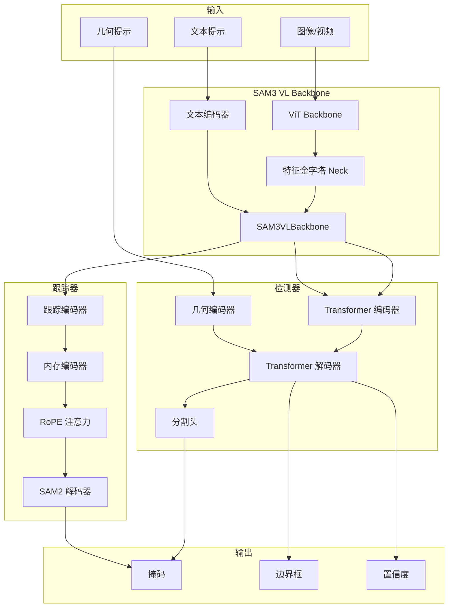
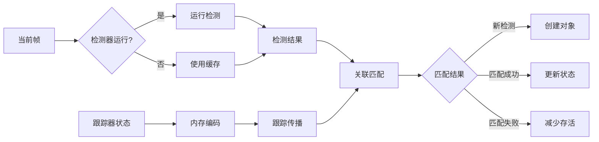

# SAM 3 技术分析完整文档

**版本**: 1.0
**日期**: 2026-03-16
**项目**: SAM 3 (Segment Anything with Concepts)

---

## 目录

1. [概述](#1-概述)
2. [核心架构](#2-核心架构)
3. [视觉编码器](#3-视觉编码器)
4. [文本编码器](#4-文本编码器)
5. [检测器模块](#5-检测器模块)
6. [跟踪器模块](#6-跟踪器模块)
7. [图像分割流程](#7-图像分割流程)
8. [视频跟踪流程](#9-视频跟踪流程)
9. [Agent 系统](#9-agent-系统)
10. [性能优化](#10-性能优化)
11. [训练与评估](#11-训练与评估)
12. [总结](#12-总结)

---

## 1. 概述

### 1.1 项目简介

SAM 3 (Segment Anything with Concepts) 是 Meta 发布的统一基础模型，用于图像和视频中的可提示分割。它能够使用文本或视觉提示（如点、框和掩码）来检测、分割和跟踪对象。

### 1.2 关键特性

- **848M 参数规模**：检测器-跟踪器解耦架构
- **开放词汇支持**：支持 270K+ 独特概念
- **多模态输入**：文本、点、框、掩码等多种提示类型
- **双任务设计**：图像分割和视频跟踪统一架构
- **高性能推理**：支持多 GPU 分布式推理

### 1.3 设计理念

SAM 3 采用了**检测器-跟踪器解耦**的设计理念：

1. **检测器 (Detector)**：负责识别图像/视频中的对象，基于文本提示生成初始检测
2. **跟踪器 (Tracker)**：负责跨帧跟踪已识别对象，处理时间一致性

这种设计最小化了任务干扰，提高了模型的可扩展性和训练效率。

---

## 2. 核心架构

### 2.1 整体架构

SAM 3 由以下核心组件组成：



### 2.2 模型参数

| 组件 | 参数配置 |
|------|----------|
| ViT Backbone | img_size=1008, patch_size=14, embed_dim=1024, depth=32, num_heads=16 |
| 文本编码器 | width=1024, layers=24, heads=16, vocab_size=49408 |
| Transformer | d_model=256, num_layers=6, num_queries=200 |
| 跟踪器 | num_maskmem=7, max_cond_frames_in_attn=4 |

---

## 3. 视觉编码器

### 3.1 ViT Backbone

SAM 3 的视觉编码器基于 Vision Transformer (ViT)，采用**混合注意力机制**：

- **全局注意力层**：第 7、15、23、31 层使用全局注意力
- **窗口注意力层**：其余层使用窗口注意力（24×24 窗口）
- **RoPE 编码**：支持旋转位置编码，具有强外推能力

### 3.2 特征金字塔 Neck

`Sam3DualViTDetNeck` 生成多尺度特征：

| Scale | 操作 | 输出尺寸 |
|-------|------|----------|
| 4.0x | 上采样 4 倍 | stride 3.5 |
| 2.0x | 上采样 2 倍 | stride 7 |
| 1.0x | 原尺寸 | stride 14 |
| 0.5x | 下采样 2 倍 | stride 28 |

### 3.3 关键代码

```python
# ViT 初始化（sam3/model/vitdet.py）
self.blocks = nn.ModuleList([
    Block(
        dim=embed_dim,
        num_heads=num_heads,
        window_size=0 if i in global_att_blocks else window_size,
    )
    for i in range(depth)
])
```

---

## 4. 文本编码器

### 4.1 VETextEncoder

文本编码器基于 24 层 Transformer：

- **词嵌入**：49408 词汇表
- **位置嵌入**：可学习的位置编码
- **输出维度**：256（与视觉特征对齐）

### 4.2 BPE 分词器

`SimpleTokenizer` 使用 Byte Pair Encoding：

- **词汇表大小**：49408 tokens
- **特殊标记**：SOT (49406)、EOT (49407)、PAD (0)
- **支持上下文长度**：最多 32 tokens

### 4.3 VL 融合

`SAM3VLBackbone` 独立处理视觉和文本特征，通过 `scalp` 参数控制特征层级。

---

## 5. 检测器模块

### 5.1 TransformerEncoderFusion

多模态编码器，融合文本和图像特征：

- **自注意力**：图像特征间的交互
- **跨注意力**：文本作为 memory 与图像交互
- **池化融合**：将池化的文本特征添加到图像特征

### 5.2 Presence Token

SAM 3 的关键创新：

- **作用**：判断目标是否存在
- **位置**：在解码器开始处添加
- **输出**：Presence Token 通过 MLP 输出存在概率

### 5.3 BoxRPB

边界框参考点偏置：

- **模式**：支持 "none"、"log"、"linear"、"both"
- **作用**：将边界框信息融入注意力机制
- **实现**：计算相对位置并通过 MLP 投影为注意力偏置

---

## 6. 跟踪器模块

### 6.1 Sam3TrackerPredictor

跟踪器维护 7 帧历史信息：

- **条件帧**：有用户标注的帧
- **非条件帧**：自动跟踪的帧
- **内存特征**：通过 `SimpleMaskEncoder` 编码

### 6.2 内存编码器

`SimpleMaskEncoder` 使用三阶段编码：

1. **下采样**：将掩码从 (H, W) 降到 (H/16, W/16)
2. **融合**：与视觉特征相加
3. **CXBlock**：通过 ConvNeXt 块进一步处理

### 6.3 RoPE 注意力

旋转位置编码用于时空建模：

- **轴向编码**：分别计算 x 和 y 方向
- **复数表示**：使用极坐标表示旋转
- **外推能力**：支持不同分辨率输入

---

## 7. 图像分割流程

### 7.1 Sam3Processor

推理处理器提供统一接口：

```python
processor = Sam3Processor(model)
state = processor.set_image(image)
output, state = processor.set_text_prompt("a dog", state)
```

### 7.2 提示编码

支持三种提示类型：

1. **文本提示**：通过文本编码器
2. **几何提示**：通过几何编码器
3. **视觉提示**：如示例掩码

### 7.3 掩码解码

`MaskDecoder` 生成多掩码输出：

- **多掩码模式**：返回 3 个候选掩码
- **单掩码模式**：基于 IoU 返回最佳掩码
- **IoU 预测**：预测每个掩码的质量分数

---

## 8. 视频跟踪流程

### 8.1 检测器-跟踪器协作



### 8.2 热启动机制

- **延迟输出**：前 15 帧不输出
- **稳定跟踪**：等跟踪稳定后再输出
- **重复抑制**：移除重复的检测

### 8.3 多 GPU 推理

`Sam3VideoPredictorMultiGPU` 支持：

- **NCCL 通信**：GPU 间高效通信
- **负载均衡**：动态分配对象到不同 GPU
- **特征共享**：All-gather 收集所有 GPU 的特征

---

## 9. Agent 系统

### 9.1 工具系统

Agent 支持以下工具：

1. **segment_phrase**：使用 SAM3 进行语义分割
2. **examine_each_mask**：检查每个掩码质量
3. **select_masks_and_return**：选择最终掩码并返回
4. **report_no_mask**：报告无掩码情况

### 9.2 LLM 集成

- **支持两种模式**：OpenAI API 和 vLLM
- **多模态输入**：支持图像和文本
- **工具调用**：LLM 选择合适的工具并生成参数

### 9.3 迭代优化

- **多轮推理**：支持多轮 LLM 对话
- **自我检查**：检查掩码质量
- **消息压缩**：压缩长对话历史

---

## 10. 性能优化

### 10.1 FlashAttention3

```python
@torch.library.custom_op("flash::flash_attn_func", mutates_args=())
def flash_attn_func_op(q, k, v):
    from flash_attn_interface import flash_attn_func as fa3
    return fa3(q, k, v)
```

### 10.2 Triton Kernel

- **连接组件**：四阶段算法，使用并查集
- **NMS**：优化的非极大值抑制
- **自动调优**：支持多种配置

### 10.3 编译优化

- **Torch Compile**：自动图优化和算子融合
- **激活检查点**：减少显存占用
- **形状缓存**：记录首次出现的形状

---

## 11. 训练与评估

### 11.1 损失函数

| 损失类型 | 权重 | 描述 |
|----------|------|------|
| Focal Loss | 2.0 | 分类损失 |
| L1 + GIoU | 5.0 + 2.0 | 边界框损失 |
| Dice + BCE | 1.0 + 1.0 | 掩码损失 |
| Presence Loss | - | Presence Token 损失 |

### 11.2 评估指标

- **cgF1**：Conditional Group F1，用于开放词汇分割
- **HOTA**：Higher Order Tracking Accuracy，用于视频跟踪
- **mAP**：Mean Average Precision

### 11.3 数据增强

- **随机裁剪**：最小对象可见性 50%
- **随机翻转**：水平翻转概率 50%
- **颜色变换**：亮度、对比度、饱和度调整

---

## 12. 总结

SAM 3 通过以下设计实现了强大的多模态分割能力：

1. **检测器-跟踪器解耦**：最小化任务干扰，提高可扩展性
2. **Presence Token**：改善相关提示之间的区分度
3. **混合注意力机制**：结合全局和窗口注意力，平衡性能和效率
4. **RoPE 编码**：提供强外推能力，支持不同分辨率
5. **多模态融合**：文本、几何和视觉提示的统一处理
6. **性能优化**：FlashAttention、Triton Kernel、编译优化等
7. **Agent 系统**：LLM 驱动的智能分割推理

这些设计使得 SAM 3 在多个基准上达到了领先的性能，实现了 75-80% 的人类性能水平。

---

## 附录

### A. 文件索引

| 模块 | 核心文件 |
|------|----------|
| 核心架构 | `sam3/model_builder.py`, `sam3/model/vl_combiner.py` |
| 视觉编码器 | `sam3/model/vitdet.py`, `sam3/model/necks.py` |
| 文本编码器 | `sam3/model/text_encoder_ve.py`, `sam3/model/tokenizer_ve.py` |
| 检测器 | `sam3/model/encoder.py`, `sam3/model/decoder.py` |
| 跟踪器 | `sam3/model/sam3_tracking_predictor.py`, `sam3/model/memory.py` |
| 图像分割 | `sam3/model/sam3_image.py`, `sam3/model/sam3_image_processor.py` |
| 视频跟踪 | `sam3/model/sam3_video_predictor.py`, `sam3/model/sam3_video_inference.py` |
| Agent | `sam3/agent/agent_core.py`, `sam3/agent/client_llm.py` |
| 性能优化 | `sam3/perflib/fa3.py`, `sam3/perflib/compile.py`, `sam3/perflib/triton/` |
| 训练 | `sam3/train/data/`, `sam3/train/loss/` |
| 评估 | `sam3/eval/` |

### B. 参考文档

- [SAM 3 Paper](https://arxiv.org/abs/2511.16719)
- [SAM 3 GitHub](https://github.com/facebookresearch/sam3)
- [SAM 2 Paper](https://arxiv.org/abs/2308.08723)
- [DETR Paper](https://arxiv.org/abs/2005.12872)

---

*本文档由 SAM 3 技术分析自动生成*
